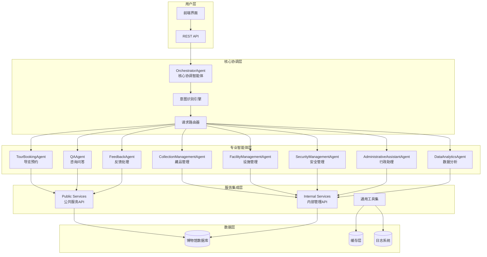
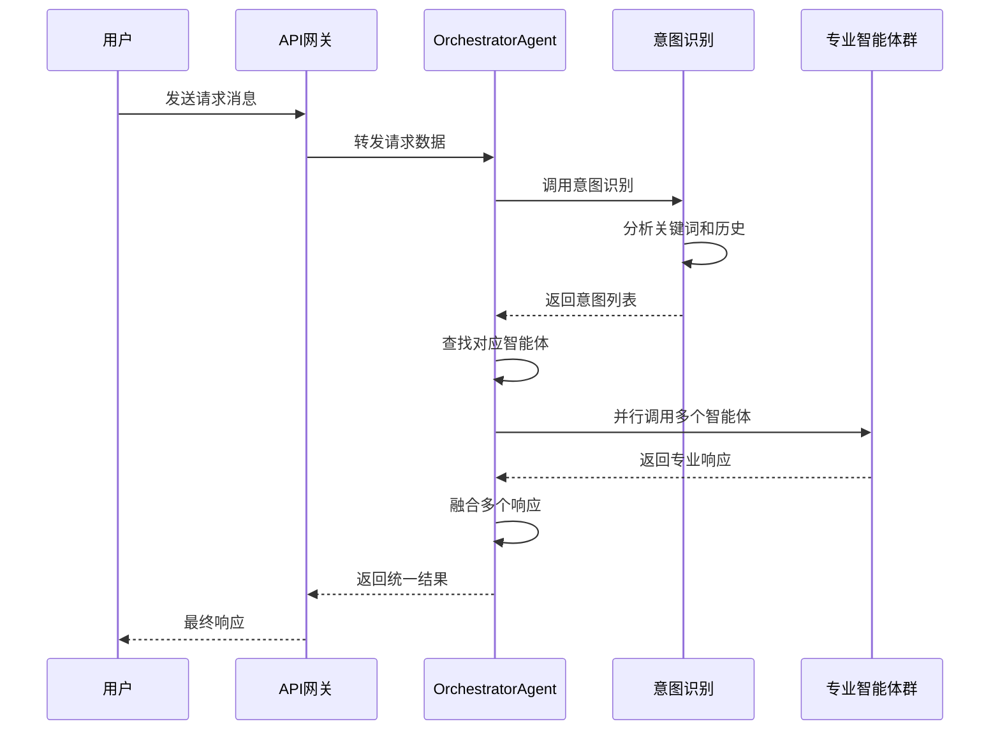
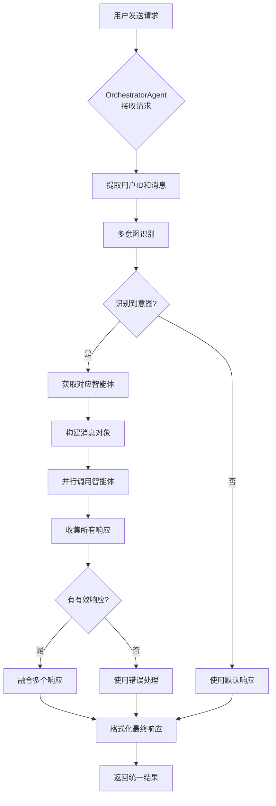

# 博物馆多智能体系统 - 技术架构文档

## 🏛️ 项目概述

本项目基于 **AgentScope** 框架构建了一个完整的博物馆多智能体协同系统，通过多个专业智能体的分工协作，为博物馆提供智能化的游客服务、藏品管理、设施运营等全方位支持。

## 🎯 核心特性

- **多智能体协同**：8个专业智能体各司其职，通过核心协调器统一调度
- **智能路由**：基于意图识别的动态请求路由，支持多意图并行处理
- **高并发支持**：异步架构设计，支持并行智能体执行
- **服务集成**：无缝集成现有博物馆服务API，提供RESTful接口
- **实时响应**：优化的响应处理机制，避免文本重复和流式响应异常

## 🏗️ 技术架构

### 系统架构图



### 技术栈

| 层级 | 技术 | 用途 |
|------|------|------|
| **后端框架** | FastAPI | REST API服务 |
| **智能体框架** | AgentScope | 多智能体管理 |
| **大模型** | Ollama(qwen2:latest) | 意图识别与响应生成 |
| **数据存储** | JSON文件 | 博物馆数据模拟 |
| **通信协议** | HTTP/HTTPS | 服务间通信 |
| **并发处理** | asyncio | 异步任务处理 |
| **日志系统** | Python logging | 系统监控与调试 |

## 🔀 多智能体协同机制

### 1. 意图识别与路由流程



### 2. 智能体注册与管理

```python
# orchestrator_agent.py - 智能体注册机制
class OrchestratorAgent(AgentBase):
    def __init__(self):
        super().__init__()
        self.agents: Dict[str, AgentBase] = {}
        self._register_all_agents()
    
    def _register_all_agents(self) -> None:
        """自动注册所有专业智能体"""
        agents_to_register = [
            ("TourBookingAgent", TourBookingAgent()),
            ("QAAgent", QAAgent()),
            ("CollectionManagementAgent", CollectionManagementAgent()),
            ("FacilityManagementAgent", FacilityManagementAgent()),
            ("FeedbackAgent", FeedbackAgent()),
            ("SecurityManagementAgent", SecurityManagementAgent()),
            ("AdministrativeAssistantAgent", AdministrativeAssistantAgent()),
            ("DataAnalyticsAgent", DataAnalyticsAgent())
        ]
        
        for name, agent in agents_to_register:
            self.register_agent(name, agent)
```

### 3. 意图识别映射表

```python
# core_orchestrator.py - 意图映射配置
INTENT_MAPPING = {
    "tour_booking": [
        "预约参观", "预订门票", "预约导览", "购买门票", 
        "团体预约", "特别活动预约"
    ],
    "qa": [
        "展览介绍", "藏品信息", "历史背景", "艺术家介绍",
        "开放时间", "门票价格", "参观指南"
    ],
    "facility": [
        "洗手间位置", "餐厅位置", "无障碍设施", 
        "寄存服务", "停车场信息"
    ],
    "collection": [
        "藏品管理", "藏品查询", "文物详情", 
        "展品搜索", "文物保护"
    ]
}
```

## 🚀 关键工作流程

### 1. 请求处理完整流程



### 2. 并行智能体执行机制

```python
# orchestrator_agent.py - 并行执行核心逻辑
async def process_request(self, request_data: Dict[str, Any]) -> Dict[str, Any]:
    # 1. 多意图识别
    intents = await self.recognize_intents(message, history)
    
    # 2. 获取对应的所有智能体
    agents = self.get_agents_by_intents(intents)
    
    if agents:
        # 3. 并行执行多个智能体
        tasks = []
        for agent in agents:
            task = agent(msg)  # 异步调用
            tasks.append(task)
        
        # 4. 等待所有智能体完成
        responses = await asyncio.gather(*tasks, return_exceptions=True)
        
        # 5. 融合响应结果
        combined_response = await self._combine_agent_responses(agent_results)
```

### 3. 响应融合算法

```python
# orchestrator_agent.py - 响应融合机制
async def _combine_agent_responses(self, agent_results) -> str:
    """使用大模型融合多个智能体的响应"""
    responses_text = "\n\n".join([
        f"【{result.get('agent_name')}】\n{result.get('response')}"
        for result in agent_results
    ])
    
    prompt = f"""# 多智能体响应融合任务
    
    请将以下多个智能体的响应结果融合成一个连贯、完整的回答给用户。
    
    {responses_text}
    
    融合要求：
    1. 将相关信息有机整合，避免重复
    2. 保持语言流畅自然
    3. 按重要性和逻辑顺序组织内容
    4. 使用中文回答
    """
    
    # 调用大模型进行智能融合
    return await self.model(prompt)
```

## 🎭 专业智能体详解

### TourBookingAgent - 导览预约智能体

```python
class TourBookingAgent(AgentBase):
    async def reply(self, message: Msg) -> Msg:
        """处理预约相关请求"""
        content = message.content.lower()
        
        # 意图识别关键词匹配
        if any(word in content for word in ["预约", "预订", "门票"]):
            return await self._handle_booking(message)
        elif any(word in content for word in ["查询", "我的预约"]):
            return await self._query_booking(message)
        elif any(word in content for word in ["路线", "参观路线"]):
            return await self._generate_route(message)
```

### QAAgent - 咨询问答智能体

```python
class QAAgent(AgentBase):
    async def _generate_answer(self, query: str, context: Dict) -> str:
        """生成智能回答"""
        prompt = f"""
        作为博物馆的智能助手，请回答以下问题：
        
        用户问题：{query}
        相关上下文：{context}
        
        请提供专业、准确且简洁的回答。
        """
        
        response = await self.model(prompt)
        return str(response.content).strip()  # 简化响应处理
```

### CollectionManagementAgent - 藏品管理智能体

```python
class CollectionManagementAgent(AgentBase):
    async def _get_collection_detail(self, collection_id: str) -> Dict:
        """获取藏品详细信息"""
        # 调用内部服务API
        return await execute_museum_service(
            endpoint="/api/internal/collection/detail",
            method="GET",
            params={"id": collection_id}
        )
```

## 🔧 服务集成接口

### REST API 端点

| 端点 | 方法 | 用途 | 智能体 |
|------|------|------|--------|
| `/api/core/orchestrate` | POST | 核心协调 | OrchestratorAgent |
| `/api/public/tour-booking` | POST | 导览预约 | TourBookingAgent |
| `/api/public/qa` | POST | 咨询问答 | QAAgent |
| `/api/internal/collection` | POST | 藏品管理 | CollectionManagementAgent |
| `/api/internal/facility` | POST | 设施管理 | FacilityManagementAgent |

### 请求格式示例

```json
{
  "user_id": "user123",
  "message": "我想预约明天上午的参观",
  "context": {
    "current_time": "2024-01-15T10:00:00Z",
    "user_preferences": ["历史文物", "古代艺术"]
  },
  "history": [
    {
      "role": "user",
      "content": "博物馆几点开门？"
    },
    {
      "role": "assistant", 
      "content": "博物馆开放时间为每天9:00-17:00"
    }
  ]
}
```

### 响应格式示例

```json
{
  "status": "success",
  "result": {
    "response": "已为您成功预约明天上午9:00-11:00的参观时段，请携带身份证件准时到达。",
    "intent": "tour_booking",
    "handled_by": "TourBookingAgent"
  },
  "agent_info": {
    "name": "TourBookingAgent",
    "type": "specialized"
  }
}
```

## 🛡️ 系统优化与异常处理

### 1. 响应处理优化

- **禁用流式响应**：所有智能体统一使用 `stream=False` 避免重复文本
- **简化响应处理**：移除复杂的流式处理逻辑，直接获取最终响应
- **异常捕获**：完善的错误处理机制，确保系统稳定性

### 2. 并发安全机制

```python
# 使用 asyncio.gather 的异常处理
responses = await asyncio.gather(*tasks, return_exceptions=True)

for agent, response in zip(agents, responses):
    if isinstance(response, Exception):
        logger.error(f"智能体{agent.name}执行失败: {response}")
        continue  # 跳过失败的智能体，不影响其他响应
```

### 3. 性能监控

```python
# 关键路径日志记录
logger.info(f"[性能监控] 意图识别耗时: {intent_time:.2f}s")
logger.info(f"[性能监控] 智能体执行耗时: {agent_time:.2f}s") 
logger.info(f"[性能监控] 响应融合耗时: {fusion_time:.2f}s")
```

## 🚀 快速开始

### 1. 环境准备

```bash
# 克隆项目
git clone [repository-url]
cd p-llm-agent-museum

# 安装依赖
pip install -r requirements.txt

# 启动Ollama服务
ollama run qwen2:latest
```

### 2. 启动服务

```bash
# 启动博物馆服务
python main.py

# 或使用启动脚本
./start_service.sh
```

### 3. 测试验证

```bash
# 运行集成测试
python test_final_integration.py

# 测试特定智能体
python test_qa_agent.py
python test_collection_agent.py
```

## 📊 项目结构

```
p-llm-agent-museum/
├── agents/                 # 智能体实现
│   ├── orchestrator_agent.py    # 核心协调智能体
│   ├── tour_booking_agent.py  # 导览预约智能体
│   ├── qa_agent.py           # 咨询问答智能体
│   ├── collection_management_agent.py  # 藏品管理智能体
│   └── ...
├── services/              # 服务层
│   ├── core_orchestrator.py   # 核心协调服务
│   ├── public_services.py     # 公共服务API
│   └── internal_services.py   # 内部管理API
├── utils/                 # 工具集
│   ├── agent_tools.py       # 智能体工具
│   ├── email_tool.py        # 邮件工具
│   └── data_loader.py       # 数据加载器
├── public_services/       # 公共服务数据
├── internal_management/   # 内部管理数据
├── main.py               # 主程序入口
├── chat_interface.html   # 前端界面
└── requirements.txt      # 依赖清单
```

## 🔮 未来规划

- **增强意图识别**：引入深度学习模型提升识别准确率
- **扩展智能体**：增加AR导览、语音交互等专业智能体
- **实时数据集成**：连接真实博物馆数据库和IoT设备
- **多语言支持**：支持中英文等多语言交互
- **移动端适配**：开发配套的移动应用

## 🤝 贡献指南

欢迎提交Issue和Pull Request来改进这个博物馆多智能体系统。在贡献代码前，请确保：

1. 运行测试用例确保功能正常
2. 遵循项目的代码规范
3. 更新相关文档和注释

## 📄 许可证

本项目采用 MIT 许可证，详见 [LICENSE](LICENSE) 文件。

---

*构建智能化的博物馆体验，让文化遗产在现代科技中焕发新生。*