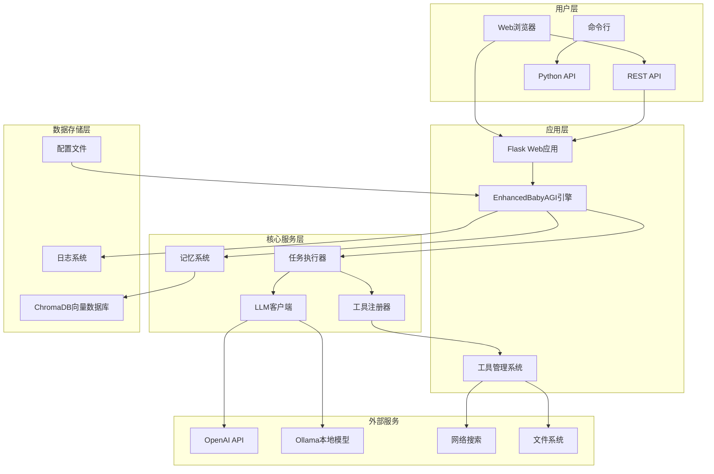
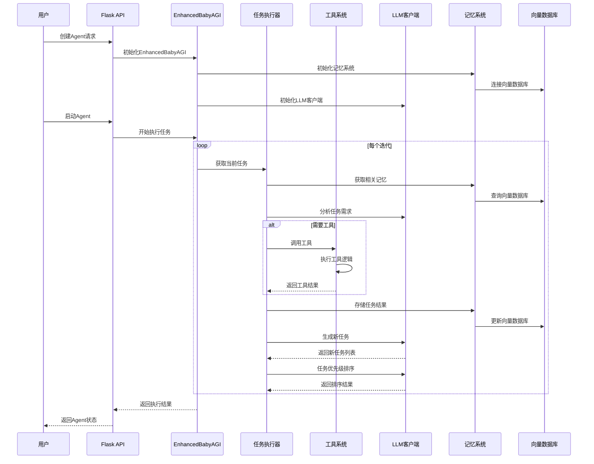
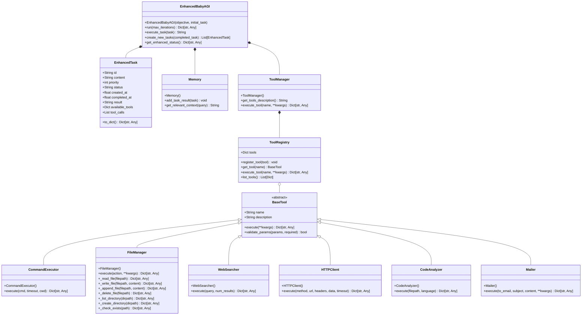

# 🚀 增强版 Agent 系统

基于 手搓智能 一个Agent 系统，具备任务规划、工具集成、执行管理和结果分析功能。支持多种 LLM 提供商、向量数据库和工具扩展。

## 📋 目录

- [快速开始](#快速开始)
- [系统架构](#系统架构)
- [核心特性](#核心特性)
- [技术栈](#技术栈)
- [项目结构](#项目结构)
- [详细配置](#详细配置)
- [API文档](#api文档)
- [工具系统](#工具系统)
- [使用指南](#使用指南)
- [开发指南](#开发指南)
- [部署指南](#部署指南)

## 🚀 快速开始

### 1. 安装依赖
```bash
pip install -r requirements.txt
```

### 2. 配置环境
```bash
# 复制环境配置文件
cp .env.example .env

# 编辑配置文件，设置必要的参数
vim .env
```

### 3. 启动系统
```bash
# 方式一：使用启动脚本（推荐）
python run.py

# 方式二：直接运行 Flask 应用
python app.py
```

### 4. 访问系统
- **Web界面**: http://localhost:5000
- **API文档**: http://localhost:5000/api/info
- **健康检查**: http://localhost:5000/api/health

## 🏗️ 系统架构

### 整体架构



### 数据流架构



### 类结构图



## ✨ 核心特性

### 1. 智能任务规划
- **任务分解**: 自动将复杂目标分解为可执行的小任务
- **优先级排序**: 基于任务相关性和重要性进行动态排序
- **依赖管理**: 识别任务间的依赖关系
- **循环检测**: 防止任务循环和无限递归

### 2. 工具集成系统
- **6种内置工具**: 命令执行、文件管理、网络搜索、HTTP客户端、代码分析、邮件发送
- **统一接口**: 所有工具继承BaseTool基类，提供标准化接口
- **错误处理**: 完整的异常捕获和错误报告机制
- **结果验证**: 基于JSON的成功/失败状态判断

### 3. 记忆系统
- **向量存储**: 使用ChromaDB存储任务执行结果和上下文
- **语义搜索**: 基于嵌入向量的相似度搜索
- **上下文管理**: 为每个任务提供相关的历史上下文
- **持久化存储**: 支持数据库持久化和恢复

### 4. 多LLM支持
- **OpenAI**: 支持GPT-3.5-turbo、GPT-4等模型
- **Ollama**: 支持本地运行的开源模型
- **可扩展**: 易于添加新的LLM提供商
- **智能重试**: 网络异常时的重试机制

### 5. RESTful API
- **完整CRUD**: Agent的创建、读取、更新、删除
- **实时监控**: 任务执行状态的实时查询
- **统计信息**: 详细的执行统计和性能指标
- **错误处理**: 标准化的错误响应格式

### 6. Web界面
- **现代化UI**: 响应式设计，支持移动端
- **实时监控**: 任务执行的实时进度展示
- **交互式操作**: 图形化的Agent管理界面
- **结果可视化**: 任务结果和统计图表展示

## 🔧 技术栈

### 后端技术
- **Python 3.8+**: 主要开发语言
- **Flask**: Web框架和RESTful API
- **ChromaDB**: 向量数据库存储
- **OpenAI API**: GPT模型调用
- **Requests**: HTTP客户端
- **BeautifulSoup**: HTML解析
- **Pathlib**: 文件路径操作

### 前端技术
- **HTML5/CSS3**: 页面结构和样式
- **JavaScript ES6+**: 动态交互
- **Bootstrap**: 响应式UI框架
- **Fetch API**: 异步数据请求
- **Chart.js**: 数据可视化

### 开发工具
- **Logging**: 结构化日志系统
- **UUID**: 唯一标识符生成
- **JSON**: 数据交换格式
- **Dotenv**: 环境变量管理
- **Threading**: 并发任务执行

## 📁 项目结构

```
p-llm-agent-babyagi/
├── 📄 app.py                    # Flask Web应用主文件
├── 📄 run.py                    # 系统启动脚本
├── 📄 config.py                 # 配置管理类
├── 📄 logger.py                 # 日志系统配置
├── 📄 enhanced_babyagi.py       # 增强版BabyAGI核心
├── 📄 tools.py                  # 工具集成系统
├── 📄 custom_babyagi.py         # 自定义BabyAGI基类
├── 📄 email_tool.py             # 邮件发送工具
├── 📄 requirements.txt          # Python依赖包
├── 📄 .env.example             # 环境变量示例
├── 📄 README.md                # 项目文档
├── 📁 templates/               # HTML模板
│   └── 📄 index.html          # Web界面主页面
├── 📁 static/                  # 静态资源
│   ├── 📁 css/
│   │   └── 📄 style.css       # 样式文件
│   └── 📁 js/
│       └── 📄 app.js          # 前端JavaScript
├── 📁 logs/                    # 日志文件
│   ├── 📄 babyagi.log         # 应用日志
│   └── 📄 error.log           # 错误日志
├── 📁 tests/                   # 测试文件
│   ├── 📄 test_app.py         # API测试
│   ├── 📄 test_enhanced_babyagi.py  # 核心功能测试
│   └── 📄 test_tools.py       # 工具测试
└── 📁 chroma_db/              # ChromaDB数据目录
    └── ...                    # 向量数据库文件
```

## ⚙️ 详细配置

### 环境变量配置 (.env)

```bash
# ========================================
# LLM 配置
# ========================================

# LLM提供商选择: openai, ollama
LLM_PROVIDER=openai

# OpenAI 配置
OPENAI_API_KEY=sk-your-openai-api-key-here
OPENAI_BASE_URL=https://api.openai.com/v1
OPENAI_MODEL=gpt-3.5-turbo

# Ollama 配置（本地模型）
OLLAMA_BASE_URL=http://localhost:11434
OLLAMA_MODEL=llama2:latest

# ========================================
# 向量数据库配置
# ========================================

# 向量数据库类型: chroma, pinecone
VECTOR_DB=chroma
CHROMA_PERSIST_DIR=./chroma_db

# Pinecone 配置（可选）
PINECONE_API_KEY=your-pinecone-key
PINECONE_ENVIRONMENT=us-west1-gcp-free
PINECONE_INDEX_NAME=babyagi-tasks

# ========================================
# 任务配置
# ========================================

# 最大迭代次数
MAX_ITERATIONS=5

# 默认目标（可被运行时覆盖）
OBJECTIVE=Develop a comprehensive task management system

# ========================================
# API配置
# ========================================

# API服务器配置
API_HOST=0.0.0.0
API_PORT=5000
API_DEBUG=true

# Web界面配置
WEB_HOST=0.0.0.0
WEB_PORT=7860

# ========================================
# 日志配置
# ========================================

LOG_LEVEL=INFO
LOG_FILE=logs/babyagi.log

# ========================================
# Redis配置（可选）
# ========================================

REDIS_URL=redis://localhost:6379/0

# ========================================
# 邮件配置（可选）
# ========================================

SMTP_SERVER=smtp.gmail.com
SMTP_PORT=587
SENDER_EMAIL=your-email@gmail.com
SENDER_PASSWORD=your-app-password
```

### 配置验证

系统启动时会自动验证配置：

```python
# config.py 中的验证方法
@classmethod
def validate(cls) -> bool:
    """验证配置是否有效"""
    if cls.LLM_PROVIDER == "openai" and not cls.OPENAI_API_KEY:
        raise ValueError("使用 OpenAI 时必须设置 OPENAI_API_KEY")
    
    if cls.VECTOR_DB == "pinecone" and (not cls.PINECONE_API_KEY or not cls.PINECONE_ENVIRONMENT):
        raise ValueError("使用 Pinecone 时必须设置 PINECONE_API_KEY 和 PINECONE_ENVIRONMENT")
    
    return True
```

## 🔌 API文档

### 基础接口

#### 健康检查
```http
GET /api/health
```

**响应示例：**
```json
{
  "success": true,
  "data": {
    "status": "healthy",
    "version": "1.0.0",
    "config": {
      "llm_provider": "openai",
      "openai_model": "gpt-3.5-turbo",
      "vector_db": "chroma",
      "max_iterations": 5,
      "log_level": "INFO"
    }
  }
}
```

#### 系统信息
```http
GET /api/info
```

**响应示例：**
```json
{
  "success": true,
  "data": {
    "system": "BabyAGI Enhanced Agent",
    "version": "1.0.0",
    "features": [
      "自主任务规划",
      "工具集成",
      "向量数据库存储",
      "多 LLM 支持",
      "RESTful API",
      "Web 界面"
    ],
    "available_tools": 6,
    "running_agents": 0
  }
}
```

### Agent管理接口

#### 创建Agent
```http
POST /api/agents
Content-Type: application/json

{
  "objective": "分析Python代码质量",
  "initial_task": "收集项目中的Python文件"
}
```

**响应示例：**
```json
{
  "success": true,
  "data": {
    "agent_id": "550e8400-e29b-41d4-a716-446655440000",
    "objective": "分析Python代码质量",
    "initial_task": "收集项目中的Python文件",
    "status": "created"
  }
}
```

#### 启动Agent
```http
POST /api/agents/{agent_id}/start
```

#### 获取Agent状态
```http
GET /api/agents/{agent_id}
```

#### 获取执行结果
```http
GET /api/agents/{agent_id}/results
```

#### 停止Agent
```http
POST /api/agents/{agent_id}/stop
```

#### 删除Agent
```http
DELETE /api/agents/{agent_id}
```

### 工具接口

#### 获取可用工具
```http
GET /api/tools
```

**响应示例：**
```json
{
  "success": true,
  "data": [
    {
      "name": "execute_command",
      "description": "执行系统shell命令...",
      "parameters": {...}
    },
    {
      "name": "file_manager",
      "description": "文件和目录操作...",
      "parameters": {...}
    }
  ]
}
```

#### 执行工具
```http
POST /api/tools/{tool_name}/execute
Content-Type: application/json

{
  "cmd": "ls -la",
  "cwd": "/tmp"
}
```

### 快捷执行接口

#### 快速运行
```http
POST /api/execute
Content-Type: application/json

{
  "objective": "分析当前目录的Python代码",
  "initial_task": "列出所有Python文件",
  "max_iterations": 3
}
```

## 🛠️ 工具系统

### 1. 命令执行工具 (execute_command)

**功能**: 执行系统shell命令并返回详细结果

**参数**:
- `cmd` (必填): 要执行的shell命令
- `timeout` (可选): 超时时间，默认30秒
- `cwd` (可选): 工作目录

**使用示例**:
```python
# API调用
curl -X POST http://localhost:5000/api/tools/execute_command/execute \
  -H "Content-Type: application/json" \
  -d '{"cmd": "ls -la", "cwd": "/tmp"}'

# 代码中使用
from tools import tool_registry
result = tool_registry.execute_tool("execute_command", cmd="python --version")
```

### 2. 文件管理工具 (file_manager)

**功能**: 完整的文件系统操作

**支持操作**:
- `read`: 读取文件内容
- `write`: 写入文件内容
- `append`: 追加内容到文件
- `delete`: 删除文件或目录
- `list`: 列出目录内容
- `create_dir`: 创建目录
- `exists`: 检查文件/目录是否存在

**使用示例**:
```python
# 读取文件
result = tool_registry.execute_tool("file_manager", 
    action="read", 
    filepath="/tmp/test.txt"
)

# 写入文件
result = tool_registry.execute_tool("file_manager",
    action="write",
    filepath="/tmp/output.txt",
    content="Hello World"
)
```

### 3. 网络搜索工具 (web_search)

**功能**: 使用Bing搜索引擎获取网络信息

**参数**:
- `query` (必填): 搜索关键词
- `num_results` (可选): 返回结果数量，默认5个

**使用示例**:
```python
result = tool_registry.execute_tool("web_search", 
    query="Python最佳实践 2024",
    num_results=10
)
```

### 4. HTTP客户端工具 (http_client)

**功能**: 发送HTTP请求并获取响应

**参数**:
- `method` (必填): HTTP方法 (GET, POST, PUT, DELETE, PATCH)
- `url` (必填): 请求URL
- `headers` (可选): 请求头字典
- `data` (可选): 请求数据
- `timeout` (可选): 超时时间

**使用示例**:
```python
result = tool_registry.execute_tool("http_client",
    method="POST",
    url="https://api.github.com/user/repos",
    headers={"Authorization": "token YOUR_TOKEN"},
    data={"name": "new-repo", "private": false}
)
```

### 5. 代码分析工具 (code_analyzer)

**功能**: 分析代码文件，提供语法检查和统计信息

**参数**:
- `filepath` (必填): 代码文件路径
- `language` (可选): 编程语言类型

**使用示例**:
```python
result = tool_registry.execute_tool("code_analyzer",
    filepath="/tmp/test.py",
    language="python"
)
```

### 6. 邮件发送工具 (mailer)

**功能**: 发送邮件通知

**参数**:
- `to_email` (必填): 收件人邮箱
- `subject` (必填): 邮件主题
- `content` (必填): 邮件内容
- `smtp_server` (可选): SMTP服务器
- `smtp_port` (可选): SMTP端口
- `sender_email` (可选): 发件人邮箱
- `sender_password` (可选): 发件人密码

**使用示例**:
```python
result = tool_registry.execute_tool("mailer",
    to_email="user@example.com",
    subject="任务完成通知",
    content="BabyAGI任务已成功完成，请查看详细结果。"
)
```

## 📖 使用指南

### Web界面使用

#### 1. 快速执行任务
1. 打开 http://localhost:5000
2. 在"快速执行"区域填写目标描述
3. 可选：添加初始任务
4. 点击"立即执行"按钮
5. 实时查看执行进度和结果

#### 2. 创建持久化Agent
1. 点击"创建Agent"按钮
2. 填写Agent名称和目标
3. 添加初始任务（可选）
4. 点击"创建"按钮
5. 在Agent列表中管理创建的Agent

#### 3. Agent管理操作
- **启动**: 点击Agent卡片上的"启动"按钮
- **查看详情**: 点击Agent名称查看详细信息
- **停止**: 点击"停止"按钮终止执行
- **删除**: 点击"删除"按钮移除Agent

### API使用示例

#### Python示例
```python
import requests
import json

# 基础配置
BASE_URL = "http://localhost:5000"

# 1. 创建Agent
def create_agent(objective, initial_task=None):
    data = {
        "objective": objective,
        "initial_task": initial_task
    }
    response = requests.post(f"{BASE_URL}/api/agents", json=data)
    return response.json()["data"]["agent_id"]

# 2. 启动Agent
def start_agent(agent_id):
    response = requests.post(f"{BASE_URL}/api/agents/{agent_id}/start")
    return response.json()

# 3. 获取结果
def get_results(agent_id):
    response = requests.get(f"{BASE_URL}/api/agents/{agent_id}/results")
    return response.json()

# 4. 快速执行
def quick_execute(objective, max_iterations=3):
    data = {
        "objective": objective,
        "max_iterations": max_iterations
    }
    response = requests.post(f"{BASE_URL}/api/execute", json=data)
    return response.json()

# 使用示例
if __name__ == "__main__":
    # 快速执行
    result = quick_execute("分析当前目录的Python代码质量")
    print(json.dumps(result, indent=2))
```

#### JavaScript示例
```javascript
// 创建Agent
async function createAgent(objective, initialTask) {
    const response = await fetch('http://localhost:5000/api/agents', {
        method: 'POST',
        headers: {
            'Content-Type': 'application/json',
        },
        body: JSON.stringify({
            objective: objective,
            initial_task: initialTask
        })
    });
    return await response.json();
}

// 获取Agent状态
async function getAgentStatus(agentId) {
    const response = await fetch(`http://localhost:5000/api/agents/${agentId}`);
    return await response.json();
}

// 使用示例
createAgent("分析项目代码", "收集所有Python文件")
    .then(result => console.log(result))
    .catch(error => console.error('Error:', error));
```

### 命令行使用

#### 直接运行
```bash
# 使用默认配置
python enhanced_babyagi.py

# 指定目标和初始任务
python enhanced_babyagi.py --objective "分析项目代码" --initial-task "列出所有Python文件"

# 指定迭代次数
python enhanced_babyagi.py --max-iterations 10
```

#### 使用交互式脚本
```python
# interactive_run.py
from enhanced_babyagi import EnhancedBabyAGI

def main():
    objective = input("请输入Agent目标: ")
    initial_task = input("请输入初始任务(可选，直接回车跳过): ")
    max_iterations = int(input("请输入最大迭代次数(默认5): ") or "5")
    
    agent = EnhancedBabyAGI(
        objective=objective,
        initial_task=initial_task if initial_task else None
    )
    
    print("🚀 开始执行任务...")
    results = agent.run(max_iterations)
    
    print("\n✅ 任务完成！")
    print(f"总任务数: {results.get('total_tasks', 0)}")
    print(f"成功任务: {results.get('completed_tasks', 0)}")
    print(f"失败任务: {results.get('failed_tasks', 0)}")

if __name__ == "__main__":
    main()
```

## 🔧 开发指南

### 添加自定义工具

#### 1. 创建工具类
```python
# custom_tools.py
from tools import BaseTool

class DatabaseQueryTool(BaseTool):
    """数据库查询工具"""
    
    def __init__(self):
        super().__init__(
            name="database_query",
            description="""
            执行SQL数据库查询
            
            使用方法：
            TOOL_CALL: database_query query="SELECT * FROM users" db_path="/tmp/data.db"
            
            参数：
            - query (必填): SQL查询语句
            - db_path (可选): 数据库文件路径，默认./data.db
            """
        )
    
    def execute(self, query, db_path="./data.db"):
        import sqlite3
        try:
            conn = sqlite3.connect(db_path)
            cursor = conn.cursor()
            cursor.execute(query)
            
            if query.strip().upper().startswith('SELECT'):
                results = cursor.fetchall()
                columns = [desc[0] for desc in cursor.description]
                return {
                    "success": True,
                    "columns": columns,
                    "rows": results,
                    "count": len(results)
                }
            else:
                conn.commit()
                return {
                    "success": True,
                    "affected_rows": cursor.rowcount
                }
                
        except Exception as e:
            return {
                "success": False,
                "error": str(e)
            }
        finally:
            conn.close()
```

#### 2. 注册工具
```python
# 在tools.py中添加
from custom_tools import DatabaseQueryTool

# 注册新工具
tool_registry.register(DatabaseQueryTool())
```

### 扩展记忆系统

#### 1. 添加新的记忆类型
```python
# enhanced_memory.py
from enhanced_babyagi import Memory

class EnhancedMemory(Memory):
    def add_custom_context(self, context_type, content):
        """添加自定义上下文"""
        self.vector_db.add(
            documents=[content],
            metadatas=[{"type": context_type}],
            ids=[f"context_{uuid.uuid4()}"]
        )
    
    def get_context_by_type(self, context_type, query):
        """按类型获取上下文"""
        results = self.vector_db.query(
            query_texts=[query],
            where={"type": context_type},
            n_results=5
        )
        return results
```

### 自定义LLM集成

#### 1. 添加新的LLM提供商
```python
# custom_llm.py
from enhanced_babyagi import EnhancedBabyAGI

class CustomLLMEnhancedBabyAGI(EnhancedBabyAGI):
    def _init_custom_llm(self):
        """初始化自定义LLM"""
        def custom_llm(prompt, max_tokens=1000):
            # 集成Anthropic Claude
            import anthropic
            client = anthropic.Anthropic(api_key="your-key")
            
            response = client.messages.create(
                model="claude-3-sonnet-20240229",
                max_tokens=max_tokens,
                messages=[{"role": "user", "content": prompt}]
            )
            return response.content[0].text
        
        return custom_llm
```

### 插件系统

#### 1. 创建插件框架
```python
# plugin_system.py
from abc import ABC, abstractmethod

class BabyAGIPlugin(ABC):
    """插件基类"""
    
    @abstractmethod
    def initialize(self, agent):
        """初始化插件"""
        pass
    
    @abstractmethod
    def before_task(self, task):
        """任务执行前调用"""
        pass
    
    @abstractmethod
    def after_task(self, task, result):
        """任务执行后调用"""
        pass

class LoggingPlugin(BabyAGIPlugin):
    """日志记录插件"""
    
    def initialize(self, agent):
        self.agent = agent
        print("📊 日志插件已初始化")
    
    def before_task(self, task):
        print(f"📝 开始执行任务: {task}")
    
    def after_task(self, task, result):
        print(f"✅ 任务完成: {task}")
        print(f"📊 结果长度: {len(result)}字符")

# 使用插件
plugin = LoggingPlugin()
agent = EnhancedBabyAGI("测试目标")
plugin.initialize(agent)
```

## 🐳 部署指南

### Docker部署

#### 1. 创建Dockerfile
```dockerfile
FROM python:3.9-slim

WORKDIR /app

# 安装系统依赖
RUN apt-get update && apt-get install -y \
    gcc \
    g++ \
    && rm -rf /var/lib/apt/lists/*

# 复制依赖文件
COPY requirements.txt .
RUN pip install --no-cache-dir -r requirements.txt

# 复制应用代码
COPY . .

# 创建日志目录
RUN mkdir -p logs

# 设置环境变量
ENV PYTHONPATH=/app
ENV FLASK_APP=app.py

# 暴露端口
EXPOSE 5000

# 启动命令
CMD ["python", "run.py"]
```

#### 2. 创建docker-compose.yml
```yaml
version: '3.8'

services:
  babyagi:
    build: .
    ports:
      - "5000:5000"
    volumes:
      - ./chroma_db:/app/chroma_db
      - ./logs:/app/logs
      - ./.env:/app/.env
    environment:
      - CHROMA_PERSIST_DIR=/app/chroma_db
    restart: unless-stopped
    
  redis:
    image: redis:7-alpine
    ports:
      - "6379:6379"
    restart: unless-stopped
    
  ollama:
    image: ollama/ollama:latest
    ports:
      - "11434:11434"
    volumes:
      - ollama_data:/root/.ollama
    restart: unless-stopped

volumes:
  ollama_data:
```

#### 3. 部署命令
```bash
# 构建镜像
docker build -t babyagi-enhanced:latest .

# 使用docker-compose启动
docker-compose up -d

# 查看日志
docker-compose logs -f babyagi

# 停止服务
docker-compose down
```

### Kubernetes部署

#### 1. 创建部署配置
```yaml
# k8s-deployment.yaml
apiVersion: apps/v1
kind: Deployment
metadata:
  name: babyagi-deployment
spec:
  replicas: 3
  selector:
    matchLabels:
      app: babyagi
  template:
    metadata:
      labels:
        app: babyagi
    spec:
      containers:
      - name: babyagi
        image: babyagi-enhanced:latest
        ports:
        - containerPort: 5000
        env:
        - name: LLM_PROVIDER
          value: "openai"
        - name: OPENAI_API_KEY
          valueFrom:
            secretKeyRef:
              name: babyagi-secrets
              key: openai-api-key
        volumeMounts:
        - name: chroma-storage
          mountPath: /app/chroma_db
        - name: logs-storage
          mountPath: /app/logs
      volumes:
      - name: chroma-storage
        persistentVolumeClaim:
          claimName: chroma-pvc
      - name: logs-storage
        persistentVolumeClaim:
          claimName: logs-pvc

---
apiVersion: v1
kind: Service
metadata:
  name: babyagi-service
spec:
  selector:
    app: babyagi
  ports:
  - protocol: TCP
    port: 80
    targetPort: 5000
  type: LoadBalancer
```

#### 2. 部署命令
```bash
# 创建命名空间
kubectl create namespace babyagi

# 创建密钥
kubectl create secret generic babyagi-secrets \
  --from-literal=openai-api-key=your-key-here \
  -n babyagi

# 部署应用
kubectl apply -f k8s-deployment.yaml -n babyagi

# 查看状态
kubectl get pods -n babyagi
kubectl get svc -n babyagi
```

### 生产环境配置

#### 1. 环境变量管理
```bash
# 生产环境配置示例
export LLM_PROVIDER=openai
export OPENAI_API_KEY=your-production-key
export CHROMA_PERSIST_DIR=/var/lib/babyagi/chroma
export LOG_LEVEL=WARNING
export API_DEBUG=false
export MAX_ITERATIONS=10
```

#### 2. 反向代理配置 (Nginx)
```nginx
# /etc/nginx/sites-available/babyagi
server {
    listen 80;
    server_name your-domain.com;
    
    location / {
        proxy_pass http://localhost:5000;
        proxy_set_header Host $host;
        proxy_set_header X-Real-IP $remote_addr;
        proxy_set_header X-Forwarded-For $proxy_add_x_forwarded_for;
        proxy_set_header X-Forwarded-Proto $scheme;
    }
    
    location /static {
        alias /path/to/babyagi/static;
        expires 1y;
        add_header Cache-Control "public, immutable";
    }
}
```

#### 3. 系统服务配置
```ini
# /etc/systemd/system/babyagi.service
[Unit]
Description=BabyAGI Enhanced Agent
After=network.target

[Service]
Type=simple
User=babyagi
WorkingDirectory=/opt/babyagi
ExecStart=/opt/babyagi/.venv/bin/python run.py
Restart=always
RestartSec=10
Environment=PATH=/opt/babyagi/.venv/bin
Environment=PYTHONPATH=/opt/babyagi

[Install]
WantedBy=multi-user.target
```

## 📊 监控和日志

### 日志配置

#### 1. 结构化日志
```python
# logger.py
import logging
import json
from datetime import datetime

class StructuredFormatter(logging.Formatter):
    def format(self, record):
        log_entry = {
            "timestamp": datetime.utcnow().isoformat(),
            "level": record.levelname,
            "message": record.getMessage(),
            "module": record.module,
            "function": record.funcName,
            "line": record.lineno
        }
        
        if hasattr(record, 'agent_id'):
            log_entry['agent_id'] = record.agent_id
        
        if hasattr(record, 'task_id'):
            log_entry['task_id'] = record.task_id
            
        return json.dumps(log_entry)
```

#### 2. 性能监控
```python
# metrics.py
import time
from functools import wraps

class PerformanceMonitor:
    def __init__(self):
        self.metrics = {}
    
    def timer(self, name):
        def decorator(func):
            @wraps(func)
            def wrapper(*args, **kwargs):
                start = time.time()
                try:
                    result = func(*args, **kwargs)
                    self.metrics[f"{name}_success"] = self.metrics.get(f"{name}_success", 0) + 1
                    return result
                except Exception as e:
                    self.metrics[f"{name}_error"] = self.metrics.get(f"{name}_error", 0) + 1
                    raise
                finally:
                    duration = time.time() - start
                    self.metrics[f"{name}_duration"] = self.metrics.get(f"{name}_duration", 0) + duration
            return wrapper
        return decorator
```

### 健康检查端点

```python
# health_check.py
@app.route('/health/ready')
def readiness_check():
    """就绪检查"""
    try:
        # 检查向量数据库连接
        agent = EnhancedBabyAGI("health_check")
        agent.vector_db.count()
        
        # 检查LLM连接
        agent.llm("test")
        
        return jsonify({"status": "ready"}), 200
    except Exception as e:
        return jsonify({"status": "not_ready", "error": str(e)}), 503

@app.route('/health/live')
def liveness_check():
    """存活检查"""
    return jsonify({"status": "alive"}), 200
```

## 🧪 测试

### 单元测试

```bash
# 运行所有测试
python -m pytest tests/

# 运行特定测试
python -m pytest tests/test_tools.py -v

# 覆盖率测试
python -m pytest --cov=enhanced_babyagi tests/
```

### 集成测试

```python
# test_integration.py
import pytest
from enhanced_babyagi import EnhancedBabyAGI

class TestIntegration:
    
    def test_full_workflow(self):
        """测试完整工作流"""
        agent = EnhancedBabyAGI(
            objective="测试集成工作流",
            initial_task="创建测试文件"
        )
        
        results = agent.run(max_iterations=3)
        
        assert results["total_tasks"] > 0
        assert results["completed_tasks"] > 0
        assert results["success_rate"] > 0
    
    def test_tool_integration(self):
        """测试工具集成"""
        from tools import tool_registry
        
        # 测试文件操作
        result = tool_registry.execute_tool(
            "file_manager",
            action="write",
            filepath="/tmp/test.txt",
            content="测试内容"
        )
        assert result["success"]
        
        # 测试读取
        result = tool_registry.execute_tool(
            "file_manager",
            action="read",
            filepath="/tmp/test.txt"
        )
        assert result["content"] == "测试内容"
```

### 性能测试

```python
# benchmark.py
import time
import statistics
from enhanced_babyagi import EnhancedBabyAGI

def benchmark_performance():
    """性能基准测试"""
    execution_times = []
    
    for i in range(10):
        start = time.time()
        
        agent = EnhancedBabyAGI(
            objective=f"性能测试 {i}",
            initial_task="简单任务"
        )
        agent.run(max_iterations=2)
        
        duration = time.time() - start
        execution_times.append(duration)
    
    avg_time = statistics.mean(execution_times)
    min_time = min(execution_times)
    max_time = max(execution_times)
    
    print(f"平均执行时间: {avg_time:.2f}s")
    print(f"最短执行时间: {min_time:.2f}s")
    print(f"最长执行时间: {max_time:.2f}s")

if __name__ == "__main__":
    benchmark_performance()
```

## 📈 路线图

### 近期计划 (v1.1)
- [ ] 支持更多LLM提供商 (Anthropic Claude, Google Gemini)
- [ ] 添加更多内置工具 (数据库操作、API调用、图像处理)
- [ ] 改进Web界面 (实时日志、进度条、图表)
- [ ] 添加任务模板系统

### 中期计划 (v1.2)
- [ ] 支持分布式任务执行
- [ ] 添加工作流编排功能
- [ ] 集成更多向量数据库 (Pinecone, Weaviate)
- [ ] 添加用户认证和权限管理

### 长期计划 (v2.0)
- [ ] 支持多Agent协作
- [ ] 添加机器学习模型训练
- [ ] 集成CI/CD流水线
- [ ] 企业级部署方案

## 🤝 贡献指南

### 开发环境设置
```bash
# 克隆项目
git clone https://github.com/your-org/babyagi-enhanced.git
cd babyagi-enhanced

# 创建开发环境
python -m venv .venv
source .venv/bin/activate

# 安装开发依赖
pip install -r requirements-dev.txt

# 安装pre-commit钩子
pre-commit install
```

### 代码规范
- 遵循PEP 8编码规范
- 使用type hints
- 编写单元测试
- 添加文档字符串

### 提交规范
```
type(scope): description

feat(tools): add new database query tool
fix(api): resolve agent status update issue
docs(readme): update installation instructions
test(core): add integration tests for workflow
```

## 📄 许可证

本项目采用MIT许可证 - 查看 [LICENSE](LICENSE) 文件了解详情。

## 🙏 致谢

- [BabyAGI](https://github.com/yoheinakajima/babyagi) - 原始项目
- [OpenAI](https://openai.com) - GPT模型
- [ChromaDB](https://www.trychroma.com) - 向量数据库
- [Flask](https://flask.palletsprojects.com) - Web框架

## 📞 支持

- 📧 邮箱: support@babyagi-enhanced.com
- 💬 Discord: [加入社区](https://discord.gg/babyagi)
- 🐛 Issues: [GitHub Issues](https://github.com/your-org/babyagi-enhanced/issues)
- 📖 Wiki: [项目Wiki](https://github.com/your-org/babyagi-enhanced/wiki)