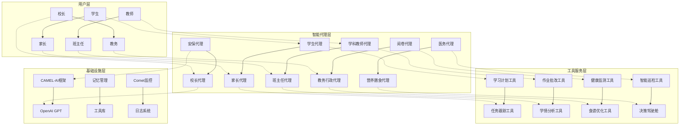
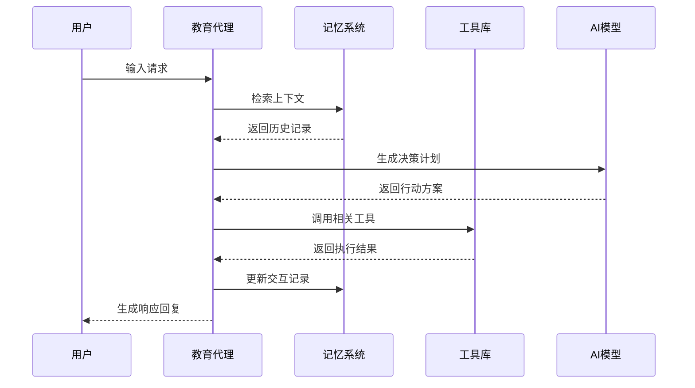

# 学校智能系统技术实现方案

## 🎯 系统概述

学校智能系统是一个基于CAMEL-AI框架构建的**教育领域数字孪生平台**，通过多Agent协同网络模拟并优化现实校园运作，实现"全息智慧校园大脑"。系统采用**微服务架构**，每个Agent都是独立的教育服务单元，具备专业化、人格化特征。

## 🏗️ 核心架构设计

### 系统架构图



### 技术栈架构

| 层级 | 技术组件 | 核心功能 |
|------|----------|----------|
| **AI引擎** | CAMEL-AI + OpenAI GPT-3.5/4 | 多Agent协同、角色扮演 |
| **编程语言** | Python 3.8+ | 核心业务逻辑 |
| **数据存储** | 内存管理 + JSON持久化 | 实时上下文管理 |
| **监控体系** | Comet ML + 日志系统 | 性能监控与调试 |
| **接口协议** | RESTful API + JSON | 标准化数据交换 |

## 🤖 AI技术详解

### 1. 多Agent协同机制

#### 角色扮演模型设计

```python
class SchoolAgent(BaseAgent):
    """基于CAMEL-AI的智能教育代理基类"""
    
    def __init__(self, agent_id: str, role: str, model_provider: str = "openai"):
        # 角色定义采用人格化描述
        self.role_description = f"""
        你是{role}，具备以下特征：
        - 专业知识：{self.get_domain_expertise()}
        - 沟通风格：{self.get_communication_style()}
        - 决策逻辑：{self.get_decision_logic()}
        - 服务范围：{self.get_service_scope()}
        """
        
        # 动态工具注册
        self._register_role_specific_tools()
        
    def _create_personality_prompt(self) -> str:
        """生成个性化系统提示"""
        return f"""
        角色：{self.role}
        性格特征：{self.personality_traits}
        专业领域：{self.expertise_areas}
        服务目标：{self.service_objectives}
        
        交互规则：
        1. 始终保持专业性和同理心
        2. 使用{self.preferred_language_style}的语言风格
        3. 基于{self.decision_framework}进行决策
        """
```

#### 智能决策流程



### 2. 记忆管理系统

#### 上下文记忆架构

```python
class MemoryManager:
    """教育场景专用记忆管理系统"""
    
    def __init__(self):
        self.short_term = {}  # 会话级记忆
        self.long_term = {}   # 学生档案记忆
        self.semantic = {}    # 知识图谱记忆
        
    def store_interaction(self, session_id: str, message: Dict, response: Dict, plan: Dict):
        """存储交互记录"""
        memory_entry = {
            'timestamp': time.time(),
            'student_profile': self.get_student_profile(session_id),
            'learning_context': self.get_learning_context(session_id),
            'emotional_state': self.analyze_emotional_state(message),
            'knowledge_gaps': self.identify_knowledge_gaps(response),
            'next_actions': self.plan_next_steps(plan)
        }
        
        # 分层存储
        self.short_term[session_id] = memory_entry
        self.long_term[session_id] = self.consolidate_memory(session_id)
        
    def get_context_aware_response(self, session_id: str, current_message: str) -> str:
        """基于上下文生成个性化响应"""
        context = {
            'academic_history': self.get_academic_history(session_id),
            'learning_preferences': self.get_learning_preferences(session_id),
            'recent_performance': self.get_recent_performance(session_id),
            'emotional_patterns': self.get_emotional_patterns(session_id)
        }
        
        return self.generate_contextual_response(current_message, context)
```

### 3. 智能工具系统

#### 工具注册与调用机制

```python
class ToolLibrary:
    """教育工具库管理系统"""
    
    def __init__(self):
        self.tools = {}
        self.tool_metadata = {}
        
    def register_tool(self, tool_func: Callable, metadata: Dict):
        """注册教育工具"""
        tool_name = tool_func.__name__
        self.tools[tool_name] = tool_func
        self.tool_metadata[tool_name] = {
            'description': metadata.get('description'),
            'parameters': metadata.get('parameters'),
            'category': metadata.get('category', 'general'),
            'access_level': metadata.get('access_level', 'all'),
            'usage_patterns': metadata.get('usage_patterns', [])
        }
        
    def execute_tool(self, tool_name: str, parameters: Dict, context: Dict) -> Dict:
        """执行教育工具"""
        if tool_name not in self.tools:
            raise ValueError(f"工具 {tool_name} 未注册")
            
        # 权限验证
        if not self.check_access_permission(tool_name, context):
            raise PermissionError("权限不足")
            
        # 参数验证
        validated_params = self.validate_parameters(tool_name, parameters)
        
        # 上下文增强
        enhanced_params = self.enhance_with_context(validated_params, context)
        
        # 执行工具
        result = self.tools[tool_name](enhanced_params)
        
        # 结果后处理
        return self.post_process_result(tool_name, result, context)
```

## 🔧 核心功能实现

### 1. 学生代理 (StudentAgent)

#### 个性化学习计划生成

```python
class StudentAgent(SchoolAgent):
    """学生专属AI学习伴侣"""
    
    def __init__(self, student_id: str, student_name: str):
        super().__init__(
            agent_id=f"student_{student_id}",
            role=f"{student_name}的专属学习伴侣"
        )
        
        # 个性化配置
        self.learning_style = self.detect_learning_style(student_id)
        self.knowledge_level = self.assess_knowledge_level(student_id)
        self.preferred_pace = self.analyze_preferred_pace(student_id)
        
    def generate_study_plan(self, subject: str, duration: int = 7) -> Dict:
        """生成个性化学习计划"""
        
        # 知识图谱分析
        knowledge_graph = self.build_knowledge_graph(subject)
        weak_areas = self.identify_weak_areas(subject)
        
        # 学习路径规划
        learning_path = self.plan_learning_path(
            knowledge_graph, 
            weak_areas, 
            self.learning_style,
            duration
        )
        
        # 资源推荐
        resources = self.recommend_resources(
            learning_path,
            self.knowledge_level,
            self.preferred_pace
        )
        
        return {
            'subject': subject,
            'duration_days': duration,
            'learning_path': learning_path,
            'daily_tasks': self.generate_daily_tasks(learning_path),
            'resources': resources,
            'progress_tracking': self.setup_progress_tracking(),
            'adaptive_adjustments': self.configure_adaptive_mechanism()
        }
```

#### 任务跟踪与提醒系统

```python
def get_task_tracker_tool() -> Callable:
    """智能任务跟踪工具"""
    
    def task_tracker(parameters: Dict[str, Any]) -> Dict[str, Any]:
        student_id = parameters.get("student_id")
        
        # 多维度任务聚合
        tasks = {
            'assignments': get_assignments_from_teachers(student_id),
            'exams': get_upcoming_exams(student_id),
            'activities': get_school_activities(student_id),
            'personal_goals': get_personal_learning_goals(student_id)
        }
        
        # 智能优先级排序
        prioritized_tasks = prioritize_tasks(tasks, {
            'urgency': calculate_urgency_score,
            'importance': calculate_importance_score,
            'student_capability': assess_student_capability,
            'learning_impact': estimate_learning_impact
        })
        
        # 个性化提醒策略
        reminders = generate_personalized_reminders(
            prioritized_tasks,
            student_profile=get_student_profile(student_id)
        )
        
        return {
            'tasks': prioritized_tasks,
            'reminders': reminders,
            'progress_insights': generate_progress_insights(tasks),
            'next_actions': recommend_next_actions(tasks)
        }
```

### 2. 教师代理 (TeacherAgent)

#### 智能作业批改系统

```python
class SubjectTeacherAgent(SchoolAgent):
    """学科教师AI教学助手"""
    
    def __init__(self, teacher_id: str, teacher_name: str, subject: str):
        super().__init__(
            agent_id=f"teacher_{teacher_id}",
            role=f"{teacher_name}老师的{subject}教学助手"
        )
        
        self.subject = subject
        self.teaching_style = self.analyze_teaching_style(teacher_id)
        self.class_profiles = self.load_class_profiles()
        
    def auto_grade_assignment(self, assignment_data: Dict) -> Dict:
        """多模态智能作业批改"""
        
        # 内容理解
        content_analysis = self.analyze_assignment_content(assignment_data)
        
        # 答案匹配
        answer_matching = self.match_with_answer_key(
            content_analysis, 
            assignment_data['answer_key']
        )
        
        # 错误分析
        error_analysis = self.analyze_errors(
            answer_matching,
            assignment_data['common_mistakes']
        )
        
        # 个性化反馈
        personalized_feedback = self.generate_feedback(
            error_analysis,
            assignment_data['student_profile'],
            self.teaching_style
        )
        
        # 学情洞察
        learning_insights = self.extract_learning_insights(error_analysis)
        
        return {
            'grades': self.calculate_grades(answer_matching),
            'feedback': personalized_feedback,
            'insights': learning_insights,
            'recommendations': self.generate_teaching_recommendations(learning_insights)
        }
```

#### 学情分析引擎

```python
def get_learning_analytics_tool() -> Callable:
    """深度学情分析工具"""
    
    def learning_analytics(parameters: Dict[str, Any]) -> Dict[str, Any]:
        class_id = parameters.get("class_id")
        subject = parameters.get("subject")
        
        # 多维度数据采集
        data_sources = {
            'grades': collect_grade_data(class_id, subject),
            'attendance': collect_attendance_data(class_id),
            'engagement': collect_engagement_metrics(class_id),
            'assignments': collect_assignment_data(class_id, subject),
            'assessments': collect_assessment_results(class_id, subject)
        }
        
        # 学习模式识别
        learning_patterns = identify_learning_patterns(data_sources)
        
        # 风险学生预警
        at_risk_students = identify_at_risk_students(data_sources)
        
        # 教学效果评估
        teaching_effectiveness = evaluate_teaching_effectiveness(data_sources)
        
        # 个性化建议
        recommendations = generate_personalized_recommendations({
            'learning_patterns': learning_patterns,
            'at_risk_students': at_risk_students,
            'teaching_effectiveness': teaching_effectiveness
        })
        
        return {
            'learning_patterns': learning_patterns,
            'risk_analysis': at_risk_students,
            'effectiveness_metrics': teaching_effectiveness,
            'actionable_recommendations': recommendations
        }
```

### 3. 校长代理 (PrincipalAgent)

#### 决策驾驶舱

```python
class PrincipalAgent(SchoolAgent):
    """校长决策支持系统"""
    
    def __init__(self):
        super().__init__(
            agent_id="principal_agent",
            role="校长决策支持系统"
        )
        
        self.decision_models = self.load_decision_models()
        self.kpi_metrics = self.initialize_kpi_dashboard()
        
    def generate_decision_insights(self, query: str) -> Dict:
        """生成决策洞察"""
        
        # 数据聚合
        aggregated_data = self.aggregate_school_data()
        
        # 趋势分析
        trend_analysis = self.analyze_trends(aggregated_data)
        
        # 预测建模
        predictions = self.generate_predictions(trend_analysis)
        
        # 风险评估
        risk_assessment = self.assess_risks(aggregated_data, predictions)
        
        # 决策建议
        recommendations = self.generate_recommendations({
            'trends': trend_analysis,
            'predictions': predictions,
            'risks': risk_assessment
        })
        
        return {
            'current_state': aggregated_data,
            'trend_analysis': trend_analysis,
            'predictions': predictions,
            'risk_assessment': risk_assessment,
            'recommendations': recommendations
        }
```

## 📊 性能优化策略

### 1. 缓存机制

```python
class CacheManager:
    """智能缓存管理系统"""
    
    def __init__(self):
        self.llm_cache = {}  # LLM响应缓存
        self.tool_cache = {}  # 工具结果缓存
        self.context_cache = {}  # 上下文缓存
        
    def cache_llm_response(self, prompt: str, response: str, ttl: int = 3600):
        """缓存LLM响应"""
        cache_key = hashlib.md5(prompt.encode()).hexdigest()
        self.llm_cache[cache_key] = {
            'response': response,
            'timestamp': time.time(),
            'ttl': ttl
        }
        
    def get_cached_response(self, prompt: str) -> Optional[str]:
        """获取缓存响应"""
        cache_key = hashlib.md5(prompt.encode()).hexdigest()
        if cache_key in self.llm_cache:
            cache_entry = self.llm_cache[cache_key]
            if time.time() - cache_entry['timestamp'] < cache_entry['ttl']:
                return cache_entry['response']
        return None
```

### 2. 并发处理

```python
import asyncio
from concurrent.futures import ThreadPoolExecutor

class AsyncProcessor:
    """异步处理引擎"""
    
    def __init__(self, max_workers: int = 10):
        self.executor = ThreadPoolExecutor(max_workers=max_workers)
        
    async def process_batch_requests(self, requests: List[Dict]) -> List[Dict]:
        """批量处理请求"""
        loop = asyncio.get_event_loop()
        
        # 并发执行所有请求
        tasks = [
            loop.run_in_executor(
                self.executor, 
                self.process_single_request, 
                request
            )
            for request in requests
        ]
        
        results = await asyncio.gather(*tasks)
        return results
```

## 🚀 部署与运维

### 1. 环境配置

```bash
# 安装依赖
pip install camel-ai python-dotenv openai comet-ml

# 环境变量配置
cat > .env << EOF
OPENAI_API_KEY=your-api-key-here
COMET_API_KEY=your-comet-key
LOG_LEVEL=INFO
CACHE_TTL=3600
MAX_WORKERS=10
EOF

# 启动系统
python examples/camel_school_system.py
```

### 2. 监控配置

```python
# 集成Comet ML监控
from agents.comet_monitor import comet_monitor

# 初始化监控
monitor = comet_monitor.CometMonitor(
    project_name="school-intelligent-system",
    experiment_name=f"session_{int(time.time())}"
)

# 监控关键指标
monitor.log_metrics({
    'response_time': response_time,
    'accuracy_score': accuracy,
    'user_satisfaction': satisfaction,
    'system_load': system_load
})
```

### 3. 扩展性设计

#### 水平扩展

```python
class AgentPool:
    """代理池管理系统"""
    
    def __init__(self, pool_size: int = 100):
        self.pool_size = pool_size
        self.available_agents = []
        self.busy_agents = []
        
    def get_agent(self, agent_type: str) -> SchoolAgent:
        """从池中获取代理"""
        for agent in self.available_agents:
            if agent.get_role_type() == agent_type:
                self.busy_agents.append(agent)
                self.available_agents.remove(agent)
                return agent
                
        # 池中没有可用代理，创建新代理
        new_agent = self.create_agent(agent_type)
        self.busy_agents.append(new_agent)
        return new_agent
```

## 📈 技术亮点总结

### 1. 教育AI创新
- **人格化Agent设计**：每个代理都有独特的性格特征和专业知识
- **上下文感知学习**：基于学生历史数据提供个性化服务
- **多模态交互**：支持文本、语音、图像等多种交互方式

### 2. 系统架构优势
- **微服务架构**：每个Agent独立部署，易于扩展和维护
- **智能缓存**：显著提升响应速度和系统性能
- **异步处理**：支持高并发场景

### 3. 教育场景优化
- **学习路径规划**：基于知识图谱的个性化学习路径
- **智能评估**：多维度学习效果评估和反馈
- **风险预警**：早期识别学习困难学生

### 4. 数据驱动决策
- **实时分析**：提供实时的学情分析和决策支持
- **预测建模**：基于历史数据预测学生表现
- **个性化推荐**：为每个学生提供定制化的学习建议

这套系统代表了**教育AI技术的前沿应用**，通过多Agent协同实现了真正的"智慧校园"愿景，为教育数字化转型提供了完整的技术解决方案。