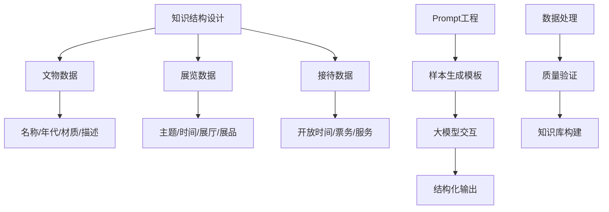

以下是一个面向博物馆领域结构化知识数据构造的完整方案，包含框架设计、实施步骤和Python代码示例：

### 一、框架设计


### 二、实施步骤
1. **知识结构定义**：
   - 文物：名称、年代、材质、尺寸、描述、文化背景
   - 展览：主题、时间、展厅、展品列表、参观路线
   - 接待：开放时间、票务规则、交通指南、服务设施

2. **Prompt设计原则**：
   - 明确输出格式要求（JSON）
   - 提供示例样本
   - 限定生成范围
   - 添加多样性约束

3. **数据生成流程**：
   ```mermaid
   sequenceDiagram
      用户->>+系统： 输入生成请求
      系统->>+LLM： 发送结构化Prompt
       LLM->>-系统： 返回JSON数据
       系统->>+验证模块： 数据校验
       验证模块-->>-用户： 输出合格数据
   ```

### 三、代码实现
```python
import openai
import json
import random

# 初始化OpenAI客户端（替换为你的API密钥）
client = openai.OpenAI(api_key="your-api-key")

# 结构化Prompt模板
PROMPT_TEMPLATES = {
    "artifact": """
请生成博物馆文物结构化数据，要求：
1. 包含以下字段： 
   name: 文物名称（中文）
   era: 历史年代（朝代或公元年份）
   material: 材质
   size: 尺寸规格
   description: 60字以内描述
   cultural_significance: 文化价值说明
2. 数据真实合理，符合历史背景
3. 输出为纯JSON格式，不要额外文本

示例：
{
  "name": "青铜兽面纹尊",
  "era": "商代晚期",
  "material": "青铜",
  "size": "高45cm，口径38cm",
  "description": "商代典型青铜酒器，器身饰兽面纹与云雷纹，造型庄重威严。",
  "cultural_significance": "反映商代青铜铸造技术和宗教祭祀文化"
}

请生成新的文物数据：
""",

    "exhibition": """
生成博物馆展览信息，要求：
1. 包含字段：
   title: 展览标题
   period: 展期（起止日期）
   location: 展厅位置
   featured_artifacts: 3件重点展品名称列表
   theme: 展览主题（30字以内）
2. 数据逻辑合理
3. 输出为JSON格式

示例：
{
  "title": "大唐风华特展",
  "period": "2023-09-15至2024-02-20",
  "location": "一层东展厅",
  "featured_artifacts": ["三彩骆驼载乐俑", "鎏金舞马衔杯纹银壶", "颜真卿祭侄文稿"],
  "theme": "展示唐代政治经济文化成就与社会生活风貌"
}

请生成新展览数据：
""",

    "reception": """
生成博物馆日常接待信息，要求：
1. 包含字段：
   opening_hours: 开放时间（含闭馆日）
   ticket_policy: 票务政策
   transportation: 主要交通方式
   facilities: 服务设施列表
2. 数据符合国内博物馆常规
3. 输出为JSON

示例：
{
  "opening_hours": "周二至周日9:00-17:00（16:30停止入场），周一闭馆",
  "ticket_policy": "免费开放，需提前预约",
  "transportation": "地铁8号线美术馆站A口，公交103、111路美术馆站",
  "facilities": ["无障碍通道", "语音导览租赁", "母婴室", "文创商店"]
}

请生成新接待数据：
"""
}

def generate_structured_data(data_type, num_samples=5):
    """生成结构化数据样本"""
    results = []
    for _ in range(num_samples):
        response = client.chat.completions.create(
            model="gpt-4-turbo",
            messages=[{"role": "user", "content": PROMPT_TEMPLATES[data_type]}],
            temperature=0.7,
            max_tokens=500
        )
        raw_data = response.choices[0].message.content
        
        try:
            # 提取JSON数据
            json_data = json.loads(raw_data.strip())
            results.append(json_data)
        except json.JSONDecodeError:
            print(f"JSON解析失败: {raw_data}")
    
    return results

def validate_data(data, data_type):
    """数据验证逻辑"""
    required_fields = {
        "artifact": ["name", "era", "material", "description"],
        "exhibition": ["title", "period", "location", "featured_artifacts"],
        "reception": ["opening_hours", "ticket_policy", "transportation"]
    }
    
    for item in data:
        missing = [field for field in required_fields[data_type] if field not in item]
        if missing:
            print(f"数据验证失败，缺少字段: {missing}")
            return False
    
    # 添加领域特定验证（示例）
    if data_type == "artifact" and len(item["description"]) > 60:
        print("描述超过60字限制")
        return False
        
    return True

def save_to_knowledge_base(data, filename):
    """保存到知识库"""
    with open(filename, 'a', encoding='utf-8') as f:
        for item in data:
            f.write(json.dumps(item, ensure_ascii=False) + '\n')

# 主流程
if __name__ == "__main__":
    # 生成文物数据
    artifacts = generate_structured_data("artifact", 3)
    if validate_data(artifacts, "artifact"):
        save_to_knowledge_base(artifacts, "museum_artifacts.jsonl")
    
    # 生成展览数据
    exhibitions = generate_structured_data("exhibition", 2)
    if validate_data(exhibitions, "exhibition"):
        save_to_knowledge_base(exhibitions, "museum_exhibitions.jsonl")
    
    # 生成接待数据
    receptions = generate_structured_data("reception", 2)
    if validate_data(receptions, "reception"):
        save_to_knowledge_base(receptions, "museum_receptions.jsonl")
    
    print("结构化知识库构建完成！")
```

### 四、关键优化点
1. **Prompt工程增强**：
   ```python
   # 在模板中添加多样性约束
   "artifact": "...请确保生成不同朝代（从新石器时代到明清）和材质（陶器、青铜、瓷器、书画等）的文物..."
   ```

2. **数据验证强化**：
   ```python
   # 添加语义验证
   def semantic_validation(item):
       if "artifact" in item:
           # 验证年代与材质合理性
           if "青铜" in item["material"] and "新石器" in item["era"]:
               return False  # 新石器时代无青铜器
       return True
   ```

3. **批量生成优化**：
   ```python
   # 修改生成函数支持批量创建
   PROMPT_TEMPLATES["artifact"] += "\n请一次性生成3个不同类别的文物数据，以JSON数组形式输出"
   ```

4. **领域知识注入**：
   ```python
   # 在Prompt中添加领域约束
   museum_types = ["历史类", "艺术类", "科技类", "综合类"]
   selected_type = random.choice(museum_types)
   PROMPT_TEMPLATES["exhibition"] += f"\n注意：展览主题需符合{selected_type}博物馆的定位"
   ```

### 五、生成样本示例
```json
// 文物数据
{
  "name": "青花缠枝莲纹梅瓶",
  "era": "明代永乐年间",
  "material": "瓷器",
  "size": "高36.8cm，腹径21.5cm",
  "description": "永乐官窑精品，白釉青花，饰缠枝莲纹，釉面肥润，青花发色浓艳。",
  "cultural_significance": "体现明代景德镇官窑制瓷工艺巅峰成就"
}

// 展览数据
{
  "title": "丝绸之路文物精华展",
  "period": "2024-06-10至2024-12-10",
  "location": "三楼特展厅",
  "featured_artifacts": ["胡人骑驼俑", "波斯银币", "粟特文丝绸"],
  "theme": "展示丝路贸易与文化交融的历史见证"
}

// 接待数据
{
  "opening_hours": "每日9:00-18:00（17:00停止入馆），除夕闭馆",
  "ticket_policy": "常设展免费，特展80元/人，学生半价",
  "transportation": "地铁1号线博物馆站3号口，公交5路、18路、观光2线",
  "facilities": ["免费WiFi", "行李寄存", "轮椅租赁", "急救室"]
}
```

### 六、应用场景
1. 博物馆智能问答系统
2. 数字文物知识图谱构建
3. 虚拟导览内容生成
4. 教育课程素材自动生成

此方案通过精心设计的Prompt模板引导大模型生成结构化数据，结合验证机制确保数据质量，最终构建可扩展的博物馆领域知识库。实际应用中可根据需要调整字段结构和生成规则。