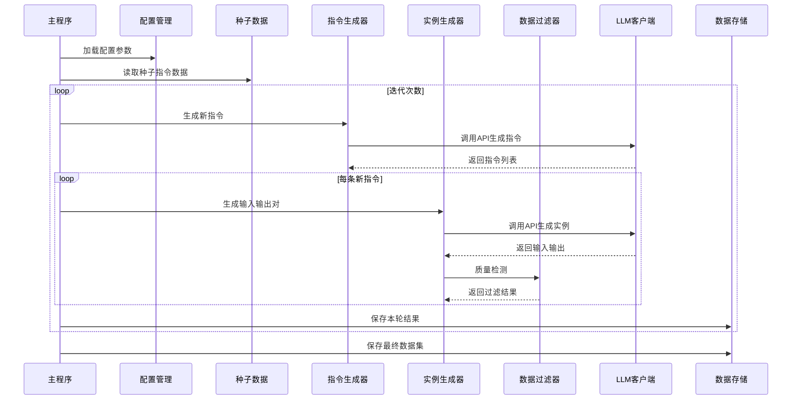

# Self-Instruct数据构造框架技术方案

## 项目概述

本项目是一个基于**Self-Instruct方法**的数据构造框架，通过迭代式生成和过滤机制，利用大语言模型（LLM）自动生成高质量的指令遵循数据集。该框架支持多轮迭代优化，具备完整的质量控制机制，可扩展性强。

## 技术架构

### 系统架构图

```
┌─────────────────┐    ┌──────────────────┐    ┌─────────────────┐
│   配置管理      │    │   数据生成引擎    │    │   质量控制系统   │
│   (Config)      │───▶│  (Generator)     │───▶│   (Filter)      │
└─────────────────┘    └──────────────────┘    └─────────────────┘
         │                       │                       │
         ▼                       ▼                       ▼
┌─────────────────┐    ┌──────────────────┐    ┌─────────────────┐
│   种子数据      │    │   LLM客户端      │    │   去重机制       │
│ (Seed Data)     │    │   (LLM Client)   │    │ (Deduplication) │
└─────────────────┘    └──────────────────┘    └─────────────────┘
```

### 核心模块设计

#### 1. 配置管理模块 (`src/config.py`)

**功能描述**：统一管理所有配置参数，支持JSON配置文件和运行时参数覆盖。

**关键配置项**：
- **LLM配置**：API密钥、基础URL、模型选择、温度参数
- **生成策略**：每轮生成数量、种子示例数量、迭代次数
- **质量控制**：最小指令长度、最小输出长度、黑名单关键词
- **重试机制**：API调用重试次数、重试间隔

**代码示例**：
```python
class Config:
    def __init__(self, config_path: str = None):
        # 默认配置
        self.api_key = "YOUR_API_KEY"
        self.base_url = "https://api.openai.com/v1"
        self.model = "gpt-3.5-turbo"
        self.temperature = 0.7
        self.max_tokens = 256
        self.retry_count = 3
        self.retry_delay = 5
        self.num_seed_examples = 3
        self.min_instruction_length = 5
        self.min_output_length = 5
        self.blacklist_keywords = ["色情", "暴力", "仇恨言论"]
```

#### 2. LLM客户端模块 (`src/llm.py`)

**功能描述**：封装与OpenAI API的交互逻辑，提供重试机制和错误处理。

**核心特性**：
- **连接池管理**：支持自定义base_url，兼容OpenAI和Ollama
- **智能重试**：指数退避重试策略
- **批量生成**：支持批量文本生成

**代码示例**：
```python
class LLMClient:
    def __init__(self, config):
        self.client = OpenAI(api_key=config.api_key, base_url=config.base_url)
    
    def generate(self, prompt: str, **kwargs) -> str:
        # 重试机制实现
        for attempt in range(self.retry_count):
            try:
                response = self.client.chat.completions.create(
                    model=self.model,
                    messages=[{"role": "user", "content": prompt}],
                    temperature=self.temperature,
                    max_tokens=self.max_tokens
                )
                return response.choices[0].message.content.strip()
            except Exception as e:
                if attempt < self.retry_count - 1:
                    time.sleep(self.retry_delay * (attempt + 1))
                else:
                    raise e
```

#### 3. 指令生成器 (`src/generator.py`)

**功能描述**：基于种子指令生成新的多样化任务指令。

**生成策略**：
- **多样性控制**：通过提示词工程确保生成指令覆盖不同领域
- **随机采样**：从种子数据中随机选择示例，避免偏差
- **格式清洗**：智能解析和清洗LLM响应格式

**提示词模板**：
```python
prompt_template = """
你是一个指令生成器。请基于以下示例生成{num_prompts}条新的、多样化的任务指令：
{seed_examples}

新指令要求：
1. 避免重复示例中的指令
2. 覆盖不同领域（写作、翻译、编码、分析、创作等）
3. 使用自然语言描述任务
4. 每条指令应该是独立的，不要有编号
5. 特别注意：生成至少三种不同任务类型

生成的指令列表：
"""
```

#### 4. 实例生成器 (`src/generator.py`)

**功能描述**：为每个生成的指令创建对应的输入-输出对。

**生成流程**：
1. **任务理解**：分析指令类型和要求
2. **输入生成**：创建符合指令要求的输入示例
3. **输出生成**：生成高质量的完成任务输出
4. **格式验证**：确保输出格式符合预期

**提示词模板**：
```python
instance_prompt = """
根据指令生成输入和输出：
指令：{instruction}

要求：
1. 如果任务不需要输入，填写"无"
2. 输出必须直接完成任务
3. 输入应该是真实、多样化的
4. 输出应该是高质量、有帮助的

请按以下格式回复：
输入：<在此生成任务输入>
输出：<在此生成任务输出>
"""
```

#### 5. 数据过滤器 (`src/filter.py`)

**功能描述**：多维度质量检测和清洗机制。

**过滤规则**：
- **长度过滤**：最小指令长度和输出长度限制
- **内容过滤**：黑名单关键词检测、道歉/拒绝表达过滤
- **有效性验证**：空值、无效输出检测

**实现代码**：
```python
class DataFilter:
    def __init__(self, config):
        self.blacklist = config.blacklist_keywords
        self.min_instruction_length = config.min_instruction_length
        self.min_output_length = config.min_output_length
        self.invalid_outputs = ["n/a", "我不知道", "无法回答", ""]
    
    def is_valid(self, instance: Dict[str, str]) -> bool:
        # 长度检测
        if len(instance["instruction"]) < self.min_instruction_length:
            return False
        
        # 输出有效性检测
        if instance["output"].lower() in self.invalid_outputs:
            return False
        
        # 关键词过滤
        if any(word in instance["instruction"].lower() for word in self.blacklist):
            return False
        
        return True
```

## 数据处理流程

### 时序图



### 详细流程步骤

#### 步骤1：环境初始化

**命令行参数**：
```bash
python main.py --config config/default.json \
               --seed_file data/seed_instructions.json \
               --output_dir output \
               --iterations 5 \
               --num_per_iter 100
```

**配置加载**：
```python
# 配置文件示例 (config/default.json)
{
  "api_key": "your_api_key_here",
  "base_url": "https://api.openai.com/v1",
  "model": "gpt-3.5-turbo",
  "temperature": 0.7,
  "max_tokens": 256,
  "retry_count": 3,
  "retry_delay": 5,
  "num_seed_examples": 3,
  "min_instruction_length": 5,
  "min_output_length": 5,
  "blacklist_keywords": ["色情", "暴力", "仇恨言论"]
}
```

#### 步骤2：种子数据准备

**数据结构**：
```json
[
  {
    "instruction": "翻译成法语",
    "input": "Hello world",
    "output": "Bonjour le monde"
  },
  {
    "instruction": "用Python实现快速排序算法",
    "input": "无",
    "output": "def quicksort(arr): ..."
  }
]
```

#### 步骤3：迭代生成流程

**主程序逻辑**：
```python
def main():
    # 1. 初始化
    config = Config(args.config)
    seed_data = load_json(args.seed_file)
    
    # 2. 初始化组件
    instruction_gen = InstructionGenerator(config)
    instance_gen = InstanceGenerator(config)
    data_filter = DataFilter(config)
    
    # 3. 迭代生成
    current_pool = seed_data.copy()
    
    for iter_idx in range(args.iterations):
        # 生成新指令
        new_instructions = instruction_gen.generate(
            current_pool, 
            num_to_generate=args.num_per_iter
        )
        
        # 生成实例并过滤
        new_data = []
        for instruction in new_instructions:
            instance = instance_gen.generate(instruction)
            if data_filter.is_valid(instance):
                new_data.append(instance)
        
        # 更新数据池
        current_pool.extend(new_data)
        
        # 保存检查点
        save_json(current_pool, f"output/iter_{iter_idx}.json")
    
    # 4. 保存最终结果
    save_json(current_pool, "output/self_instruct_final.json")
```

#### 步骤4：质量控制机制

**多维度质量检测**：
1. **语法检测**：指令长度、格式规范性
2. **内容安全**：敏感词汇过滤、不当内容检测
3. **有效性验证**：输出完整性、任务完成度
4. **重复检测**：文本相似度计算、语义去重

**去重策略**：
```python
def deduplicate_instructions(new_instructions, existing_instructions):
    # 文本匹配去重
    unique_instructions = []
    existing_lower = [inst.lower() for inst in existing_instructions]
    
    for inst in new_instructions:
        if inst.lower() not in existing_lower:
            unique_instructions.append(inst)
    
    return unique_instructions
```

## 扩展功能

### 1. 语义去重（可选）

**使用Sentence-BERT进行语义相似度计算**：
```python
def semantic_deduplicate(new_data, pool, threshold=0.8):
    from sentence_transformers import SentenceTransformer
    import numpy as np
    
    model = SentenceTransformer('paraphrase-multilingual-MiniLM-L12-v2')
    
    # 计算嵌入向量
    pool_embeddings = model.encode([d["instruction"] for d in pool])
    new_embeddings = model.encode([d["instruction"] for d in new_data])
    
    # 计算余弦相似度并过滤
    unique_data = []
    for i, item in enumerate(new_data):
        similarities = np.dot(new_embeddings[i], pool_embeddings.T) / \
                      (np.linalg.norm(new_embeddings[i]) * np.linalg.norm(pool_embeddings, axis=1))
        
        if np.max(similarities) < threshold:
            unique_data.append(item)
    
    return unique_data
```

### 2. 批量处理优化

**并发API调用**：
```python
import asyncio
from concurrent.futures import ThreadPoolExecutor

async def batch_generate_async(instructions, max_workers=5):
    with ThreadPoolExecutor(max_workers=max_workers) as executor:
        loop = asyncio.get_event_loop()
        tasks = [
            loop.run_in_executor(executor, instance_gen.generate, instruction)
            for instruction in instructions
        ]
        results = await asyncio.gather(*tasks)
    return results
```

### 3. 质量评分系统

**自动质量评估**：
```python
def calculate_quality_score(instance):
    score = 0
    
    # 指令清晰度评分
    instruction_length = len(instance["instruction"])
    if instruction_length > 10:
        score += 20
    
    # 输出完整性评分
    output_length = len(instance["output"])
    if output_length > 50:
        score += 30
    
    # 多样性评分（基于关键词覆盖）
    keywords = ["解释", "翻译", "实现", "分析", "创作"]
    matched = sum(1 for kw in keywords if kw in instance["instruction"])
    score += matched * 10
    
    return min(score, 100)
```

## 运行示例

### 1. 快速开始

```bash
# 安装依赖
pip install -r requirements.txt

# 运行基本生成
python main.py

# 使用自定义配置
python main.py --config config/custom.json --iterations 3 --num_per_iter 50
```

### 2. 输出结果

**生成数据示例**：
```json
{
  "instruction": "创作一篇关于未来城市生活的科幻短篇故事",
  "input": "无",
  "output": "在不远的未来，人类居住的城市变成了自给自足且充满科技奇迹的乌托邦..."
}
```

**日志输出**：
```
2024-01-01 10:00:00 - INFO - 加载种子指令: data/seed_instructions.json
2024-01-01 10:00:01 - INFO - 初始种子指令数量: 10
2024-01-01 10:00:02 - INFO - 开始第 1/5 轮迭代
2024-01-01 10:00:03 - INFO - 生成了 100 条新指令
2024-01-01 10:00:45 - INFO - 成功生成 85/100 条有效数据
2024-01-01 10:00:46 - INFO - 当前数据池大小: 95 (新增 85 条)
```

## 性能优化建议

### 1. API调用优化

- **请求缓存**：对相同提示词的结果进行缓存
- **批量处理**：使用批处理API减少调用次数
- **并发控制**：合理设置并发数避免API限制

### 2. 内存管理

- **流式处理**：大文件分块处理避免内存溢出
- **及时清理**：定期清理不再使用的中间数据
- **数据压缩**：使用压缩格式存储中间结果

### 3. 监控与调试

- **详细日志**：记录每次API调用的耗时和结果
- **性能指标**：统计生成成功率、质量评分分布
- **错误追踪**：建立错误日志和重试机制

## 部署指南

### 1. 环境要求

```bash
# 系统要求
Python 3.8+
OpenAI API密钥或Ollama本地部署

# 依赖安装
pip install -r requirements.txt

# 可选依赖（语义去重）
pip install sentence-transformers
```

### 2. 配置部署

**本地Ollama部署**：
```json
{
  "api_key": "ollama",
  "base_url": "http://localhost:11434/v1",
  "model": "qwen2:latest"
}
```

**云端OpenAI部署**：
```json
{
  "api_key": "sk-your-openai-key",
  "base_url": "https://api.openai.com/v1",
  "model": "gpt-3.5-turbo"
}
```

### 3. 生产环境配置

**Docker部署**：
```dockerfile
FROM python:3.9-slim

WORKDIR /app
COPY requirements.txt .
RUN pip install -r requirements.txt

COPY . .
CMD ["python", "main.py"]
```

**环境变量配置**：
```bash
export OPENAI_API_KEY="your_api_key"
export CONFIG_PATH="config/production.json"
```

## 最佳实践

### 1. 种子数据设计

- **领域覆盖**：确保种子指令覆盖目标应用场景
- **质量优先**：少量高质量种子优于大量低质量种子
- **格式统一**：保持指令、输入、输出格式的一致性

### 2. 参数调优

- **温度设置**：0.7-0.8平衡创造性和稳定性
- **生成长度**：根据任务复杂度调整max_tokens
- **迭代次数**：3-5次迭代通常足够，过多可能导致质量下降

### 3. 质量监控

- **人工抽检**：每轮迭代后人工检查10%的生成数据
- **自动评分**：建立基于规则和机器学习的质量评分系统
- **反馈循环**：根据质量评估结果调整生成参数

## 故障排除

### 常见问题及解决方案

| 问题描述 | 可能原因 | 解决方案 |
|---------|----------|----------|
| API调用超时 | 网络延迟或API限制 | 增加retry_delay，降低并发数 |
| 生成质量低 | 温度设置过高 | 降低temperature值 |
| 重复内容多 | 去重阈值设置不当 | 调整语义相似度阈值 |
| 内存溢出 | 数据量过大 | 使用流式处理，分批保存 |

## 项目结构

```
p-llm-datacreator/
├── src/                    # 核心源代码
│   ├── __init__.py
│   ├── config.py          # 配置管理
│   ├── generator.py       # 指令和实例生成器
│   ├── filter.py          # 数据过滤器
│   ├── llm.py            # LLM客户端
│   └── utils.py          # 工具函数
├── config/                # 配置文件
│   ├── default.json      # 默认配置
│   └── custom.json       # 自定义配置模板
├── data/                 # 种子数据
│   └── seed_instructions.json
├── output/              # 生成结果
├── examples/            # 使用示例
├── main.py             # 主程序入口
├── requirements.txt    # 依赖列表
└── README.md          # 项目文档
```

## 许可证

本项目采用MIT许可证，详见LICENSE文件。

## 贡献指南

欢迎提交Issue和Pull Request来改进项目。在贡献代码前，请：

1. 阅读并遵循代码风格指南
2. 为新功能添加相应的测试用例
3. 更新相关文档
4. 确保所有测试通过

## 联系信息

如有问题或建议，请通过GitHub Issues联系项目维护者。