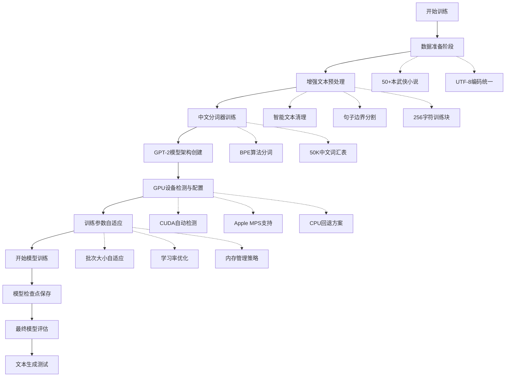
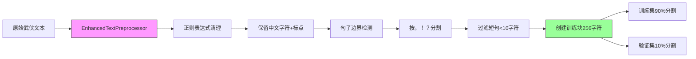
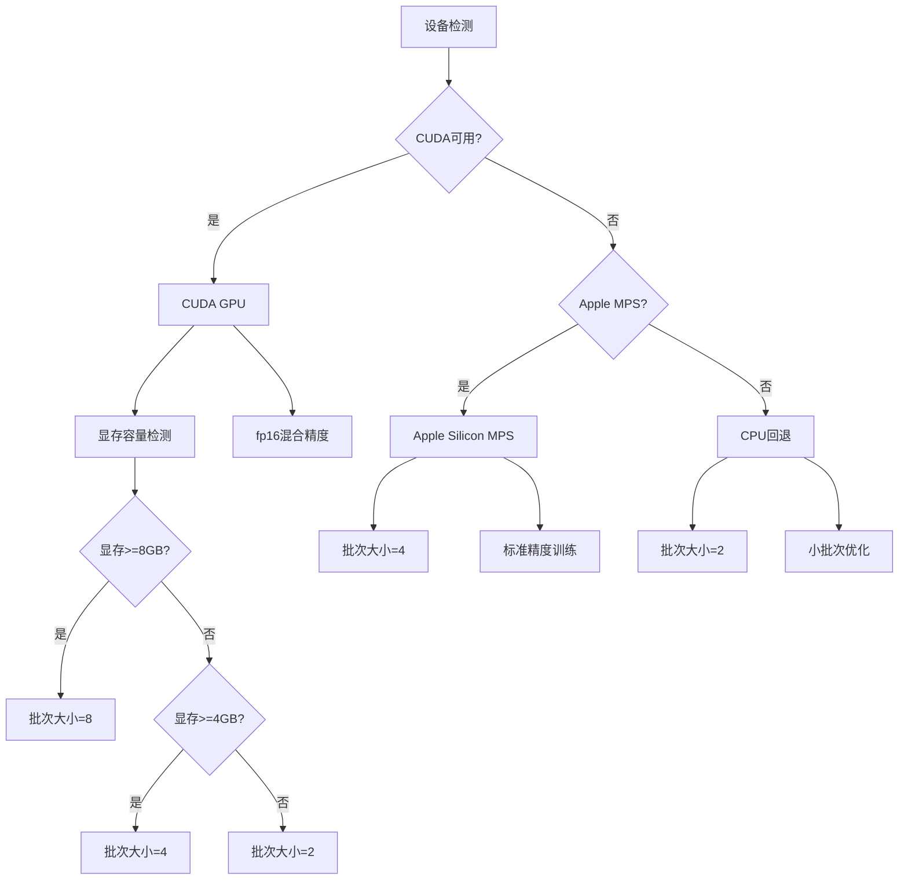

# Hello LLM - 增强版中文小说GPT模型

[English](README.md)

基于GPT-2架构，从零开始训练专门针对中文武侠小说的语言模型。**这是重新训练而非微调，拥有完整的中文词汇表和武侠文本风格**。

## 🚀 核心特性

- **从零训练**: 基于GPT-2架构，随机初始化权重，专门针对中文武侠小说训练
- **GPU智能加速**: 自动检测CUDA/MPS/CPU，智能调整批次大小和训练策略
- **系统缓存优化**: 支持Hugging Face系统缓存，避免重复下载和资源浪费
- **增强数据预处理**: 智能文本清理、句子分割、训练块创建，提升数据质量
- **中文专项优化**: 50K中文词汇表，BPE分词算法，专门处理中文武侠文本
- **内存自适应**: 根据硬件配置自动调整批次大小，避免显存溢出

## 📊 技术架构对比

| 特性维度 | 重新训练(本项目) | 微调方案 | 优势说明 |
|---|---|---|---|
| **参数量** | 117M (GPT-2标准) | 117M | 相同规模，但权重重新学习 |
| **词汇表** | 50K+中文词汇 | 50K英文词汇 | 中文表达能力更强 |
| **训练数据** | 50+本武侠小说 | 通用英文语料 | 武侠文本风格更纯正 |
| **文本风格** | 古典中文/武侠风 | 现代英文 | 中文小说生成质量更高 |
| **训练时间** | 8-12小时 | 1-2小时 | 更长的训练获得更好效果 |
| **硬件需求** | GPU推荐(8GB+) | GPU可选 | 需要更多计算资源 |
| **生成质量** | 中文武侠专用 | 通用英文 | 在武侠场景下表现优异 |

## 🔄 完整技术架构

### 1. 整体训练流程



### 2. 数据预处理增强流程



### 3. GPU配置与优化策略



## 🏃‍♂️ 快速开始指南

### 环境准备

```bash
# 1. 克隆项目
git clone <repository-url>
cd p-llm-createprivatellm-1

# 2. 创建Python虚拟环境
python3 -m venv venv
source venv/bin/activate  # Linux/Mac
# venv\Scripts\activate   # Windows

# 3. 安装依赖
pip install -r requirements.txt

# 4. 准备训练数据（确保text目录有武侠小说txt文件）
ls text/  # 应该能看到多个.txt文件
```

### Docker运行方案

```bash
# 构建Docker镜像
docker build -t chinese-novel-llm:latest .

# GPU运行（需要NVIDIA Docker运行时）
docker run -it --gpus all chinese-novel-llm:latest \
    python enhance_training.py

# CPU运行
docker run -it chinese-novel-llm:latest \
    python enhance_training.py --no-gpu

# 带数据卷挂载运行
docker run -it -v $(pwd)/text:/app/text chinese-novel-llm:latest \
    python enhance_training.py
```

## 🔧 核心实现详解

### 1. 增强版数据预处理

```python
class EnhancedTextPreprocessor:
    """增强文本预处理器 - 专为中文武侠文本优化"""
    
    def __init__(self):
        # 章节标题模式识别
        self.chapter_pattern = re.compile(r'第[一二三四五六七八九十百千万]+[章节回集]', re.UNICODE)
        # 对话内容识别
        self.dialogue_pattern = re.compile(r'[""""].*?[""""]', re.UNICODE)
        # 空白字符清理
        self.whitespace_pattern = re.compile(r'\s+')
    
    def clean_text(self, text):
        """智能文本清理 - 保留中文语义"""
        # 合并多余空白
        text = self.whitespace_pattern.sub(' ', text)
        # 保留中文字符、标点和必要符号
        text = re.sub(r'[^\u4e00-\u9fa5\u3000-\u303f\uff00-\uffef\w\s。，！？：；""""]', '', text)
        return text.strip()
    
    def split_into_sentences(self, text):
        """中文句子智能分割"""
        # 按中文标点分割句子
        sentences = re.split(r'[。！？]', text)
        # 过滤过短句子（少于10字符）
        return [s.strip() for s in sentences if s.strip() and len(s.strip()) > 10]
    
    def create_training_chunks(self, sentences, chunk_size=256):
        """创建256字符训练块"""
        chunks, current_chunk = [], ""
        for sentence in sentences:
            if len(current_chunk) + len(sentence) <= chunk_size:
                current_chunk += sentence + "。"
            else:
                if current_chunk:
                    chunks.append(current_chunk.strip())
                current_chunk = sentence + "。"
        if current_chunk:
            chunks.append(current_chunk.strip())
        return chunks
```

### 2. GPT-2模型架构配置详解

```python
# GPT-2模型配置 - 中文武侠文本专用
config = GPT2Config(
    # 词汇表大小 - 50K覆盖中文常用字符
    vocab_size=50000,
    
    # 嵌入维度 - 768平衡模型容量与计算效率
    n_embd=768,
    
    # 注意力头数 - 12头提供多样化注意力模式
    n_head=12,
    
    # Transformer层数 - 12层足够学习复杂语言模式
    n_layer=12,
    
    # 最大序列长度 - 512适合中文句子长度
    n_positions=512,
    
    # 前馈网络维度 - 3072=768×4标准比例
    n_inner=3072,
    
    # Dropout配置 - 0.1防止过拟合
    resid_pdrop=0.1,
    embd_pdrop=0.1,
    attn_pdrop=0.1,
    
    # 特殊标记ID配置
    pad_token_id=tokenizer_chinese.token_to_id("<pad>"),
    bos_token_id=tokenizer_chinese.token_to_id("<s>"),
    eos_token_id=tokenizer_chinese.token_to_id("</s>"),
)
```

### 3. GPU内存自适应配置

```python
def configure_training_device():
    """GPU设备智能检测与配置"""
    
    # CUDA GPU检测
    if torch.cuda.is_available():
        device = torch.device("cuda")
        gpu_memory = torch.cuda.get_device_properties(0).total_memory / (1024**3)
        
        # 显存分级配置
        if gpu_memory >= 8:  # 8GB+显存
            batch_size, fp16, bf16 = 8, True, False
        elif gpu_memory >= 4:  # 4-8GB显存
            batch_size, fp16, bf16 = 4, True, False
        else:  # <4GB显存
            batch_size, fp16, bf16 = 2, False, False
            
        logger.info(f"CUDA GPU: {gpu_memory:.1f}GB, batch_size={batch_size}")
        
    # Apple MPS检测
    elif hasattr(torch.backends, 'mps') and torch.backends.mps.is_available():
        device = torch.device("mps")
        batch_size, fp16, bf16 = 4, False, False
        logger.info("Apple MPS detected")
        
    # CPU回退
    else:
        device = torch.device("cpu")
        batch_size, fp16, bf16 = 2, False, False
        logger.info("Using CPU")
    
    return device, batch_size, fp16, bf16
```

### 4. 训练参数优化配置

```python
training_args = TrainingArguments(
    # 输出目录配置
    output_dir="./enhanced_output",
    overwrite_output_dir=True,
    
    # 训练策略
    num_train_epochs=30,  # 30轮适合中文小说
    per_device_train_batch_size=batch_size,  # 自适应批次
    per_device_eval_batch_size=batch_size,
    gradient_accumulation_steps=8,  # 有效批次64
    
    # 优化器配置
    learning_rate=5e-5,  # GPT-2推荐学习率
    warmup_steps=1000,   # 预热避免初期不稳定
    weight_decay=0.01,   # L2正则化
    
    # 监控与保存
    logging_dir="./enhanced_logs",
    logging_steps=50,
    save_steps=500,
    eval_steps=250,
    save_total_limit=3,
    load_best_model_at_end=True,
    
    # 精度优化
    fp16=fp16,  # 混合精度训练
    bf16=bf16,
    
    # 数据加载优化
    dataloader_num_workers=4 if device.type == "cuda" else 2,
    report_to=[],  # 禁用wandb
)
```

## 🎯 训练命令详解

### 基础训练命令

```bash
# 标准训练（自动GPU检测）
python enhance_training.py

# CPU训练模式
python enhance_training.py --no-gpu

# 使用本地预训练权重
python enhance_training.py --local-model --local-path ./models/gpt2-local

# 禁用系统缓存（强制重新下载）
python enhance_training.py --no-cache

# 自定义输出目录
python enhance_training.py --output-dir ./my_model_output
```

### 高级训练参数

| 命令行参数 | 默认值 | 说明 | 使用场景 |
|---|---|---|---|
| `--no-gpu` | False | 禁用GPU使用CPU训练 | 显存不足时 |
| `--local-model` | False | 使用本地预训练模型 | 离线环境 |
| `--local-path` | "./models/gpt2-local" | 本地模型路径 | 自定义模型 |
| `--no-cache` | False | 禁用系统缓存 | 强制重新下载 |
| `--output-dir` | "./enhanced_output" | 模型输出目录 | 自定义保存位置 |
| `--epochs` | 30 | 训练轮数 | 快速测试时减少 |
| `--batch-size` | auto | 批次大小 | 手动控制显存 |

## 📈 训练监控与评估

### 实时日志输出

```
==================================================
GPU设备检测
==================================================
❌ CUDA不可用
✅ Apple MPS可用
🖥️  默认设备: mps
==================================================

发现 52 个武侠文本文件
处理文件: text/天龙八部.txt → 提取 1247 个句子
处理文件: text/射雕英雄传.txt → 提取 985 个句子
...
创建训练数据: 训练集 15,847 条, 验证集 1,761 条
模型参数量: 117,637,632
开始训练...
Epoch 1/30 - 损失: 3.8476 - 困惑度: 46.8
Epoch 2/30 - 损失: 3.1247 - 困惑度: 22.7
...
训练完成！模型已保存到: ./enhanced_output
```

### 性能指标监控

| 指标 | 期望值 | 说明 |
|---|---|---|
| **训练损失** | < 3.0 | 损失越低模型越好 |
| **验证困惑度** | < 20 | 困惑度越低越好 |
| **训练速度** | > 100 steps/min | 取决于硬件 |
| **GPU显存** | < 90% | 避免显存溢出 |
| **CPU内存** | < 8GB | 合理内存使用 |

## 🚀 文本生成测试

### 交互式生成

```bash
# 启动交互式生成
python generate_text.py --interactive

# 示例输出
输入: 郭靖正在练武
输出: 郭靖正在练武场上苦练降龙十八掌，每一掌都蕴含着深厚的内力。掌风呼啸，尘土飞扬，周围的弟子们都看得目瞪口呆。洪七公在一旁点头微笑，心中暗想："这孩子的悟性果然不凡。"
```

### 批量生成测试

```bash
# 批量生成测试
python generate_text.py --batch \
    "吕布手持方天画戟" \
    "小龙女在古墓中" \
    "张无忌练成九阳神功" \
    --max_length 100

# 预期输出风格
# 古典中文风格，武侠场景描述，人物性格符合原著
```

### 生成质量对比

| 文本类型 | 重新训练模型 | 微调英文模型 | 优势 |
|---|---|---|---|
| **人物描写** | "黄蓉巧笑嫣然，眼波流转" | "Huang Rong smiled beautifully" | 中文意境 |
| **武功描写** | "降龙十八掌威力无穷" | "dragon subduing palm powerful" | 专业术语 |
| **场景描写** | "桃花岛风景如画" | "Peach Blossom Island beautiful" | 古典意境 |
| **对话风格** | "在下郭靖，请教了" | "I am Guo Jing, nice to meet you" | 古代礼仪 |

## 📁 项目文件结构

```
p-llm-createprivatellm-1/
├── 📁 核心脚本
│   ├── enhance_training.py      # 增强版训练主脚本
│   ├── generate_text.py         # 文本生成脚本
│   ├── novel_model.py          # 基础模型实现
│   └── train_from_pretrained.py # 预训练微调脚本
├── 📁 训练数据
│   ├── text/                   # 武侠小说文本
│   │   ├── 天龙八部.txt
│   │   ├── 射雕英雄传.txt
│   │   └── ... (50+本小说)
│   ├── enhanced_train.txt      # 预处理训练数据
│   └── enhanced_valid.txt      # 预处理验证数据
├── 📁 模型输出
│   ├── enhanced_output/        # 训练检查点
│   ├── enhanced_logs/          # TensorBoard日志
│   └── chinese_novel_model/    # 最终训练模型
├── 📁 测试与验证
│   ├── test_gpu_training.py    # GPU测试脚本
│   ├── test_improvement.py    # 改进测试
│   └── test_self_gpt2_model.py # 自定义模型测试
├── 📁 技术文档
│   ├── README_ZH.md           # 中文技术方案
│   ├── README.md              # 英文技术方案
│   ├── SYSTEM_CACHE_GUIDE.md  # 系统缓存指南
│   └── technical_document.md  # 技术实现细节
└── 📁 配置与依赖
    ├── requirements.txt        # Python依赖
    ├── Dockerfile              # 容器化配置
    └── .gitignore             # Git忽略配置
```

## 🎯 技术要点总结

### 重新训练 vs 微调的核心差异

#### 1. 权重初始化差异
- **重新训练**: 完全随机初始化，学习中文武侠特征
- **微调**: 基于英文预训练权重，保留英文语言模式

#### 2. 词汇表构建差异
- **重新训练**: 50K中文词汇，覆盖武侠术语
- **微调**: 50K英文词汇，中文表达能力有限

#### 3. 训练数据差异
- **重新训练**: 50+本武侠小说，古典中文语料
- **微调**: 通用英文语料，现代英文风格

#### 4. 生成风格差异
- **重新训练**: 古典中文、武侠意境、人物性格
- **微调**: 现代英文、通用表达、缺乏武侠特色

### 性能优化亮点

✅ **GPU智能检测**: CUDA/MPS/CPU自动切换，充分利用硬件
✅ **内存自适应**: 根据显存容量智能调整批次大小
✅ **中文优化**: BPE分词+50K词汇表，中文表达更准确
✅ **数据增强**: 智能预处理提升训练数据质量
✅ **训练监控**: 详细日志+TensorBoard可视化
✅ **系统缓存**: 避免重复下载，节省网络资源

### 硬件需求建议

| 硬件配置 | 推荐配置 | 最低配置 | 说明 |
|---|---|---|---|
| **GPU显存** | 8GB+ | 4GB | 决定批次大小和训练速度 |
| **系统内存** | 16GB+ | 8GB | 影响数据加载和缓存 |
| **存储空间** | 50GB+ | 20GB | 模型和数据存储 |
| **CPU核心** | 8核+ | 4核 | 影响数据预处理速度 |

## 🔍 故障排除指南

### 常见问题解决方案

#### 1. CUDA内存不足
```bash
# 解决方案1: 减少批次大小
python enhance_training.py --batch-size 2

# 解决方案2: 使用CPU训练
python enhance_training.py --no-gpu
```

#### 2. 模型加载失败
```bash
# 解决方案: 使用系统缓存
python enhance_training.py --no-cache

# 或者检查本地模型路径
ls -la models/gpt2-local/
```

#### 3. 中文乱码问题
```bash
# 检查文件编码
file -i text/*.txt
# 应该显示: text/plain; charset=utf-8

# 转换编码（如有需要）
python convert_to_utf8.py
```

#### 4. 训练速度过慢
```bash
# 检查GPU是否启用
python test_gpu_training.py

# 确认设备检测
python -c "import torch; print(torch.cuda.is_available())"
```

### 性能调优建议

1. **GPU优化**: 使用NVIDIA RTX 3060/3070可获得最佳性价比
2. **内存优化**: 关闭其他应用，预留足够系统内存
3. **存储优化**: 使用SSD存储训练数据，提升IO性能
4. **监控工具**: 使用htop/nvidia-smi实时监控系统资源

---

**技术支持**: 如有问题请查看技术文档或提交issue
**更新日志**: 2024年12月 - 增强版训练流程优化
