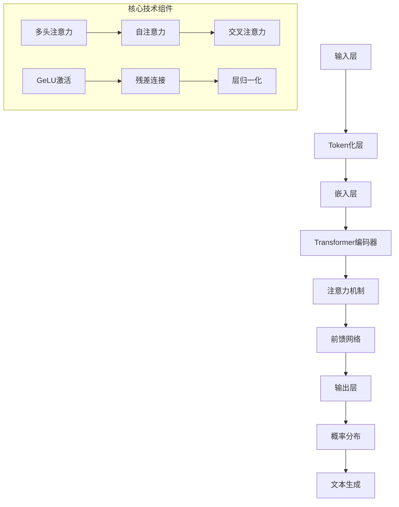

# LLM类模型技术详解与LangChain实战指南

## 1. LLM类模型深度解析

### 1.1 核心定义与架构原理

**LLM（Large Language Model）** 特指基于Transformer架构的大规模语言模型，其核心特征包括：

- **参数规模**: 通常包含数十亿到数万亿参数
- **上下文长度**: 支持4K-2M tokens的上下文窗口
- **多模态能力**: 文本、图像、音频、视频的统一理解
- **涌现能力**: 随着规模增长出现的复杂推理能力

### 1.2 技术架构分层



### 1.3 主流模型对比

| 模型名称 | 参数量 | 上下文长度 | 特点 | 适用场景 |
|---------|--------|------------|------|----------|
| GPT-4 | 1.76T | 128K | 多模态、推理强 | 复杂任务 |
| Claude-3 | 未公开 | 200K | 安全性高 | 企业应用 |
| Llama-2 | 7B-70B | 4K | 开源可商用 | 私有化部署 |
| ChatGLM-6B | 6B | 32K | 中文优化 | 中文场景 |
| Baichuan-13B | 13B | 4K | 双语支持 | 中英混合 |

## 2. LangChain架构深度解析

### 2.1 核心组件架构

```python
from langchain_core.language_models import BaseLanguageModel
from langchain_core.prompts import BasePromptTemplate
from langchain_core.chains import Chain
from langchain_core.memory import BaseMemory
from langchain_core.tools import BaseTool

class LangChainArchitecture:
    """LangChain核心架构实现"""
    
    def __init__(self):
        self.components = {
            "models": ["LLMs", "ChatModels", "Embeddings"],
            "prompts": ["PromptTemplate", "FewShotPrompt", "ChatPrompt"],
            "chains": ["LLMChain", "SequentialChain", "RouterChain"],
            "memory": ["ConversationBuffer", "VectorStoreRetriever"],
            "tools": ["Search", "Calculator", "API调用"]
        }
```

### 2.2 模型集成层设计

#### 2.2.1 多模型统一接口

```python
from langchain_openai import ChatOpenAI, OpenAI
from langchain_anthropic import ChatAnthropic
from langchain_community.llms import HuggingFaceHub, LlamaCpp
from typing import Dict, Any, Optional

class UnifiedLLMFactory:
    """统一LLM工厂模式"""
    
    _model_registry = {
        "gpt-4": {
            "class": ChatOpenAI,
            "params": {"temperature": 0.7, "max_tokens": 2000}
        },
        "claude-3": {
            "class": ChatAnthropic,
            "params": {"temperature": 0.7, "max_tokens": 2000}
        },
        "llama2-7b": {
            "class": LlamaCpp,
            "params": {"model_path": "path/to/llama2", "n_ctx": 4096}
        }
    }
    
    @classmethod
    def create_model(cls, model_name: str, **kwargs) -> BaseLanguageModel:
        """创建指定模型实例"""
        if model_name not in cls._model_registry:
            raise ValueError(f"Unsupported model: {model_name}")
        
        config = cls._model_registry[model_name]
        model_class = config["class"]
        params = {**config["params"], **kwargs}
        
        return model_class(**params)

# 使用示例
llm = UnifiedLLMFactory.create_model("gpt-4", api_key="your-key")
```

#### 2.2.2 动态模型切换

```python
from langchain_core.runnables import RunnableLambda, RunnablePassthrough

class DynamicModelRouter:
    """动态模型路由系统"""
    
    def __init__(self):
        self.models = {}
        self.routing_rules = {}
    
    def register_model(self, name: str, model: BaseLanguageModel, condition_func):
        """注册模型和路由条件"""
        self.models[name] = model
        self.routing_rules[name] = condition_func
    
    def route(self, input_data: Dict[str, Any]) -> BaseLanguageModel:
        """根据输入数据路由到合适模型"""
        for name, condition in self.routing_rules.items():
            if condition(input_data):
                return self.models[name]
        
        return self.models.get("default")

# 实现示例
router = DynamicModelRouter()
router.register_model("gpt-4", gpt4, lambda x: x.get("complexity", 0) > 0.8)
router.register_model("gpt-3.5", gpt35, lambda x: x.get("complexity", 0) <= 0.8)
```

## 3. 高级Prompt工程

### 3.1 结构化Prompt模板

```python
from langchain_core.prompts import ChatPromptTemplate, MessagesPlaceholder
from langchain_core.output_parsers import PydanticOutputParser
from pydantic import BaseModel, Field
from typing import List, Optional

class AnalysisResult(BaseModel):
    """结构化输出模型"""
    sentiment: str = Field(description="情感倾向")
    keywords: List[str] = Field(description="关键词列表")
    summary: str = Field(description="内容摘要")
    confidence: float = Field(description="置信度", ge=0.0, le=1.0)

class AdvancedPromptEngineering:
    """高级Prompt工程实现"""
    
    def __init__(self):
        self.output_parser = PydanticOutputParser(pydantic_object=AnalysisResult)
    
    def create_analysis_prompt(self) -> ChatPromptTemplate:
        """创建分析类Prompt模板"""
        
        system_template = """你是一个专业的文本分析专家。
        
        任务要求：
        1. 准确识别文本的情感倾向
        2. 提取核心关键词（最多5个）
        3. 生成简洁的内容摘要
        4. 给出置信度评估
        
        输出格式：{format_instructions}
        
        分析原则：
        - 客观中立，避免主观臆断
        - 关键词需具有代表性
        - 摘要不超过100字"""
        
        human_template = "请分析以下文本：{text}"
        
        return ChatPromptTemplate.from_messages([
            ("system", system_template),
            ("human", human_template)
        ]).partial(format_instructions=self.output_parser.get_format_instructions())

# 使用示例
engine = AdvancedPromptEngineering()
prompt = engine.create_analysis_prompt()
chain = prompt | llm | engine.output_parser
result = chain.invoke({"text": "这是一个关于人工智能的积极评价"})
```

### 3.2 Few-Shot学习模板

```python
from langchain_core.prompts import FewShotPromptTemplate, PromptTemplate

class FewShotLearningEngine:
    """Few-Shot学习引擎"""
    
    def __init__(self):
        self.examples = [
            {
                "input": "这个产品非常好用，界面简洁，功能强大",
                "output": "{"sentiment": "positive", "keywords": ["好用", "简洁", "强大"], "summary": "产品体验优秀"}"
            },
            {
                "input": "服务很差，响应慢，问题没解决",
                "output": "{"sentiment": "negative", "keywords": ["很差", "响应慢", "没解决"], "summary": "服务质量不佳"}"
            }
        ]
    
    def create_few_shot_prompt(self) -> FewShotPromptTemplate:
        """创建Few-Shot学习Prompt"""
        
        example_prompt = PromptTemplate(
            input_variables=["input", "output"],
            template="输入: {input}\n输出: {output}"
        )
        
        return FewShotPromptTemplate(
            examples=self.examples,
            example_prompt=example_prompt,
            prefix="以下是一个文本分析任务的示例：",
            suffix="输入: {input}\n输出:",
            input_variables=["input"]
        )

# 动态Few-Shot示例选择
class DynamicExampleSelector:
    """动态示例选择器"""
    
    def __init__(self, vector_store):
        self.vector_store = vector_store
    
    def select_examples(self, query: str, k: int = 3) -> List[Dict]:
        """基于相似度选择最相关的示例"""
        results = self.vector_store.similarity_search(query, k=k)
        return [self._format_example(doc) for doc in results]
```

## 4. 记忆系统实现

### 4.1 会话记忆管理

```python
from langchain.memory import ConversationBufferMemory, ConversationSummaryMemory
from langchain_community.vectorstores import Chroma
from langchain_community.embeddings import OpenAIEmbeddings

class AdvancedMemorySystem:
    """高级记忆系统实现"""
    
    def __init__(self, llm, embeddings_model):
        self.llm = llm
        self.embeddings = embeddings_model
        self.vector_store = Chroma(
            embedding_function=self.embeddings,
            collection_name="conversation_memory"
        )
        
    def create_hybrid_memory(self):
        """创建混合记忆系统"""
        
        # 短期记忆：保留最近对话
        short_term = ConversationBufferMemory(
            memory_key="chat_history",
            return_messages=True,
            max_token_limit=1000
        )
        
        # 长期记忆：向量存储历史对话
        long_term = ConversationSummaryMemory(
            llm=self.llm,
            memory_key="summary",
            max_token_limit=500
        )
        
        return {
            "short_term": short_term,
            "long_term": long_term,
            "vector_store": self.vector_store
        }
    
    def semantic_search_memory(self, query: str, k: int = 5) -> List[str]:
        """语义搜索历史记忆"""
        results = self.vector_store.similarity_search(query, k=k)
        return [doc.page_content for doc in results]

# 记忆增强链
class MemoryAugmentedChain:
    """记忆增强的对话链"""
    
    def __init__(self, llm, memory_system):
        self.llm = llm
        self.memory = memory_system
        
    def create_chain(self):
        """创建记忆增强链"""
        
        prompt = ChatPromptTemplate.from_messages([
            ("system", """你是一个有帮助的AI助手，拥有以下记忆：
            
            长期记忆摘要：{summary}
            
            相关历史对话：{relevant_history}
            
            当前对话：{chat_history}
            
            请基于以上信息，为用户提供准确、有帮助的回答。"""),
            ("human", "{input}")
        ])
        
        return (
            {
                "summary": lambda x: self.memory["long_term"].load_memory_variables({}),
                "relevant_history": lambda x: self.memory["vector_store"].similarity_search(x["input"]),
                "chat_history": lambda x: self.memory["short_term"].load_memory_variables({}),
                "input": RunnablePassthrough()
            }
            | prompt
            | self.llm
        )
```

## 5. 工具调用系统

### 5.1 动态工具注册

```python
from langchain_core.tools import StructuredTool
from langchain_community.tools import WikipediaQueryRun, DuckDuckGoSearchRun
from typing import Any, Dict, List
import inspect

class ToolRegistry:
    """动态工具注册系统"""
    
    def __init__(self):
        self.tools = {}
        self.categories = {}
    
    def register_tool(self, 
                     name: str, 
                     func: callable, 
                     description: str, 
                     schema: Dict[str, Any] = None):
        """注册工具"""
        
        if schema is None:
            schema = self._auto_generate_schema(func)
        
        tool = StructuredTool.from_function(
            func=func,
            name=name,
            description=description,
            args_schema=schema
        )
        
        self.tools[name] = tool
        
        # 自动分类
        category = self._categorize_tool(func)
        if category not in self.categories:
            self.categories[category] = []
        self.categories[category].append(tool)
    
    def _auto_generate_schema(self, func: callable) -> Dict[str, Any]:
        """自动生成函数参数schema"""
        sig = inspect.signature(func)
        schema = {
            "type": "object",
            "properties": {},
            "required": []
        }
        
        for param_name, param in sig.parameters.items():
            schema["properties"][param_name] = {
                "type": "string" if param.annotation == str else "number",
                "description": f"Parameter {param_name}"
            }
            
            if param.default == inspect.Parameter.empty:
                schema["required"].append(param_name)
        
        return schema
    
    def get_tools_by_category(self, category: str) -> List[StructuredTool]:
        """按类别获取工具"""
        return self.categories.get(category, [])

# 工具函数定义
def calculate(expression: str) -> str:
    """计算数学表达式"""
    try:
        result = eval(expression)
        return f"计算结果: {result}"
    except Exception as e:
        return f"计算错误: {str(e)}"

def search_web(query: str, max_results: int = 5) -> List[str]:
    """搜索网络信息"""
    search = DuckDuckGoSearchRun()
    return search.run(query)

def get_weather(location: str) -> str:
    """获取天气信息"""
    # 模拟天气API调用
    return f"{location}当前天气：晴朗，25°C"

# 注册工具
registry = ToolRegistry()
registry.register_tool("calculator", calculate, "执行数学计算")
registry.register_tool("web_search", search_web, "搜索网络信息")
registry.register_tool("weather", get_weather, "获取天气信息")
```

### 5.2 智能代理系统

```python
from langchain.agents import initialize_agent, AgentType
from langchain.tools.render import render_text_description
from langchain_core.messages import HumanMessage, AIMessage, SystemMessage

class IntelligentAgent:
    """智能代理系统"""
    
    def __init__(self, llm, tools: List[StructuredTool]):
        self.llm = llm
        self.tools = tools
        self.tool_map = {tool.name: tool for tool in tools}
        
    def create_react_agent(self):
        """创建ReAct代理"""
        
        agent_prompt = """你是一个能够使用工具解决问题的AI助手。
        
        可用工具：
        {tools}
        
        工具使用格式：
        Thought: 思考当前需要做什么
        Action: 要使用的工具名称
        Action Input: 工具的输入参数
        Observation: 工具返回的结果
        ... (这个思考-行动-观察的循环可以重复多次)
        Thought: 我现在知道最终答案了
        Final Answer: 最终答案
        
        开始！
        
        问题：{input}
        思考：{agent_scratchpad}"""
        
        return initialize_agent(
            tools=self.tools,
            llm=self.llm,
            agent=AgentType.ZERO_SHOT_REACT_DESCRIPTION,
            verbose=True,
            agent_kwargs={
                "prefix": agent_prompt,
                "format_instructions": """
                使用以下格式：
                Thought: 你的思考过程
                Action: 工具名称
                Action Input: 工具输入
                Observation: 工具结果
                Final Answer: 最终回答
                """
            }
        )
    
    def create_plan_execute_agent(self):
        """创建计划-执行代理"""
        
        planner_prompt = """你是一个任务规划专家。请根据用户请求制定详细的执行计划。
        
        要求：
        1. 将复杂任务分解为简单步骤
        2. 明确每个步骤需要使用的工具
        3. 考虑步骤之间的依赖关系
        
        输出格式：
        计划步骤：
        1. [工具名称] - [具体操作]
        2. [工具名称] - [具体操作]
        ...
        """
        
        executor_prompt = """你是一个任务执行专家。请按照给定的计划逐步执行。
        
        当前步骤：{step}
        可用工具：{tools}
        
        请执行当前步骤并返回结果。
        """
        
        return {
            "planner": planner_prompt,
            "executor": executor_prompt
        }
```

## 6. 高级应用场景

### 6.1 多轮对话系统

```python
from langchain_core.runnables import RunnableBranch, RunnableLambda
from langchain_core.messages import BaseMessage
import json

class MultiTurnConversationSystem:
    """多轮对话系统"""
    
    def __init__(self, llm, memory_system, tool_registry):
        self.llm = llm
        self.memory = memory_system
        self.tools = tool_registry
        
    def create_conversation_chain(self):
        """创建对话链"""
        
        def classify_intent(state: Dict[str, Any]) -> str:
            """意图分类"""
            user_input = state["input"]
            
            # 使用LLM进行意图分类
            prompt = ChatPromptTemplate.from_template(
                """根据用户输入判断意图类型：
                
                输入：{input}
                
                可能的意图类型：
                - 问答：询问事实信息
                - 计算：需要数学计算
                - 搜索：需要网络搜索
                - 闲聊：日常对话
                - 任务：需要执行具体操作
                
                请只返回意图类型，不要解释。
                意图："""
            )
            
            result = (prompt | self.llm).invoke({"input": user_input})
            return result.content.strip()
        
        def route_to_handler(intent: str, state: Dict[str, Any]) -> Any:
            """路由到对应的处理器"""
            
            handlers = {
                "问答": self._handle_qa,
                "计算": self._handle_calculation,
                "搜索": self._handle_search,
                "闲聊": self._handle_chat,
                "任务": self._handle_task
            }
            
            handler = handlers.get(intent, self._handle_default)
            return handler(state)
        
        return (
            {"input": RunnablePassthrough()}
            | RunnableLambda(classify_intent)
            | RunnableLambda(lambda x: route_to_handler(x["intent"], x))
        )
    
    def _handle_qa(self, state: Dict[str, Any]) -> str:
        """处理问答"""
        prompt = ChatPromptTemplate.from_template(
            """基于你的知识回答以下问题：
            
            问题：{input}
            
            请提供准确、简洁的答案。"""
        )
        
        return (prompt | self.llm).invoke({"input": state["input"]})
    
    def _handle_calculation(self, state: Dict[str, Any]) -> str:
        """处理计算"""
        calculator = self.tools.get_tool("calculator")
        return calculator.invoke(state["input"])
    
    def _handle_search(self, state: Dict[str, Any]) -> str:
        """处理搜索"""
        search_tool = self.tools.get_tool("web_search")
        results = search_tool.invoke(state["input"])
        
        # 总结搜索结果
        summary_prompt = ChatPromptTemplate.from_template(
            """基于以下搜索结果提供简洁回答：
            
            搜索结果：{results}
            
            用户问题：{input}
            
            请总结关键信息。"""
        )
        
        return (summary_prompt | self.llm).invoke({
            "results": results,
            "input": state["input"]
        })
```

### 6.2 文档分析系统

```python
from langchain_community.document_loaders import PyPDFLoader, TextLoader
from langchain.text_splitter import RecursiveCharacterTextSplitter
from langchain.chains.summarize import load_summarize_chain

class DocumentAnalysisSystem:
    """文档分析系统"""
    
    def __init__(self, llm, embeddings):
        self.llm = llm
        self.embeddings = embeddings
        self.text_splitter = RecursiveCharacterTextSplitter(
            chunk_size=1000,
            chunk_overlap=200,
            length_function=len,
        )
        
    def process_document(self, file_path: str, file_type: str) -> Dict[str, Any]:
        """处理文档"""
        
        # 根据文件类型选择加载器
        loaders = {
            "pdf": PyPDFLoader,
            "txt": TextLoader,
            "md": TextLoader
        }
        
        loader = loaders.get(file_type, TextLoader)(file_path)
        documents = loader.load()
        
        # 文本分块
        splits = self.text_splitter.split_documents(documents)
        
        # 创建向量存储
        vector_store = Chroma.from_documents(
            documents=splits,
            embedding=self.embeddings
        )
        
        # 生成摘要
        summary_chain = load_summarize_chain(
            llm=self.llm,
            chain_type="map_reduce",
            return_intermediate_steps=True
        )
        
        summary = summary_chain.invoke({"input_documents": splits})
        
        return {
            "summary": summary["output_text"],
            "chunks": len(splits),
            "vector_store": vector_store,
            "metadata": {
                "file_path": file_path,
                "file_type": file_type,
                "total_chars": sum(len(doc.page_content) for doc in splits)
            }
        }
    
    def query_document(self, vector_store, query: str) -> Dict[str, Any]:
        """查询文档内容"""
        
        # 相似度搜索
        docs = vector_store.similarity_search(query, k=4)
        
        # 生成回答
        qa_prompt = ChatPromptTemplate.from_template(
            """基于以下文档内容回答问题：
            
            相关段落：{context}
            
            问题：{question}
            
            请提供准确、相关的回答，并标注信息来源。"""
        )
        
        context = "\n".join([doc.page_content for doc in docs])
        
        result = (qa_prompt | self.llm).invoke({
            "context": context,
            "question": query
        })
        
        return {
            "answer": result.content,
            "sources": [doc.metadata for doc in docs],
            "confidence": self._calculate_confidence(docs, query)
        }
    
    def _calculate_confidence(self, docs: List, query: str) -> float:
        """计算回答置信度"""
        # 基于相似度分数计算置信度
        if not docs:
            return 0.0
        
        scores = [doc.metadata.get("score", 0) for doc in docs]
        return min(sum(scores) / len(scores), 1.0)
```

## 7. 性能优化与监控

### 7.1 缓存策略

```python
from functools import lru_cache
import redis
import json
from typing import Optional

class LLMCacheManager:
    """LLM缓存管理器"""
    
    def __init__(self, redis_client: redis.Redis):
        self.redis = redis_client
        self.cache_ttl = 3600  # 1小时
        
    def cache_key(self, prompt: str, model: str, **kwargs) -> str:
        """生成缓存键"""
        cache_data = {
            "prompt": prompt,
            "model": model,
            "params": kwargs
        }
        return f"llm_cache:{hash(json.dumps(cache_data, sort_keys=True))}"
    
    def get_cached_response(self, key: str) -> Optional[str]:
        """获取缓存响应"""
        result = self.redis.get(key)
        return result.decode('utf-8') if result else None
    
    def cache_response(self, key: str, response: str):
        """缓存响应"""
        self.redis.setex(key, self.cache_ttl, response)
    
    @lru_cache(maxsize=1000)
    def cached_llm_call(self, prompt: str, model_name: str) -> str:
        """带缓存的LLM调用"""
        # 这里实现实际的LLM调用逻辑
        pass
```

### 7.2 监控指标

```python
import time
import logging
from dataclasses import dataclass
from typing import Dict, Any

@dataclass
class LLMMetrics:
    """LLM性能指标"""
    model_name: str
    prompt_tokens: int
    completion_tokens: int
    total_tokens: int
    latency_ms: float
    cache_hit: bool
    error: Optional[str] = None

class LLMMonitor:
    """LLM性能监控器"""
    
    def __init__(self):
        self.metrics = []
        self.logger = logging.getLogger(__name__)
    
    def record_call(self, metrics: LLMMetrics):
        """记录调用指标"""
        self.metrics.append(metrics)
        
        # 记录日志
        self.logger.info(
            f"Model: {metrics.model_name}, "
            f"Tokens: {metrics.total_tokens}, "
            f"Latency: {metrics.latency_ms}ms, "
            f"Cache: {'Hit' if metrics.cache_hit else 'Miss'}"
        )
    
    def get_statistics(self) -> Dict[str, Any]:
        """获取统计信息"""
        if not self.metrics:
            return {}
        
        total_calls = len(self.metrics)
        cache_hits = sum(1 for m in self.metrics if m.cache_hit)
        avg_latency = sum(m.latency_ms for m in self.metrics) / total_calls
        
        return {
            "total_calls": total_calls,
            "cache_hit_rate": cache_hits / total_calls,
            "average_latency_ms": avg_latency,
            "error_rate": sum(1 for m in self.metrics if m.error) / total_calls,
            "token_usage": {
                "total_prompt_tokens": sum(m.prompt_tokens for m in self.metrics),
                "total_completion_tokens": sum(m.completion_tokens for m in self.metrics),
                "total_tokens": sum(m.total_tokens for m in self.metrics)
            }
        }

# 监控装饰器
def monitor_llm_call(monitor: LLMMonitor):
    """LLM调用监控装饰器"""
    def decorator(func):
        def wrapper(*args, **kwargs):
            start_time = time.time()
            
            try:
                result = func(*args, **kwargs)
                
                # 计算指标
                metrics = LLMMetrics(
                    model_name=kwargs.get("model_name", "unknown"),
                    prompt_tokens=len(str(args[0])),  # 简化计算
                    completion_tokens=len(str(result)),
                    total_tokens=len(str(args[0])) + len(str(result)),
                    latency_ms=(time.time() - start_time) * 1000,
                    cache_hit=False
                )
                
                monitor.record_call(metrics)
                return result
                
            except Exception as e:
                metrics = LLMMetrics(
                    model_name=kwargs.get("model_name", "unknown"),
                    prompt_tokens=len(str(args[0])),
                    completion_tokens=0,
                    total_tokens=len(str(args[0])),
                    latency_ms=(time.time() - start_time) * 1000,
                    cache_hit=False,
                    error=str(e)
                )
                monitor.record_call(metrics)
                raise
        
        return wrapper
    return decorator
```

## 8. 完整实战案例：智能客服系统

### 8.1 系统架构

```python
class IntelligentCustomerService:
    """智能客服系统"""
    
    def __init__(self):
        # 初始化组件
        self.llm = ChatOpenAI(model="gpt-4", temperature=0.7)
        self.embeddings = OpenAIEmbeddings()
        self.memory_system = AdvancedMemorySystem(self.llm, self.embeddings)
        self.tool_registry = ToolRegistry()
        
        # 注册客服专用工具
        self._register_customer_service_tools()
        
        # 初始化知识库
        self.knowledge_base = self._load_knowledge_base()
    
    def _register_customer_service_tools(self):
        """注册客服工具"""
        
        def query_order_status(order_id: str) -> str:
            """查询订单状态"""
            # 模拟订单查询
            return f"订单{order_id}状态：已发货，预计2天内到达"
        
        def process_refund(order_id: str, reason: str) -> str:
            """处理退款申请"""
            return f"退款申请已提交，订单{order_id}将在3-5个工作日内处理"
        
        def escalate_to_human(query: str, priority: str = "medium") -> str:
            """转接人工客服"""
            return f"已转接人工客服，优先级：{priority}"
        
        self.tool_registry.register_tool("query_order", query_order_status, "查询订单状态")
        self.tool_registry.register_tool("process_refund", process_refund, "处理退款")
        self.tool_registry.register_tool("escalate", escalate_to_human, "转接人工")
    
    def _load_knowledge_base(self):
        """加载知识库"""
        # 加载FAQ文档
        faq_docs = [
            {"question": "如何退换货？", "answer": "7天内可申请退换货"},
            {"question": "配送时间多久？", "answer": "通常3-5个工作日"},
            {"question": "如何联系客服？", "answer": "电话400-123-4567或在线客服"}
        ]
        
        return Chroma.from_documents(
            documents=[
                Document(page_content=f"Q: {item['question']}\nA: {item['answer']}")
                for item in faq_docs]
            ,
            embedding=self.embeddings
        )
    
    def handle_customer_query(self, query: str, customer_id: str) -> Dict[str, Any]:
        """处理客户查询"""
        
        # 意图识别
        intent = self._classify_intent(query)
        
        # 路由处理
        if intent == "order_related":
            return self._handle_order_query(query)
        elif intent == "refund":
            return self._handle_refund_query(query)
        elif intent == "general":
            return self._handle_general_query(query)
        else:
            return self._escalate_to_human(query)
    
    def _classify_intent(self, query: str) -> str:
        """意图分类"""
        
        prompt = ChatPromptTemplate.from_template(
            """将客户查询分类为以下意图之一：
            
            查询：{query}
            
            可能的意图：
            - order_related：订单相关问题
            - refund：退款/退货
            - general：一般咨询
            - complaint：投诉
            
            请只返回意图类型。"""
        )
        
        result = (prompt | self.llm).invoke({"query": query})
        return result.content.strip()
    
    def _handle_order_query(self, query: str) -> Dict[str, Any]:
        """处理订单查询"""
        
        # 提取订单号
        order_id = self._extract_order_id(query)
        
        if order_id:
            tool = self.tool_registry.get_tool("query_order")
            result = tool.invoke(order_id)
            return {"response": result, "tool_used": "query_order"}
        else:
            return {"response": "请提供订单号以便查询", "tool_used": None}
    
    def _extract_order_id(self, text: str) -> Optional[str]:
        """提取订单号"""
        import re
        match = re.search(r'订单号?[：:]?\s*([A-Z0-9]{6,12})', text)
        return match.group(1) if match else None
    
    def _handle_general_query(self, query: str) -> Dict[str, Any]:
        """处理一般查询"""
        
        # 搜索知识库
        relevant_docs = self.knowledge_base.similarity_search(query, k=3)
        
        # 生成回答
        context = "\n".join([doc.page_content for doc in relevant_docs])
        
        prompt = ChatPromptTemplate.from_template(
            """基于以下知识库内容回答客户问题：
            
            相关知识：{context}
            
            客户问题：{query}
            
            请提供准确、友好的回答。"""
        )
        
        response = (prompt | self.llm).invoke({
            "context": context,
            "query": query
        })
        
        return {
            "response": response.content,
            "sources": [doc.metadata for doc in relevant_docs],
            "confidence": len(relevant_docs) / 3
        }

# 使用示例
service = IntelligentCustomerService()
response = service.handle_customer_query("我的订单号ABC123什么时候能到？", "user_001")
print(response)
```

## 9. 最佳实践总结

### 9.1 开发规范

1. **Prompt设计原则**
   - 清晰明确：避免歧义
   - 结构化：使用模板和变量
   - 可测试：便于A/B测试

2. **错误处理**
   - 设置超时机制
   - 实现重试逻辑
   - 记录详细日志

3. **性能优化**
   - 合理使用缓存
   - 控制token使用
   - 实现异步处理

### 9.2 安全考虑

1. **输入验证**
   - 清理用户输入
   - 限制输入长度
   - 防止注入攻击

2. **输出过滤**
   - 敏感信息脱敏
   - 内容安全检查
   - 合规性验证

3. **访问控制**
   - API密钥管理
   - 速率限制
   - 权限分级

---

**总结**：LLM类模型代表了人工智能领域的重大突破，通过LangChain框架的强大抽象能力，我们可以构建出功能丰富、性能优异的AI应用系统。掌握这些核心技术将为您在AI时代的竞争中提供显著优势。