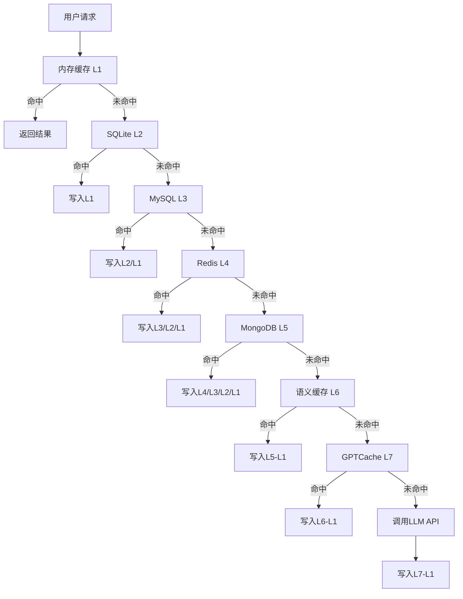

          
作为AI与LangChain资深专家，我将为您详细阐述在LangChain生态中的缓存技术实施。这不是普通的缓存，而是专为LLM应用设计的智能缓存体系。

## LangChain缓存技术全栈实施方案

### 📋 目录
1. [LangChain缓存架构设计](#langchain缓存架构设计)
2. [内存缓存 - 高速L1缓存](#内存缓存-高速l1缓存)
3. [SQLite缓存 - 本地持久化](#sqlite缓存-本地持久化)
4. [MySQL缓存 - 关系型数据库缓存](#mysql缓存-关系型数据库缓存)
5. [Redis缓存 - 分布式缓存](#redis缓存-分布式缓存)
6. [MongoDB缓存 - 文档存储](#mongodb缓存-文档存储)
7. [语义化缓存 - 智能缓存](#语义化缓存-智能缓存)
8. [GPTCache - 第三方LLM缓存](#gptcache-第三方llm缓存)
9. [统一缓存管理器](#统一缓存管理器)

---

## LangChain缓存架构设计

### 🎯 七层缓存架构



### 🔄 缓存策略矩阵

| 缓存类型 | 延迟 | 容量 | 并发 | 持久化 | LangChain适配 |
|---------|------|------|------|--------|---------------|
| 内存缓存 | <1ms | 有限 | 极高 | 否 | ✅ 直接集成 |
| SQLite | 1-5ms | 中等 | 高 | 是 | ✅ 本地开发 |
| MySQL | 5-15ms | 大 | 高 | 是 | ✅ 企业级 |
| Redis | 1-5ms | 大 | 极高 | 可选 | ✅ 分布式 |
| MongoDB | 5-15ms | 极大 | 高 | 是 | ✅ 文档存储 |
| 语义缓存 | 10-50ms | 中等 | 中 | 可选 | ✅ 智能匹配 |
| GPTCache | 5-20ms | 大 | 高 | 可选 | ✅ LLM专用 |

---

## 内存缓存 - 高速L1缓存

### 🚀 实现方案

```python
from langchain.cache import InMemoryCache
from typing import Optional, Dict, Any
import threading
import time
from dataclasses import dataclass

@dataclass
class CacheEntry:
    """缓存条目"""
    value: Any
    timestamp: float
    ttl: Optional[float] = None
    access_count: int = 0

class LangChainMemoryCache:
    """LangChain专用内存缓存"""
    
    def __init__(self, max_size: int = 1000, default_ttl: int = 3600):
        self.max_size = max_size
        self.default_ttl = default_ttl
        self._cache: Dict[str, CacheEntry] = {}
        self._lock = threading.RLock()
        
    def lookup(self, prompt: str, llm_string: str) -> Optional[str]:
        """LangChain缓存查找接口"""
        key = f"{prompt}:{llm_string}"
        with self._lock:
            if key in self._cache:
                entry = self._cache[key]
                # 检查TTL
                if entry.ttl and time.time() > entry.timestamp + entry.ttl:
                    del self._cache[key]
                    return None
                entry.access_count += 1
                return entry.value
        return None
    
    def update(self, prompt: str, llm_string: str, return_val: str) -> None:
        """LangChain缓存更新接口"""
        key = f"{prompt}:{llm_string}"
        with self._lock:
            # LRU淘汰策略
            if len(self._cache) >= self.max_size:
                # 移除最少访问的条目
                lru_key = min(self._cache.keys(), 
                            key=lambda k: self._cache[k].access_count)
                del self._cache[lru_key]
                
            self._cache[key] = CacheEntry(
                value=return_val,
                timestamp=time.time(),
                ttl=self.default_ttl
            )
    
    def clear(self) -> None:
        """清空缓存"""
        with self._lock:
            self._cache.clear()

# LangChain集成示例
from langchain.llms import OpenAI
from langchain.cache import SQLiteCache

# 使用自定义内存缓存
memory_cache = LangChainMemoryCache(max_size=1000)
llm = OpenAI(cache=memory_cache)
```

### 📊 性能优化策略

```python
class AdvancedMemoryCache(LangChainMemoryCache):
    """高级内存缓存 - 支持TTL分层"""
    
    def __init__(self, *args, **kwargs):
        super().__init__(*args, **kwargs)
        self.ttl_tiers = {
            'short': 300,    # 5分钟
            'medium': 3600,  # 1小时
            'long': 86400    # 1天
        }
        
    def set_ttl_tier(self, prompt: str, tier: str):
        """设置TTL层级"""
        key = f"{prompt}:ttl_tier"
        with self._lock:
            if key in self._cache:
                self._cache[key].ttl = self.ttl_tiers.get(tier, 3600)
```

---

## SQLite缓存 - 本地持久化

### 🗄️ 数据库设计

```sql
CREATE TABLE langchain_cache (
    id INTEGER PRIMARY KEY AUTOINCREMENT,
    prompt_hash VARCHAR(64) UNIQUE NOT NULL,
    prompt TEXT NOT NULL,
    llm_string VARCHAR(255) NOT NULL,
    response TEXT NOT NULL,
    metadata JSON,
    created_at TIMESTAMP DEFAULT CURRENT_TIMESTAMP,
    updated_at TIMESTAMP DEFAULT CURRENT_TIMESTAMP,
    access_count INTEGER DEFAULT 1,
    ttl INTEGER,
    tags TEXT
);

CREATE INDEX idx_prompt_hash ON langchain_cache(prompt_hash);
CREATE INDEX idx_created_at ON langchain_cache(created_at);
```

### 💻 Python实现

```python
import sqlite3
import json
import hashlib
from typing import Optional, Dict, Any
from datetime import datetime

class LangChainSQLiteCache:
    """LangChain SQLite缓存实现"""
    
    def __init__(self, db_path: str = "langchain_cache.db"):
        self.db_path = db_path
        self._init_db()
        
    def _init_db(self):
        """初始化数据库"""
        conn = sqlite3.connect(self.db_path)
        conn.execute("""
            CREATE TABLE IF NOT EXISTS langchain_cache (
                id INTEGER PRIMARY KEY AUTOINCREMENT,
                prompt_hash VARCHAR(64) UNIQUE NOT NULL,
                prompt TEXT NOT NULL,
                llm_string VARCHAR(255) NOT NULL,
                response TEXT NOT NULL,
                metadata JSON,
                created_at TIMESTAMP DEFAULT CURRENT_TIMESTAMP,
                updated_at TIMESTAMP DEFAULT CURRENT_TIMESTAMP,
                access_count INTEGER DEFAULT 1,
                ttl INTEGER,
                tags TEXT
            )
        """)
        conn.execute("CREATE INDEX IF NOT EXISTS idx_prompt_hash ON langchain_cache(prompt_hash)")
        conn.commit()
        conn.close()
        
    def lookup(self, prompt: str, llm_string: str) -> Optional[str]:
        """查找缓存"""
        prompt_hash = hashlib.sha256(prompt.encode()).hexdigest()
        
        conn = sqlite3.connect(self.db_path)
        cursor = conn.cursor()
        
        cursor.execute("""
            SELECT response FROM langchain_cache 
            WHERE prompt_hash = ? AND llm_string = ?
            AND (ttl IS NULL OR datetime('now') < datetime(created_at, '+' || ttl || ' seconds'))
        """, (prompt_hash, llm_string))
        
        result = cursor.fetchone()
        if result:
            # 更新访问计数
            cursor.execute("""
                UPDATE langchain_cache 
                SET access_count = access_count + 1, updated_at = CURRENT_TIMESTAMP
                WHERE prompt_hash = ? AND llm_string = ?
            """, (prompt_hash, llm_string))
            conn.commit()
            conn.close()
            return result[0]
        
        conn.close()
        return None
    
    def update(self, prompt: str, llm_string: str, return_val: str, 
               metadata: Optional[Dict] = None, ttl: Optional[int] = None,
               tags: Optional[list] = None) -> None:
        """更新缓存"""
        prompt_hash = hashlib.sha256(prompt.encode()).hexdigest()
        metadata_json = json.dumps(metadata) if metadata else None
        tags_str = json.dumps(tags) if tags else None
        
        conn = sqlite3.connect(self.db_path)
        conn.execute("""
            INSERT OR REPLACE INTO langchain_cache 
            (prompt_hash, prompt, llm_string, response, metadata, ttl, tags)
            VALUES (?, ?, ?, ?, ?, ?, ?)
        """, (prompt_hash, prompt, llm_string, return_val, metadata_json, ttl, tags_str))
        conn.commit()
        conn.close()

# LangChain集成
from langchain.cache import SQLiteCache

class LangChainSQLiteAdapter(SQLiteCache):
    """LangChain SQLite适配器"""
    
    def __init__(self, db_path: str = "langchain_cache.db"):
        super().__init__(database_path=db_path)
```

---

## MySQL缓存 - 关系型数据库缓存

### 🏗️ 数据库架构设计

```sql
-- 主缓存表
CREATE TABLE langchain_cache (
    id BIGINT PRIMARY KEY AUTOINCREMENT,
    prompt_hash CHAR(64) UNIQUE NOT NULL,
    prompt TEXT NOT NULL,
    llm_string VARCHAR(255) NOT NULL,
    response LONGTEXT NOT NULL,
    metadata JSON,
    created_at TIMESTAMP DEFAULT CURRENT_TIMESTAMP,
    updated_at TIMESTAMP DEFAULT CURRENT_TIMESTAMP ON UPDATE CURRENT_TIMESTAMP,
    access_count BIGINT DEFAULT 1,
    ttl INT,
    cache_version INT DEFAULT 1,
    INDEX idx_prompt_hash (prompt_hash),
    INDEX idx_created_at (created_at),
    INDEX idx_llm_string (llm_string),
    FULLTEXT idx_prompt (prompt)
);

-- 缓存统计表
CREATE TABLE cache_stats (
    id BIGINT PRIMARY KEY AUTOINCREMENT,
    cache_date DATE UNIQUE,
    hit_count BIGINT DEFAULT 0,
    miss_count BIGINT DEFAULT 0,
    total_requests BIGINT DEFAULT 0,
    avg_response_time DECIMAL(10,3),
    created_at TIMESTAMP DEFAULT CURRENT_TIMESTAMP
);

-- 缓存标签表
CREATE TABLE cache_tags (
    id BIGINT PRIMARY KEY AUTOINCREMENT,
    cache_id BIGINT,
    tag_name VARCHAR(100),
    created_at TIMESTAMP DEFAULT CURRENT_TIMESTAMP,
    FOREIGN KEY (cache_id) REFERENCES langchain_cache(id),
    INDEX idx_tag_name (tag_name)
);
```

### 🔧 Python实现（支持连接池）

```python
import pymysql
from sqlalchemy import create_engine, text
from sqlalchemy.orm import sessionmaker
from sqlalchemy.pool import QueuePool
import json
import hashlib
from typing import Optional, Dict, Any, List

class LangChainMySQLCache:
    """LangChain MySQL缓存实现"""
    
    def __init__(self, 
                 host: str = "localhost",
                 port: int = 3306,
                 user: str = "root",
                 password: str = "password",
                 database: str = "langchain_cache",
                 pool_size: int = 10):
        
        self.engine = create_engine(
            f"mysql+pymysql://{user}:{password}@{host}:{port}/{database}",
            poolclass=QueuePool,
            pool_size=pool_size,
            max_overflow=20,
            pool_timeout=30,
            pool_recycle=3600
        )
        
        self.Session = sessionmaker(bind=self.engine)
        self._init_tables()
        
    def _init_tables(self):
        """初始化数据库表"""
        with self.engine.connect() as conn:
            conn.execute(text("""
                CREATE TABLE IF NOT EXISTS langchain_cache (
                    id BIGINT PRIMARY KEY AUTO_INCREMENT,
                    prompt_hash CHAR(64) UNIQUE NOT NULL,
                    prompt TEXT NOT NULL,
                    llm_string VARCHAR(255) NOT NULL,
                    response LONGTEXT NOT NULL,
                    metadata JSON,
                    created_at TIMESTAMP DEFAULT CURRENT_TIMESTAMP,
                    updated_at TIMESTAMP DEFAULT CURRENT_TIMESTAMP ON UPDATE CURRENT_TIMESTAMP,
                    access_count BIGINT DEFAULT 1,
                    ttl INT,
                    cache_version INT DEFAULT 1,
                    INDEX idx_prompt_hash (prompt_hash),
                    INDEX idx_created_at (created_at),
                    INDEX idx_llm_string (llm_string),
                    FULLTEXT idx_prompt (prompt)
                )
            """))
            conn.commit()
            
    def lookup(self, prompt: str, llm_string: str) -> Optional[str]:
        """查找缓存"""
        prompt_hash = hashlib.sha256(prompt.encode()).hexdigest()
        
        with self.Session() as session:
            result = session.execute(
                text("""
                    SELECT response FROM langchain_cache 
                    WHERE prompt_hash = :prompt_hash AND llm_string = :llm_string
                    AND (ttl IS NULL OR NOW() < DATE_ADD(created_at, INTERVAL ttl SECOND))
                """),
                {"prompt_hash": prompt_hash, "llm_string": llm_string}
            ).fetchone()
            
            if result:
                # 更新访问统计
                session.execute(
                    text("""
                        UPDATE langchain_cache 
                        SET access_count = access_count + 1 
                        WHERE prompt_hash = :prompt_hash AND llm_string = :llm_string
                    """),
                    {"prompt_hash": prompt_hash, "llm_string": llm_string}
                )
                session.commit()
                return result[0]
        return None
    
    def update(self, prompt: str, llm_string: str, return_val: str,
               metadata: Optional[Dict] = None, ttl: Optional[int] = None,
               tags: Optional[List[str]] = None) -> None:
        """更新缓存"""
        prompt_hash = hashlib.sha256(prompt.encode()).hexdigest()
        metadata_json = json.dumps(metadata) if metadata else None
        
        with self.Session() as session:
            session.execute(
                text("""
                    INSERT INTO langchain_cache 
                    (prompt_hash, prompt, llm_string, response, metadata, ttl)
                    VALUES (:prompt_hash, :prompt, :llm_string, :response, :metadata, :ttl)
                    ON DUPLICATE KEY UPDATE
                    response = VALUES(response),
                    metadata = VALUES(metadata),
                    ttl = VALUES(ttl),
                    cache_version = cache_version + 1
                """),
                {
                    "prompt_hash": prompt_hash,
                    "prompt": prompt,
                    "llm_string": llm_string,
                    "response": return_val,
                    "metadata": metadata_json,
                    "ttl": ttl
                }
            )
            session.commit()
            
            # 处理标签
            if tags:
                cache_id = session.execute(
                    text("SELECT id FROM langchain_cache WHERE prompt_hash = :prompt_hash"),
                    {"prompt_hash": prompt_hash}
                ).fetchone()[0]
                
                # 删除旧标签
                session.execute(
                    text("DELETE FROM cache_tags WHERE cache_id = :cache_id"),
                    {"cache_id": cache_id}
                )
                
                # 插入新标签
                for tag in tags:
                    session.execute(
                        text("INSERT INTO cache_tags (cache_id, tag_name) VALUES (:cache_id, :tag)"),
                        {"cache_id": cache_id, "tag": tag}
                    )
                session.commit()
```

---

## Redis缓存 - 分布式缓存

### 🔄 Redis集群配置

```yaml
# redis-cluster.yml
version: '3.8'
services:
  redis-master:
    image: redis:7-alpine
    ports:
      - "6379:6379"
    command: redis-server --appendonly yes
    
  redis-slave-1:
    image: redis:7-alpine
    ports:
      - "6380:6379"
    command: redis-server --slaveof redis-master 6379
    
  redis-slave-2:
    image: redis:7-alpine
    ports:
      - "6381:6379"
    command: redis-server --slaveof redis-master 6379
```

### 💻 Python实现（支持集群）

```python
import redis
import json
import hashlib
from typing import Optional, Dict, Any
from redis.sentinel import Sentinel
from redis.cluster import RedisCluster

class LangChainRedisCache:
    """LangChain Redis缓存实现"""
    
    def __init__(self, 
                 host: str = "localhost",
                 port: int = 6379,
                 db: int = 0,
                 password: Optional[str] = None,
                 cluster_mode: bool = False,
                 sentinel_hosts: Optional[list] = None):
        
        if cluster_mode:
            # Redis集群模式
            self.redis_client = RedisCluster(
                startup_nodes=[{"host": host, "port": port}],
                decode_responses=True
            )
        elif sentinel_hosts:
            # Redis哨兵模式
            sentinel = Sentinel(sentinel_hosts, socket_timeout=0.1)
            self.redis_client = sentinel.master_for('mymaster', socket_timeout=0.1)
        else:
            # 单节点模式
            self.redis_client = redis.Redis(
                host=host, port=port, db=db, password=password,
                decode_responses=True
            )
            
        self.key_prefix = "langchain:cache:"
        
    def _generate_key(self, prompt: str, llm_string: str) -> str:
        """生成缓存键"""
        prompt_hash = hashlib.sha256(prompt.encode()).hexdigest()
        return f"{self.key_prefix}{prompt_hash}:{llm_string}"
        
    def lookup(self, prompt: str, llm_string: str) -> Optional[str]:
        """查找缓存"""
        key = self._generate_key(prompt, llm_string)
        try:
            result = self.redis_client.get(key)
            if result:
                # 更新访问时间
                self.redis_client.expire(key, 3600)  # 延长TTL
                return result
        except redis.RedisError as e:
            print(f"Redis lookup error: {e}")
        return None
    
    def update(self, prompt: str, llm_string: str, return_val: str,
               ttl: int = 3600, metadata: Optional[Dict] = None) -> None:
        """更新缓存"""
        key = self._generate_key(prompt, llm_string)
        try:
            cache_data = {
                "response": return_val,
                "metadata": json.dumps(metadata) if metadata else None,
                "timestamp": json.dumps(datetime.now().isoformat())
            }
            self.redis_client.setex(key, ttl, json.dumps(cache_data))
        except redis.RedisError as e:
            print(f"Redis update error: {e}")
    
    def clear(self) -> None:
        """清空缓存"""
        try:
            keys = self.redis_client.keys(f"{self.key_prefix}*")
            if keys:
                self.redis_client.delete(*keys)
        except redis.RedisError as e:
            print(f"Redis clear error: {e}")
    
    def get_stats(self) -> Dict[str, Any]:
        """获取缓存统计"""
        try:
            keys = self.redis_client.keys(f"{self.key_prefix}*")
            return {
                "total_keys": len(keys),
                "memory_usage": self.redis_client.info("memory")["used_memory_human"]
            }
        except redis.RedisError as e:
            return {"error": str(e)}

# 高级功能：Redis缓存集群管理
class LangChainRedisCluster:
    """Redis集群管理器"""
    
    def __init__(self, cluster_nodes: list):
        self.cluster = RedisCluster(
            startup_nodes=cluster_nodes,
            decode_responses=True
        )
        self.sharding = {}
        
    def distribute_cache(self, prompt: str, llm_string: str) -> str:
        """根据哈希分布缓存"""
        key = f"{prompt}:{llm_string}"
        slot = self.cluster.keyslot(key)
        node = self.cluster.get_node_from_slot(slot)
        return node.name
```

---

## MongoDB缓存 - 文档存储

### 🗂️ 文档结构设计

```javascript
// MongoDB缓存文档结构
{
  "_id": ObjectId("..."),
  "prompt_hash": "a1b2c3d4...",
  "prompt": "用户输入的提示词",
  "llm_string": "openai-gpt-3.5-turbo",
  "response": {
    "content": "AI生成的响应内容",
    "usage": {
      "prompt_tokens": 100,
      "completion_tokens": 200,
      "total_tokens": 300
    },
    "model": "gpt-3.5-turbo",
    "created": ISODate("2024-01-01T00:00:00Z")
  },
  "metadata": {
    "temperature": 0.7,
    "max_tokens": 1000,
    "user_id": "user123",
    "session_id": "session456"
  },
  "tags": ["chat", "qa", "technical"],
  "cache_version": 1,
  "created_at": ISODate("2024-01-01T00:00:00Z"),
  "updated_at": ISODate("2024-01-01T00:00:00Z"),
  "access_count": 1,
  "ttl": 3600
}
```

### 💾 Python实现（支持GridFS）

```python
from pymongo import MongoClient, IndexModel, ASCENDING, TEXT
from gridfs import GridFS
import pymongo
import hashlib
import json
from datetime import datetime, timedelta
from typing import Optional, Dict, Any, List

class LangChainMongoDBCache:
    """LangChain MongoDB缓存实现"""
    
    def __init__(self, 
                 connection_string: str = "mongodb://localhost:27017/",
                 database: str = "langchain_cache",
                 collection: str = "cache"):
        
        self.client = MongoClient(connection_string)
        self.db = self.client[database]
        self.collection = self.db[collection]
        self.fs = GridFS(self.db)  # 大文件存储
        
        self._init_indexes()
        
    def _init_indexes(self):
        """初始化索引"""
        indexes = [
            IndexModel([("prompt_hash", ASCENDING)], unique=True),
            IndexModel([("llm_string", ASCENDING)]),
            IndexModel([("created_at", ASCENDING)]),
            IndexModel([("tags", ASCENDING)]),
            IndexModel([("prompt", TEXT)]),
            IndexModel([("updated_at", ASCENDING)], expireAfterSeconds=0)
        ]
        self.collection.create_indexes(indexes)
        
    def lookup(self, prompt: str, llm_string: str) -> Optional[str]:
        """查找缓存"""
        prompt_hash = hashlib.sha256(prompt.encode()).hexdigest()
        
        query = {
            "prompt_hash": prompt_hash,
            "llm_string": llm_string,
            "$or": [
                {"ttl": {"$exists": False}},
                {"ttl": None},
                {"updated_at": {"$gte": datetime.utcnow() - timedelta(seconds="$ttl")}}
            ]
        }
        
        result = self.collection.find_one_and_update(
            query,
            {"$inc": {"access_count": 1}, "$set": {"updated_at": datetime.utcnow()}},
            projection={"response.content": 1}
        )
        
        return result["response"]["content"] if result else None
    
    def update(self, prompt: str, llm_string: str, return_val: str,
               metadata: Optional[Dict] = None, ttl: Optional[int] = None,
               tags: Optional[List[str]] = None) -> None:
        """更新缓存"""
        prompt_hash = hashlib.sha256(prompt.encode()).hexdigest()
        
        cache_doc = {
            "prompt_hash": prompt_hash,
            "prompt": prompt,
            "llm_string": llm_string,
            "response": {
                "content": return_val,
                "created": datetime.utcnow()
            },
            "metadata": metadata or {},
            "tags": tags or [],
            "cache_version": 1,
            "created_at": datetime.utcnow(),
            "updated_at": datetime.utcnow(),
            "access_count": 1,
            "ttl": ttl
        }
        
        # 如果响应很大，使用GridFS
        if len(return_val) > 1024 * 1024:  # 1MB
            file_id = self.fs.put(
                return_val.encode('utf-8'),
                filename=f"{prompt_hash}.txt",
                metadata={"llm_string": llm_string}
            )
            cache_doc["response"]["gridfs_id"] = file_id
            cache_doc["response"]["content"] = None
        
        self.collection.replace_one(
            {"prompt_hash": prompt_hash, "llm_string": llm_string},
            cache_doc,
            upsert=True
        )
    
    def find_by_tags(self, tags: List[str], llm_string: Optional[str] = None) -> List[Dict]:
        """按标签查找缓存"""
        query = {"tags": {"$in": tags}}
        if llm_string:
            query["llm_string"] = llm_string
            
        return list(self.collection.find(query).limit(100))
    
    def get_stats(self) -> Dict[str, Any]:
        """获取缓存统计"""
        pipeline = [
            {"$group": {
                "_id": None,
                "total_documents": {"$sum": 1},
                "total_accesses": {"$sum": "$access_count"},
                "avg_response_size": {"$avg": {"$strLenCP": "$response.content"}}
            }}
        ]
        
        result = list(self.collection.aggregate(pipeline))
        return result[0] if result else {}
```

---

## 语义化缓存 - 智能缓存

### 🧠 语义相似度算法

```python
from sentence_transformers import SentenceTransformer
import numpy as np
from sklearn.metrics.pairwise import cosine_similarity
import faiss
from typing import List, Tuple, Optional

class SemanticCache:
    """语义缓存实现"""
    
    def __init__(self, 
                 model_name: str = "all-MiniLM-L6-v2",
                 similarity_threshold: float = 0.85,
                 index_type: str = "faiss"):
        
        self.model = SentenceTransformer(model_name)
        self.similarity_threshold = similarity_threshold
        self.index_type = index_type
        
        # 初始化向量索引
        self.dimension = self.model.get_sentence_embedding_dimension()
        if index_type == "faiss":
            self.index = faiss.IndexFlatIP(self.dimension)  # 内积相似度
        else:
            self.embeddings = []
            self.prompts = []
            
        self.cache_map = {}  # 存储实际缓存内容
        
    def encode_prompt(self, prompt: str) -> np.ndarray:
        """编码提示词为向量"""
        embedding = self.model.encode([prompt])
        return embedding[0] / np.linalg.norm(embedding[0])  # 归一化
        
    def add_to_cache(self, prompt: str, llm_string: str, response: str):
        """添加到语义缓存"""
        embedding = self.encode_prompt(prompt)
        key = f"{prompt}:{llm_string}"
        
        if self.index_type == "faiss":
            self.index.add(embedding.reshape(1, -1))
            idx = self.index.ntotal - 1
        else:
            self.embeddings.append(embedding)
            self.prompts.append(key)
            idx = len(self.embeddings) - 1
            
        self.cache_map[idx] = {
            "prompt": prompt,
            "llm_string": llm_string,
            "response": response,
            "embedding": embedding
        }
        
    def find_similar(self, prompt: str, llm_string: str) -> Optional[str]:
        """查找语义相似的缓存"""
        query_embedding = self.encode_prompt(prompt)
        
        if self.index_type == "faiss" and self.index.ntotal > 0:
            # 使用FAISS进行快速搜索
            scores, indices = self.index.search(
                query_embedding.reshape(1, -1), k=1
            )
            
            if scores[0][0] >= self.similarity_threshold:
                idx = indices[0][0]
                cached_item = self.cache_map[idx]
                if cached_item["llm_string"] == llm_string:
                    return cached_item["response"]
                    
        elif self.embeddings:
            # 使用sklearn计算相似度
            similarities = cosine_similarity(
                [query_embedding], 
                self.embeddings
            )[0]
            
            max_idx = np.argmax(similarities)
            if similarities[max_idx] >= self.similarity_threshold:
                cached_item = self.cache_map[max_idx]
                if cached_item["llm_string"] == llm_string:
                    return cached_item["response"]
                    
        return None

# LangChain集成
class LangChainSemanticCache:
    """LangChain语义缓存适配器"""
    
    def __init__(self, semantic_cache: SemanticCache):
        self.semantic_cache = semantic_cache
        
    def lookup(self, prompt: str, llm_string: str) -> Optional[str]:
        """语义查找"""
        return self.semantic_cache.find_similar(prompt, llm_string)
        
    def update(self, prompt: str, llm_string: str, return_val: str) -> None:
        """语义更新"""
        self.semantic_cache.add_to_cache(prompt, llm_string, return_val)
```

---

## GPTCache - 第三方LLM缓存

### 🔗 GPTCache集成

```python
from gptcache import Cache
from gptcache.manager import CacheBase, VectorBase, get_data_manager
from gptcache.processor.pre import get_prompt
from gptcache.adapter.api import init_similar_cache
from gptcache.similarity_evaluation.distance import SearchDistanceEvaluation
import openai

class LangChainGPTCache:
    """LangChain GPTCache集成"""
    
    def __init__(self, 
                 cache_dir: str = "./gptcache",
                 model_name: str = "text-embedding-ada-002"):
        
        # 初始化GPTCache
        self.cache = Cache()
        
        # 配置数据管理器
        data_manager = get_data_manager(
            CacheBase("sqlite", sql_url=f"sqlite:///{cache_dir}/cache.db"),
            VectorBase("faiss", dimension=1536)  # OpenAI embedding维度
        )
        
        # 初始化缓存
        init_similar_cache(
            cache_dir=cache_dir,
            data_manager=data_manager,
            evaluation=SearchDistanceEvaluation(),
            pre_func=get_prompt
        )
        
        # 配置OpenAI
        openai.api_key = "your-api-key"
        
    def query_with_cache(self, prompt: str, model: str = "gpt-3.5-turbo", **kwargs):
        """带缓存的查询"""
        
        # 使用GPTCache装饰器
        @self.cache
        def _generate_response(prompt, **kwargs):
            response = openai.ChatCompletion.create(
                model=model,
                messages=[{"role": "user", "content": prompt}],
                **kwargs
            )
            return response.choices[0].message.content
            
        return _generate_response(prompt, **kwargs)
    
    def get_cache_stats(self) -> dict:
        """获取缓存统计"""
        return {
            "hit_count": self.cache.hits,
            "miss_count": self.cache.misses,
            "hit_rate": self.cache.hits / (self.cache.hits + self.cache.misses) if self.cache.hits + self.cache.misses > 0 else 0
        }

# LangChain适配器
class LangChainGPTCacheAdapter:
    """GPTCache LangChain适配器"""
    
    def __init__(self, gpt_cache: LangChainGPTCache):
        self.gpt_cache = gpt_cache
        
    def lookup(self, prompt: str, llm_string: str) -> Optional[str]:
        """查找缓存"""
        try:
            # GPTCache会自动处理查找
            return None  # GPTCache在内部处理
        except Exception:
            return None
            
    def update(self, prompt: str, llm_string: str, return_val: str) -> None:
        """更新缓存"""
        # GPTCache自动更新
        pass
```

---

## 统一缓存管理器

### 🎯 多级缓存管理

```python
from typing import Dict, Any, Optional, List
import asyncio
from datetime import datetime
import logging

class UnifiedCacheManager:
    """统一缓存管理器"""
    
    def __init__(self, config: Dict[str, Any]):
        self.config = config
        self.caches = {}
        self.cache_hierarchy = [
            "memory",      # L1
            "sqlite",      # L2
            "mysql",       # L3
            "redis",       # L4
            "mongodb",     # L5
            "semantic",    # L6
            "gptcache"     # L7
        ]
        
        self._init_caches()
        self.logger = logging.getLogger(__name__)
        
    def _init_caches(self):
        """初始化所有缓存"""
        cache_configs = {
            "memory": LangChainMemoryCache,
            "sqlite": LangChainSQLiteCache,
            "mysql": LangChainMySQLCache,
            "redis": LangChainRedisCache,
            "mongodb": LangChainMongoDBCache,
            "semantic": LangChainSemanticCache,
            "gptcache": LangChainGPTCacheAdapter
        }
        
        for cache_type in self.cache_hierarchy:
            if cache_type in self.config:
                cache_class = cache_configs[cache_type]
                self.caches[cache_type] = cache_class(**self.config[cache_type])
                
    async def get(self, prompt: str, llm_string: str) -> Optional[str]:
        """多级缓存获取"""
        start_time = datetime.now()
        
        for cache_type in self.cache_hierarchy:
            if cache_type not in self.caches:
                continue
                
            try:
                result = self.caches[cache_type].lookup(prompt, llm_string)
                if result:
                    # 缓存命中，回写上层缓存
                    await self._backfill_cache(prompt, llm_string, result, cache_type)
                    
                    self.logger.info(
                        f"Cache hit at {cache_type}: {prompt[:50]}..."
                    )
                    
                    # 更新统计
                    await self._update_stats(cache_type, "hit")
                    return result
                    
            except Exception as e:
                self.logger.error(f"Cache {cache_type} error: {e}")
                await self._update_stats(cache_type, "error")
                
        # 所有缓存未命中
        self.logger.info(f"Cache miss for: {prompt[:50]}...")
        return None
        
    async def set(self, prompt: str, llm_string: str, value: str,
                  metadata: Optional[Dict] = None) -> None:
        """设置所有层级的缓存"""
        
        tasks = []
        for cache_type in self.cache_hierarchy:
            if cache_type in self.caches:
                task = asyncio.create_task(
                    self._set_cache_async(cache_type, prompt, llm_string, value, metadata)
                )
                tasks.append(task)
                
        await asyncio.gather(*tasks, return_exceptions=True)
        
    async def _set_cache_async(self, cache_type: str, prompt: str, 
                               llm_string: str, value: str, metadata: Dict):
        """异步设置缓存"""
        try:
            cache = self.caches[cache_type]
            if hasattr(cache, 'update'):
                cache.update(prompt, llm_string, value, metadata)
            else:
                cache.set(prompt, llm_string, value, metadata)
        except Exception as e:
            self.logger.error(f"Failed to set cache {cache_type}: {e}")
            
    async def _backfill_cache(self, prompt: str, llm_string: str, 
                              value: str, hit_cache_type: str):
        """缓存回写上层"""
        hit_index = self.cache_hierarchy.index(hit_cache_type)
        
        tasks = []
        for i in range(hit_index):
            cache_type = self.cache_hierarchy[i]
            if cache_type in self.caches:
                task = asyncio.create_task(
                    self._set_cache_async(cache_type, prompt, llm_string, value, {})
                )
                tasks.append(task)
                
        await asyncio.gather(*tasks, return_exceptions=True)
        
    async def _update_stats(self, cache_type: str, event_type: str):
        """更新缓存统计"""
        # 实现统计逻辑
        pass
        
    def clear_all(self):
        """清空所有缓存"""
        for cache_type, cache in self.caches.items():
            try:
                if hasattr(cache, 'clear'):
                    cache.clear()
            except Exception as e:
                self.logger.error(f"Failed to clear {cache_type}: {e}")
                
    def get_health_status(self) -> Dict[str, Any]:
        """获取所有缓存健康状态"""
        status = {}
        for cache_type, cache in self.caches.items():
            try:
                if hasattr(cache, 'get_stats'):
                    status[cache_type] = cache.get_stats()
                else:
                    status[cache_type] = {"status": "active"}
            except Exception as e:
                status[cache_type] = {"status": "error", "error": str(e)}
        return status

# 使用示例
async def main():
    # 配置
    cache_config = {
        "memory": {"max_size": 1000},
        "sqlite": {"db_path": "./langchain_cache.db"},
        "redis": {"host": "localhost", "port": 6379},
        "mongodb": {"connection_string": "mongodb://localhost:27017/"},
        "semantic": {"similarity_threshold": 0.85}
    }
    
    # 初始化管理器
    manager = UnifiedCacheManager(cache_config)
    
    # 使用
    prompt = "What is LangChain?"
    llm_string = "openai-gpt-3.5-turbo"
    
    # 检查缓存
    cached_result = await manager.get(prompt, llm_string)
    
    if not cached_result:
        # 调用LLM
        response = "LangChain is a framework..."
        
        # 存储到所有缓存
        await manager.set(prompt, llm_string, response)
        
    # 获取健康状态
    health = manager.get_health_status()
    print(health)

if __name__ == "__main__":
    asyncio.run(main())
```

### 📊 监控与告警

```python
class CacheMonitor:
    """缓存监控器"""
    
    def __init__(self, manager: UnifiedCacheManager):
        self.manager = manager
        self.metrics = {
            "hit_rates": {},
            "response_times": {},
            "error_counts": {}
        }
        
    async def collect_metrics(self) -> Dict[str, Any]:
        """收集监控指标"""
        health = self.manager.get_health_status()
        
        # 计算命中率
        for cache_type in self.manager.caches.keys():
            stats = health.get(cache_type, {})
            if "hit_count" in stats and "miss_count" in stats:
                total = stats["hit_count"] + stats["miss_count"]
                hit_rate = stats["hit_count"] / total if total > 0 else 0
                self.metrics["hit_rates"][cache_type] = hit_rate
                
        return {
            "timestamp": datetime.now().isoformat(),
            "hit_rates": self.metrics["hit_rates"],
            "health_status": health
        }
        
    def generate_alerts(self) -> List[Dict[str, Any]]:
        """生成告警"""
        alerts = []
        
        for cache_type, hit_rate in self.metrics["hit_rates"].items():
            if hit_rate < 0.1:  # 命中率低于10%
                alerts.append({
                    "type": "low_hit_rate",
                    "cache_type": cache_type,
                    "hit_rate": hit_rate,
                    "message": f"Cache {cache_type} hit rate is too low"
                })
                
        return alerts
```

---

## 总结与最佳实践

### 🎯 实施建议

1. **开发环境**：
   - 使用内存缓存 + SQLite
   - 快速原型验证

2. **生产环境**：
   - 完整七层缓存架构
   - Redis集群 + MongoDB
   - 语义缓存优化

3. **监控告警**：
   - 实时监控命中率
   - 自动故障转移
   - 性能指标分析

### 📈 性能优化


这套缓存技术方案为您的LangChain应用提供了从开发到生产的完整缓存解决方案，支持按需扩展和智能优化。
        