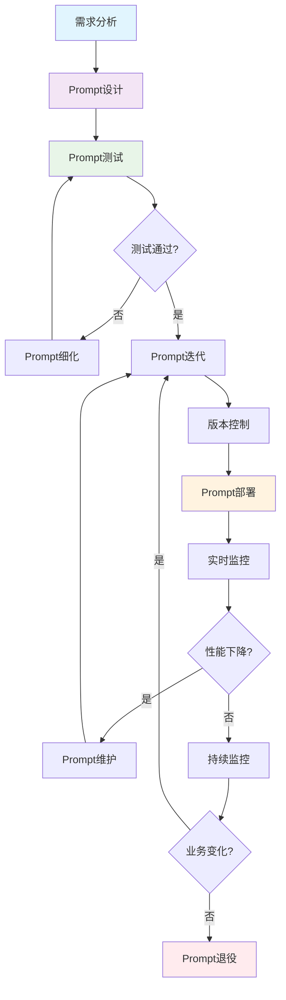
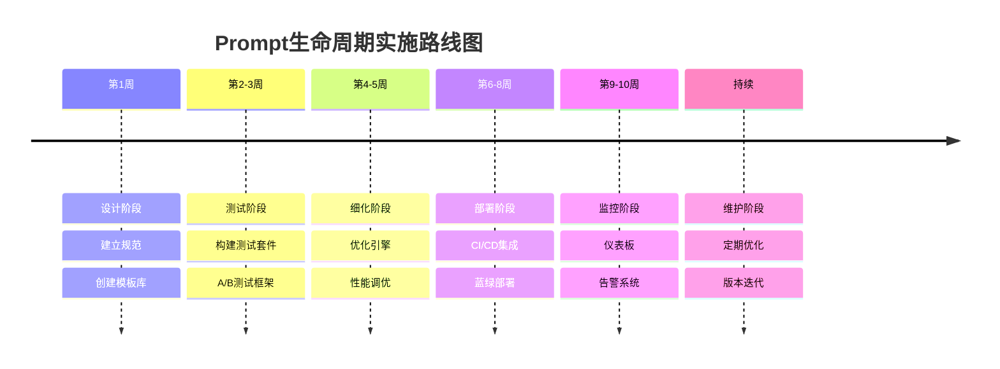

          
# LangChain Prompt生命周期管理全栈技术文档

详细阐述Prompt在LangChain生态中的完整生命周期管理。这不是简单的Prompt编写，而是企业级的Prompt工程体系。

## 📋 目录
- [LangChain Prompt生命周期管理全栈技术文档](#langchain-prompt生命周期管理全栈技术文档)
  - [📋 目录](#-目录)
  - [Prompt生命周期总览](#prompt生命周期总览)
    - [🎯 完整生命周期流程](#-完整生命周期流程)
    - [🔍 生命周期阶段矩阵](#-生命周期阶段矩阵)
  - [设计阶段 - Prompt Engineering](#设计阶段---prompt-engineering)
    - [🏗️ Prompt设计框架](#️-prompt设计框架)
    - [🎯 Prompt模板库](#-prompt模板库)
  - [测试阶段 - Prompt Testing](#测试阶段---prompt-testing)
    - [🧪 测试框架](#-测试框架)
    - [📊 测试报告生成](#-测试报告生成)
  - [细化阶段 - Prompt Refinement](#细化阶段---prompt-refinement)
    - [🔧 Prompt优化引擎](#-prompt优化引擎)
    - [📈 性能优化策略](#-性能优化策略)
  - [迭代阶段 - Prompt Iteration](#迭代阶段---prompt-iteration)
    - [🔄 版本控制系统](#-版本控制系统)
    - [📊 迭代分析仪表板](#-迭代分析仪表板)
  - [部署阶段 - Prompt Deployment](#部署阶段---prompt-deployment)
    - [🚀 CI/CD集成](#-cicd集成)
    - [🔄 蓝绿部署](#-蓝绿部署)
  - [维护阶段 - Prompt Maintenance](#维护阶段---prompt-maintenance)
    - [🔧 维护工作流](#-维护工作流)
  - [监控阶段 - Prompt Monitoring](#监控阶段---prompt-monitoring)
    - [📊 实时监控仪表板](#-实时监控仪表板)
  - [退役阶段 - Prompt Retirement](#退役阶段---prompt-retirement)
    - [🗑️ 优雅退役流程](#️-优雅退役流程)
  - [统一生命周期管理器](#统一生命周期管理器)
    - [🎯 统一管理平台](#-统一管理平台)
    - [📊 生命周期仪表板](#-生命周期仪表板)
  - [总结与最佳实践](#总结与最佳实践)
    - [🎯 实施路线图](#-实施路线图)
    - [📋 检查清单](#-检查清单)
      - [✅ 设计阶段](#-设计阶段)
      - [✅ 测试阶段](#-测试阶段)
      - [✅ 部署阶段](#-部署阶段)
      - [✅ 监控阶段](#-监控阶段)

---

## Prompt生命周期总览

### 🎯 完整生命周期流程



### 🔍 生命周期阶段矩阵

| 阶段 | 目标 | 工具链 | 输出物 | 关键指标 |
|------|------|--------|--------|----------|
| **设计** | 创建高质量Prompt | LangChain Templates | Prompt模板 | 清晰度、一致性 |
| **测试** | 验证Prompt效果 | LangSmith, PromptBench | 测试报告 | 准确率、延迟 |
| **细化** | 优化Prompt表现 | A/B测试平台 | 优化版本 | 提升幅度 |
| **迭代** | 持续改进 | 版本控制系统 | 迭代记录 | 迭代频率 |
| **部署** | 生产环境发布 | CI/CD管道 | 部署包 | 部署成功率 |
| **维护** | 性能监控 | 监控仪表板 | 监控报告 | 性能稳定性 |
| **退役** | 优雅下线 | 退役流程 | 退役报告 | 影响范围 |

---

## 设计阶段 - Prompt Engineering

### 🏗️ Prompt设计框架

```python
from langchain.prompts import PromptTemplate, ChatPromptTemplate
from langchain.schema import BaseMessage, HumanMessage, SystemMessage
from typing import Dict, Any, Optional
from dataclasses import dataclass
from datetime import datetime

@dataclass
class PromptDesignSpec:
    """Prompt设计规范"""
    name: str
    version: str
    description: str
    use_case: str
    constraints: Dict[str, Any]
    expected_output: Dict[str, Any]
    metadata: Dict[str, Any]

class PromptDesigner:
    """企业级Prompt设计器"""
    
    def __init__(self):
        self.templates = {}
        self.design_specs = {}
        
    def create_template(self, spec: PromptDesignSpec) -> ChatPromptTemplate:
        """基于规范创建Prompt模板"""
        
        # 系统Prompt模板
        system_template = """You are a {role} assistant specialized in {domain}.
        
        Context: {context}
        Task: {task_description}
        
        Constraints:
        {constraints}
        
        Output Format:
        {output_format}
        
        Examples:
        {examples}
        """
        
        # 创建ChatPromptTemplate
        prompt_template = ChatPromptTemplate.from_messages([
            SystemMessage(content=system_template),
            HumanMessage(content="{user_input}")
        ])
        
        # 存储设计规范
        self.design_specs[spec.name] = spec
        self.templates[spec.name] = prompt_template
        
        return prompt_template
    
    def validate_template(self, template_name: str, test_inputs: List[Dict]) -> Dict[str, Any]:
        """验证Prompt模板"""
        template = self.templates[template_name]
        spec = self.design_specs[template_name]
        
        validation_results = {
            "template_name": template_name,
            "validation_date": datetime.now().isoformat(),
            "test_cases": [],
            "compliance_score": 0.0,
            "issues": []
        }
        
        for test_input in test_inputs:
            try:
                formatted_prompt = template.format(**test_input)
                validation_results["test_cases"].append({
                    "input": test_input,
                    "formatted_prompt": formatted_prompt,
                    "length": len(formatted_prompt),
                    "valid": True
                })
            except Exception as e:
                validation_results["issues"].append(str(e))
                
        return validation_results

# 使用示例
designer = PromptDesigner()

# 创建客服Prompt规范
customer_service_spec = PromptDesignSpec(
    name="customer_service_v1",
    version="1.0.0",
    description="智能客服助手Prompt",
    use_case="电商客服自动回复",
    constraints={
        "max_tokens": 150,
        "tone": "friendly",
        "language": "中文"
    },
    expected_output={
        "format": "结构化JSON",
        "fields": ["response", "confidence", "category"]
    },
    metadata={
        "domain": "电商",
        "role": "客服助手"
    }
)

template = designer.create_template(customer_service_spec)
```

### 🎯 Prompt模板库

```python
class PromptTemplateLibrary:
    """Prompt模板库管理"""
    
    def __init__(self):
        self.library = {}
        
    def add_template(self, category: str, template: PromptTemplate, metadata: Dict):
        """添加模板到库"""
        self.library[category] = {
            "template": template,
            "metadata": metadata,
            "created_at": datetime.now(),
            "usage_count": 0
        }
        
    def get_template(self, category: str, use_case: str) -> Optional[PromptTemplate]:
        """按用例获取模板"""
        key = f"{category}_{use_case}"
        if key in self.library:
            self.library[key]["usage_count"] += 1
            return self.library[key]["template"]
        return None
        
    def list_categories(self) -> List[str]:
        """列出所有分类"""
        return list(self.library.keys())

# 预定义模板
template_library = PromptTemplateLibrary()

# 客服模板
customer_service_template = PromptTemplate(
    input_variables=["user_query", "context"],
    template="""
    你是一个专业的电商客服助手。
    
    用户问题: {user_query}
    上下文信息: {context}
    
    请提供:
    1. 友好且准确的回答
    2. 相关产品推荐(如适用)
    3. 下一步行动建议
    
    回答限制在150字以内。
    """
)
```

---

## 测试阶段 - Prompt Testing

### 🧪 测试框架

```python
from langchain.evaluation import load_evaluator, EvaluatorType
from langchain.schema import LLMResult
import pandas as pd
from typing import List, Dict, Any
import json

class PromptTestSuite:
    """Prompt测试套件"""
    
    def __init__(self, llm, evaluator_llm=None):
        self.llm = llm
        self.evaluator_llm = evaluator_llm or llm
        self.test_cases = []
        self.results = []
        
    def add_test_case(self, 
                     prompt: str, 
                     expected_output: str,
                     test_type: str,
                     metadata: Dict[str, Any] = None):
        """添加测试用例"""
        test_case = {
            "id": len(self.test_cases) + 1,
            "prompt": prompt,
            "expected_output": expected_output,
            "test_type": test_type,
            "metadata": metadata or {},
            "created_at": datetime.now().isoformat()
        }
        self.test_cases.append(test_case)
        
    def run_tests(self) -> Dict[str, Any]:
        """执行测试"""
        evaluator = load_evaluator(
            EvaluatorType.CRITERIA,
            criteria={
                "accuracy": "Is the response factually accurate?",
                "relevance": "Is the response relevant to the prompt?",
                "completeness": "Does the response fully address the prompt?",
                "tone": "Is the tone appropriate for the context?"
            },
            llm=self.evaluator_llm
        )
        
        test_results = {
            "summary": {
                "total_tests": len(self.test_cases),
                "passed_tests": 0,
                "failed_tests": 0,
                "average_score": 0.0
            },
            "detailed_results": []
        }
        
        for test_case in self.test_cases:
            # 生成响应
            response = self.llm.invoke(test_case["prompt"])
            
            # 评估响应
            eval_result = evaluator.evaluate_strings(
                prediction=response,
                reference=test_case["expected_output"],
                input=test_case["prompt"]
            )
            
            result = {
                "test_id": test_case["id"],
                "prompt": test_case["prompt"],
                "response": response,
                "expected": test_case["expected_output"],
                "scores": eval_result,
                "passed": eval_result["score"] >= 0.8,
                "test_type": test_case["test_type"]
            }
            
            test_results["detailed_results"].append(result)
            
            if result["passed"]:
                test_results["summary"]["passed_tests"] += 1
            else:
                test_results["summary"]["failed_tests"] += 1
                
        test_results["summary"]["average_score"] = (
            sum(r["scores"]["score"] for r in test_results["detailed_results"]) 
            / len(test_results["detailed_results"])
        )
        
        return test_results

# A/B测试框架
class ABTestFramework:
    """A/B测试框架"""
    
    def __init__(self, llm_a, llm_b):
        self.llm_a = llm_a
        self.llm_b = llm_b
        self.test_results = []
        
    def run_ab_test(self, 
                   prompts: List[str],
                   sample_size: int = 100,
                   metric_func=None) -> Dict[str, Any]:
        """执行A/B测试"""
        
        if metric_func is None:
            metric_func = self._default_metric
            
        results = {
            "llm_a": {"responses": [], "metrics": []},
            "llm_b": {"responses": [], "metrics": []},
            "winner": None,
            "significance": 0.0
        }
        
        for prompt in prompts:
            for _ in range(sample_size):
                # 随机分配
                import random
                if random.choice([True, False]):
                    response = self.llm_a.invoke(prompt)
                    results["llm_a"]["responses"].append(response)
                    results["llm_a"]["metrics"].append(metric_func(response))
                else:
                    response = self.llm_b.invoke(prompt)
                    results["llm_b"]["responses"].append(response)
                    results["llm_b"]["metrics"].append(metric_func(response))
                    
        # 统计分析
        from scipy import stats
        a_scores = results["llm_a"]["metrics"]
        b_scores = results["llm_b"]["metrics"]
        
        t_stat, p_value = stats.ttest_ind(a_scores, b_scores)
        
        if p_value < 0.05:
            if np.mean(a_scores) > np.mean(b_scores):
                results["winner"] = "llm_a"
            else:
                results["winner"] = "llm_b"
                
        results["significance"] = p_value
        
        return results
        
    def _default_metric(self, response: str) -> float:
        """默认评估指标"""
        return len(response) / 100  # 简单的长度指标
```

### 📊 测试报告生成

```python
class TestReportGenerator:
    """测试报告生成器"""
    
    def generate_html_report(self, test_results: Dict[str, Any]) -> str:
        """生成HTML测试报告"""
        
        html_template = """
        <!DOCTYPE html>
        <html>
        <head>
            <title>Prompt测试报告</title>
            <style>
                body { font-family: Arial, sans-serif; margin: 20px; }
                .summary { background: #f0f0f0; padding: 20px; border-radius: 5px; }
                .test-case { margin: 10px 0; padding: 10px; border: 1px solid #ddd; }
                .passed { background-color: #d4edda; }
                .failed { background-color: #f8d7da; }
            </style>
        </head>
        <body>
            <h1>Prompt测试报告</h1>
            <div class="summary">
                <h2>测试摘要</h2>
                <p>总测试数: {total_tests}</p>
                <p>通过测试: {passed_tests}</p>
                <p>失败测试: {failed_tests}</p>
                <p>平均分数: {avg_score:.2f}</p>
            </div>
            
            <h2>详细结果</h2>
            {test_cases}
        </body>
        </html>
        """
        
        test_cases_html = ""
        for result in test_results["detailed_results"]:
            status_class = "passed" if result["passed"] else "failed"
            test_cases_html += f"""
            <div class="test-case {status_class}">
                <h3>测试 {result["test_id"]}</h3>
                <p><strong>Prompt:</strong> {result["prompt"]}</p>
                <p><strong>响应:</strong> {result["response"]}</p>
                <p><strong>分数:</strong> {result["scores"]["score"]}</p>
            </div>
            """
            
        return html_template.format(
            total_tests=test_results["summary"]["total_tests"],
            passed_tests=test_results["summary"]["passed_tests"],
            failed_tests=test_results["summary"]["failed_tests"],
            avg_score=test_results["summary"]["average_score"],
            test_cases=test_cases_html
        )
```

---

## 细化阶段 - Prompt Refinement

### 🔧 Prompt优化引擎

```python
class PromptRefinementEngine:
    """Prompt优化引擎"""
    
    def __init__(self, llm, evaluator_llm=None):
        self.llm = llm
        self.evaluator_llm = evaluator_llm or llm
        self.refinement_history = []
        
    def auto_refine(self, 
                   original_prompt: str,
                   test_cases: List[Dict[str, Any]],
                   refinement_strategy: str = "iterative") -> Dict[str, Any]:
        """自动优化Prompt"""
        
        refinement_result = {
            "original_prompt": original_prompt,
            "refined_prompt": None,
            "iterations": [],
            "improvements": [],
            "final_score": 0.0
        }
        
        current_prompt = original_prompt
        
        for iteration in range(5):  # 最多5次迭代
            # 评估当前Prompt
            test_results = self._evaluate_prompt(current_prompt, test_cases)
            
            iteration_data = {
                "iteration": iteration + 1,
                "prompt": current_prompt,
                "score": test_results["average_score"],
                "issues": test_results["issues"]
            }
            
            refinement_result["iterations"].append(iteration_data)
            
            # 如果分数足够高，停止迭代
            if test_results["average_score"] >= 0.9:
                break
                
            # 生成改进建议
            suggestions = self._generate_suggestions(
                current_prompt, 
                test_results["issues"]
            )
            
            # 应用改进
            current_prompt = self._apply_suggestions(current_prompt, suggestions)
            
        refinement_result["refined_prompt"] = current_prompt
        refinement_result["final_score"] = test_results["average_score"]
        
        return refinement_result
        
    def _evaluate_prompt(self, prompt: str, test_cases: List[Dict]) -> Dict[str, Any]:
        """评估Prompt效果"""
        scores = []
        issues = []
        
        for test_case in test_cases:
            response = self.llm.invoke(prompt.format(**test_case["input"]))
            
            # 评估响应质量
            score = self._calculate_quality_score(response, test_case["expected"])
            scores.append(score)
            
            if score < 0.8:
                issues.append({
                    "test_case": test_case,
                    "response": response,
                    "score": score,
                    "issue_type": self._identify_issue_type(response, test_case["expected"])
                })
                
        return {
            "average_score": sum(scores) / len(scores),
            "issues": issues
        }
        
    def _generate_suggestions(self, prompt: str, issues: List[Dict]) -> List[str]:
        """基于问题生成改进建议"""
        
        suggestions = []
        
        for issue in issues:
            issue_type = issue["issue_type"]
            
            if issue_type == "incomplete":
                suggestions.append("Add more specific instructions")
            elif issue_type == "off_topic":
                suggestions.append("Clarify the scope and context")
            elif issue_type == "format_error":
                suggestions.append("Specify output format requirements")
            elif issue_type == "tone_mismatch":
                suggestions.append("Adjust tone specifications")
                
        return suggestions
        
    def _apply_suggestions(self, prompt: str, suggestions: List[str]) -> str:
        """应用改进建议"""
        
        # 使用LLM生成改进后的Prompt
        improvement_prompt = f"""
        请基于以下建议改进这个Prompt：
        
        当前Prompt: {prompt}
        
        改进建议: {', '.join(suggestions)}
        
        请提供一个改进后的版本，保持核心功能但解决上述问题。
        """
        
        improved_prompt = self.evaluator_llm.invoke(improvement_prompt)
        return improved_prompt

# 使用示例
refinement_engine = PromptRefinementEngine(llm=ChatOpenAI())

test_cases = [
    {
        "input": {"user_query": "如何退货？"},
        "expected": "包含退货政策、流程、时间限制的完整回答"
    }
]

result = refinement_engine.auto_refine(
    "回答用户的客服问题",
    test_cases
)
```

### 📈 性能优化策略

```python
class PromptOptimizer:
    """Prompt性能优化器"""
    
    def optimize_for_cost(self, prompt: str, target_cost: float) -> str:
        """优化Token成本"""
        
        optimization_prompt = f"""
        优化以下Prompt以减少token使用，同时保持效果：
        
        原Prompt: {prompt}
        目标成本: {target_cost} tokens
        
        请提供优化后的版本。
        """
        
        return self.llm.invoke(optimization_prompt)
        
    def optimize_for_latency(self, prompt: str, target_latency: float) -> str:
        """优化响应延迟"""
        
        # 分析Prompt复杂度
        complexity = self._analyze_complexity(prompt)
        
        # 基于复杂度优化
        if complexity > target_latency:
            return self._simplify_prompt(prompt)
            
        return prompt
        
    def _analyze_complexity(self, prompt: str) -> float:
        """分析Prompt复杂度"""
        # 基于token数量、指令数量、嵌套层级等
        return len(prompt.split()) / 50
```

---

## 迭代阶段 - Prompt Iteration

### 🔄 版本控制系统

```python
from git import Repo
import os
from typing import Dict, Any, List
import json

class PromptVersionControl:
    """Prompt版本控制系统"""
    
    def __init__(self, repo_path: str):
        self.repo_path = repo_path
        self.repo = Repo.init(repo_path)
        self.prompts_dir = os.path.join(repo_path, "prompts")
        os.makedirs(self.prompts_dir, exist_ok=True)
        
    def save_prompt(self, 
                   prompt_name: str, 
                   prompt_content: str,
                   metadata: Dict[str, Any]) -> str:
        """保存Prompt版本"""
        
        version = self._generate_version(prompt_name)
        filename = f"{prompt_name}_v{version}.json"
        filepath = os.path.join(self.prompts_dir, filename)
        
        prompt_data = {
            "name": prompt_name,
            "version": version,
            "content": prompt_content,
            "metadata": metadata,
            "timestamp": datetime.now().isoformat(),
            "hash": self._calculate_hash(prompt_content)
        }
        
        with open(filepath, 'w', encoding='utf-8') as f:
            json.dump(prompt_data, f, indent=2, ensure_ascii=False)
            
        # Git提交
        self.repo.index.add([filepath])
        self.repo.index.commit(f"Add prompt {prompt_name} v{version}")
        
        return version
        
    def load_prompt(self, prompt_name: str, version: str = None) -> Dict[str, Any]:
        """加载特定版本Prompt"""
        
        if version is None:
            # 获取最新版本
            version = self._get_latest_version(prompt_name)
            
        filename = f"{prompt_name}_v{version}.json"
        filepath = os.path.join(self.prompts_dir, filename)
        
        with open(filepath, 'r', encoding='utf-8') as f:
            return json.load(f)
            
    def compare_versions(self, 
                        prompt_name: str, 
                        version1: str, 
                        version2: str) -> Dict[str, Any]:
        """比较两个版本"""
        
        prompt1 = self.load_prompt(prompt_name, version1)
        prompt2 = self.load_prompt(prompt_name, version2)
        
        return {
            "diff": self._calculate_diff(prompt1["content"], prompt2["content"]),
            "metadata_changes": self._compare_metadata(
                prompt1["metadata"], 
                prompt2["metadata"]
            ),
            "performance_comparison": self._compare_performance(
                prompt1["metadata"], 
                prompt2["metadata"]
            )
        }
        
    def _generate_version(self, prompt_name: str) -> str:
        """生成新版本号"""
        existing = [f for f in os.listdir(self.prompts_dir) 
                   if f.startswith(f"{prompt_name}_v")]
        
        if not existing:
            return "1.0.0"
            
        versions = [f.split("_v")[1].split(".json")[0] for f in existing]
        latest = max(versions, key=lambda v: [int(x) for x in v.split(".")])
        
        parts = latest.split(".")
        parts[-1] = str(int(parts[-1]) + 1)
        return ".".join(parts)

# 使用示例
version_control = PromptVersionControl("./prompt_repo")

# 保存新版本
version = version_control.save_prompt(
    "customer_service",
    "优化后的客服Prompt...",
    {
        "accuracy": 0.95,
        "latency": 1.2,
        "cost": 0.05,
        "tags": ["客服", "优化"]
    }
)
```

### 📊 迭代分析仪表板

```python
class IterationAnalytics:
    """迭代分析仪表板"""
    
    def __init__(self, version_control: PromptVersionControl):
        self.version_control = version_control
        
    def generate_iteration_report(self, prompt_name: str) -> Dict[str, Any]:
        """生成迭代报告"""
        
        versions = self._get_all_versions(prompt_name)
        
        report = {
            "prompt_name": prompt_name,
            "total_versions": len(versions),
            "iteration_timeline": [],
            "performance_trends": {},
            "key_improvements": []
        }
        
        for version in versions:
            prompt_data = self.version_control.load_prompt(prompt_name, version)
            
            report["iteration_timeline"].append({
                "version": version,
                "date": prompt_data["timestamp"],
                "metadata": prompt_data["metadata"]
            })
            
        # 分析性能趋势
        report["performance_trends"] = self._analyze_trends(
            report["iteration_timeline"]
        )
        
        return report
        
    def _analyze_trends(self, timeline: List[Dict]) -> Dict[str, Any]:
        """分析性能趋势"""
        
        if len(timeline) < 2:
            return {"message": "Insufficient data for trend analysis"}
            
        # 计算趋势
        accuracies = [item["metadata"].get("accuracy", 0) for item in timeline]
        latencies = [item["metadata"].get("latency", 0) for item in timeline]
        costs = [item["metadata"].get("cost", 0) for item in timeline]
        
        return {
            "accuracy_trend": {
                "start": accuracies[0],
                "end": accuracies[-1],
                "change": accuracies[-1] - accuracies[0]
            },
            "latency_trend": {
                "start": latencies[0],
                "end": latencies[-1],
                "change": latencies[-1] - latencies[0]
            },
            "cost_trend": {
                "start": costs[0],
                "end": costs[-1],
                "change": costs[-1] - costs[0]
            }
        }
```

---

## 部署阶段 - Prompt Deployment

### 🚀 CI/CD集成

```python
from langchain_core.runnables import Runnable
import docker
import kubernetes
from typing import Dict, Any
import yaml

class PromptDeploymentPipeline:
    """Prompt部署管道"""
    
    def __init__(self, config: Dict[str, Any]):
        self.config = config
        self.docker_client = docker.from_env()
        
    def package_prompt(self, 
                      prompt_name: str, 
                      version: str,
                      environment: str) -> Dict[str, Any]:
        """打包Prompt"""
        
        prompt_data = self._load_prompt_data(prompt_name, version)
        
        package = {
            "name": prompt_name,
            "version": version,
            "environment": environment,
            "prompt_content": prompt_data["content"],
            "metadata": prompt_data["metadata"],
            "dependencies": self._resolve_dependencies(prompt_data),
            "docker_config": self._generate_docker_config(prompt_data),
            "k8s_config": self._generate_k8s_config(prompt_data)
        }
        
        return package
        
    def deploy_to_environment(self, 
                            package: Dict[str, Any], 
                            target_env: str) -> Dict[str, Any]:
        """部署到目标环境"""
        
        deployment_result = {
            "status": "success",
            "deployment_id": self._generate_deployment_id(),
            "environment": target_env,
            "timestamp": datetime.now().isoformat(),
            "logs": []
        }
        
        try:
            # 构建Docker镜像
            image = self._build_docker_image(package)
            deployment_result["logs"].append(f"Built image: {image.id}")
            
            # 部署到Kubernetes
            if target_env in ["staging", "production"]:
                deployment = self._deploy_to_k8s(package, target_env)
                deployment_result["logs"].append(f"K8s deployment: {deployment.metadata.name}")
                
            # 更新配置中心
            self._update_config_center(package, target_env)
            deployment_result["logs"].append("Updated config center")
            
        except Exception as e:
            deployment_result["status"] = "failed"
            deployment_result["error"] = str(e)
            
        return deployment_result
        
    def _build_docker_image(self, package: Dict[str, Any]) -> docker.models.images.Image:
        """构建Docker镜像"""
        
        dockerfile_content = f"""
        FROM python:3.9-slim
        
        WORKDIR /app
        
        COPY requirements.txt .
        RUN pip install -r requirements.txt
        
        COPY prompt_config.json .
        COPY prompt_runner.py .
        
        ENV PROMPT_NAME={package["name"]}
        ENV PROMPT_VERSION={package["version"]}
        
        CMD ["python", "prompt_runner.py"]
        """
        
        # 创建临时目录
        import tempfile
        with tempfile.TemporaryDirectory() as temp_dir:
            dockerfile_path = os.path.join(temp_dir, "Dockerfile")
            with open(dockerfile_path, "w") as f:
                f.write(dockerfile_content)
                
            # 构建镜像
            image, logs = self.docker_client.images.build(
                path=temp_dir,
                tag=f"prompt-{package['name']}:{package['version']}",
                rm=True
            )
            
            return image
            
    def _generate_k8s_config(self, package: Dict[str, Any]) -> Dict[str, Any]:
        """生成Kubernetes配置"""
        
        return {
            "apiVersion": "apps/v1",
            "kind": "Deployment",
            "metadata": {
                "name": f"prompt-{package['name']}",
                "labels": {
                    "app": package["name"],
                    "version": package["version"]
                }
            },
            "spec": {
                "replicas": 3,
                "selector": {
                    "matchLabels": {
                        "app": package["name"]
                    }
                },
                "template": {
                    "metadata": {
                        "labels": {
                            "app": package["name"],
                            "version": package["version"]
                        }
                    },
                    "spec": {
                        "containers": [{
                            "name": "prompt-service",
                            "image": f"prompt-{package['name']}:{package['version']}",
                            "ports": [{"containerPort": 8000}],
                            "env": [
                                {"name": "ENVIRONMENT", "value": package["environment"]},
                                {"name": "PROMPT_CONFIG", "value": json.dumps(package)}
                            ]
                        }]
                    }
                }
            }
        }

# 部署配置
deployment_config = {
    "environments": {
        "development": {
            "replicas": 1,
            "resources": {"memory": "512Mi", "cpu": "500m"}
        },
        "staging": {
            "replicas": 2,
            "resources": {"memory": "1Gi", "cpu": "1000m"}
        },
        "production": {
            "replicas": 3,
            "resources": {"memory": "2Gi", "cpu": "2000m"}
        }
    }
}
```

### 🔄 蓝绿部署

```python
class BlueGreenDeployment:
    """蓝绿部署管理"""
    
    def __init__(self, k8s_client):
        self.k8s_client = k8s_client
        
    def deploy_blue_green(self, 
                         prompt_name: str, 
                         new_version: str,
                         health_check_func) -> Dict[str, Any]:
        """执行蓝绿部署"""
        
        # 获取当前版本
        current_version = self._get_current_version(prompt_name)
        
        # 部署新版本（绿色）
        green_deployment = self._deploy_version(
            prompt_name, 
            new_version, 
            "green"
        )
        
        # 健康检查
        if health_check_func(green_deployment):
            # 切换流量到绿色
            self._switch_traffic(prompt_name, "green")
            
            # 等待稳定
            time.sleep(30)
            
            # 删除蓝色版本
            self._delete_deployment(prompt_name, "blue")
            
            return {
                "status": "success",
                "new_version": new_version,
                "old_version": current_version
            }
        else:
            # 回滚
            self._delete_deployment(prompt_name, "green")
            return {
                "status": "failed",
                "error": "Health check failed"
            }
```

---

## 维护阶段 - Prompt Maintenance

### 🔧 维护工作流

```python
class PromptMaintenanceEngine:
    """Prompt维护引擎"""
    
    def __init__(self, llm, monitor_client):
        self.llm = llm
        self.monitor = monitor_client
        
    def scheduled_maintenance(self, prompt_name: str) -> Dict[str, Any]:
        """定期维护检查"""
        
        maintenance_report = {
            "prompt_name": prompt_name,
            "maintenance_date": datetime.now().isoformat(),
            "checks": [],
            "actions": []
        }
        
        # 性能检查
        performance_metrics = self._check_performance(prompt_name)
        maintenance_report["checks"].append({
            "type": "performance",
            "metrics": performance_metrics
        })
        
        # 准确性检查
        accuracy_metrics = self._check_accuracy(prompt_name)
        maintenance_report["checks"].append({
            "type": "accuracy",
            "metrics": accuracy_metrics
        })
        
        # 成本检查
        cost_metrics = self._check_cost(prompt_name)
        maintenance_report["checks"].append({
            "type": "cost",
            "metrics": cost_metrics
        })
        
        # 生成维护建议
        recommendations = self._generate_maintenance_recommendations(
            maintenance_report["checks"]
        )
        
        maintenance_report["recommendations"] = recommendations
        
        # 执行必要的维护操作
        for recommendation in recommendations:
            if recommendation["priority"] == "high":
                action_result = self._execute_maintenance_action(recommendation)
                maintenance_report["actions"].append(action_result)
                
        return maintenance_report
        
    def _check_performance(self, prompt_name: str) -> Dict[str, Any]:
        """检查性能指标"""
        
        # 获取监控数据
        metrics = self.monitor.get_metrics(prompt_name, days=7)
        
        return {
            "average_latency": metrics.get("avg_latency", 0),
            "p95_latency": metrics.get("p95_latency", 0),
            "error_rate": metrics.get("error_rate", 0),
            "throughput": metrics.get("throughput", 0)
        }
        
    def _generate_maintenance_recommendations(self, checks: List[Dict]) -> List[Dict]:
        """生成维护建议"""
        
        recommendations = []
        
        for check in checks:
            if check["type"] == "performance":
                if check["metrics"]["average_latency"] > 2.0:
                    recommendations.append({
                        "type": "optimize_latency",
                        "priority": "high",
                        "description": "平均延迟超过2秒，需要优化"
                    })
                    
            elif check["type"] == "accuracy":
                if check["metrics"]["accuracy"] < 0.85:
                    recommendations.append({
                        "type": "retrain_prompt",
                        "priority": "high",
                        "description": "准确率低于85%，需要重新训练"
                    })
                    
        return recommendations

# 自动维护调度
class MaintenanceScheduler:
    """维护调度器"""
    
    def __init__(self, maintenance_engine: PromptMaintenanceEngine):
        self.engine = maintenance_engine
        
    def schedule_maintenance(self, prompt_name: str, schedule: str):
        """调度维护任务"""
        
        if schedule == "daily":
            # 每天凌晨2点执行
            self._schedule_cron_job(prompt_name, "0 2 * * *")
        elif schedule == "weekly":
            # 每周日凌晨执行
            self._schedule_cron_job(prompt_name, "0 0 * * 0")
        elif schedule == "monthly":
            # 每月1日凌晨执行
            self._schedule_cron_job(prompt_name, "0 0 1 * *")
```

---

## 监控阶段 - Prompt Monitoring

### 📊 实时监控仪表板

```python
from prometheus_client import Counter, Histogram, Gauge, start_http_server
import time
from typing import Dict, Any, List
import asyncio

class PromptMonitoringSystem:
    """Prompt监控系统"""
    
    def __init__(self, port: int = 8000):
        self.port = port
        
        # 指标定义
        self.prompt_requests = Counter(
            'prompt_requests_total',
            'Total number of prompt requests',
            ['prompt_name', 'version', 'status']
        )
        
        self.prompt_latency = Histogram(
            'prompt_latency_seconds',
            'Prompt response latency',
            ['prompt_name', 'version']
        )
        
        self.prompt_accuracy = Gauge(
            'prompt_accuracy_score',
            'Prompt accuracy score',
            ['prompt_name', 'version']
        )
        
        self.prompt_cost = Gauge(
            'prompt_cost_per_request',
            'Cost per prompt request',
            ['prompt_name', 'version']
        )
        
        # 启动监控服务器
        start_http_server(port)
        
    def record_request(self, prompt_name: str, version: str, status: str):
        """记录请求"""
        self.prompt_requests.labels(
            prompt_name=prompt_name,
            version=version,
            status=status
        ).inc()
        
    def record_latency(self, prompt_name: str, version: str, duration: float):
        """记录延迟"""
        self.prompt_latency.labels(
            prompt_name=prompt_name,
            version=version
        ).observe(duration)
        
    def record_accuracy(self, prompt_name: str, version: str, accuracy: float):
        """记录准确性"""
        self.prompt_accuracy.labels(
            prompt_name=prompt_name,
            version=version
        ).set(accuracy)
        
    def record_cost(self, prompt_name: str, version: str, cost: float):
        """记录成本"""
        self.prompt_cost.labels(
            prompt_name=prompt_name,
            version=version
        ).set(cost)
        
    def create_alert_rule(self, prompt_name: str, threshold: Dict[str, Any]) -> Dict[str, Any]:
        """创建告警规则"""
        
        alert_rule = {
            "alert": f"PromptPerformanceAlert_{prompt_name}",
            "expr": f"prompt_latency_seconds{{prompt_name='{prompt_name}'}} > {threshold['latency']}",
            "for": "5m",
            "labels": {
                "severity": "warning",
                "prompt_name": prompt_name
            },
            "annotations": {
                "summary": f"Prompt {prompt_name} latency is high",
                "description": f"Prompt {prompt_name} has latency above {threshold['latency']}s"
            }
        }
        
        return alert_rule

class RealTimeDashboard:
    """实时仪表板"""
    
    def __init__(self, monitor_system: PromptMonitoringSystem):
        self.monitor = monitor_system
        
    def generate_dashboard_data(self) -> Dict[str, Any]:
        """生成仪表板数据"""
        
        return {
            "overview": {
                "total_prompts": self._get_total_prompts(),
                "active_versions": self._get_active_versions(),
                "overall_health": self._calculate_overall_health()
            },
            "performance": {
                "top_slowest_prompts": self._get_top_slowest_prompts(),
                "error_rates": self._get_error_rates(),
                "cost_analysis": self._get_cost_analysis()
            },
            "alerts": self._get_active_alerts()
        }
        
    def _calculate_overall_health(self) -> float:
        """计算整体健康度"""
        
        # 基于多个指标计算健康度
        metrics = {
            "latency": 0.4,
            "accuracy": 0.3,
            "cost": 0.2,
            "availability": 0.1
        }
        
        health_score = 0.0
        
        for metric, weight in metrics.items():
            value = self._get_metric_value(metric)
            health_score += value * weight
            
        return min(health_score, 1.0)
```

---

## 退役阶段 - Prompt Retirement

### 🗑️ 优雅退役流程

```python
class PromptRetirementManager:
    """Prompt退役管理器"""
    
    def __init__(self, notification_client, migration_client):
        self.notification = notification_client
        self.migration = migration_client
        
    def initiate_retirement(self, 
                          prompt_name: str, 
                          retirement_plan: Dict[str, Any]) -> Dict[str, Any]:
        """启动退役流程"""
        
        retirement_process = {
            "prompt_name": prompt_name,
            "retirement_id": self._generate_retirement_id(),
            "status": "initiated",
            "timeline": retirement_plan["timeline"],
            "migration_strategy": retirement_plan["migration_strategy"],
            "notifications": []
        }
        
        # 发送退役通知
        notification = self.notification.send_retirement_notice(
            prompt_name,
            retirement_plan["affected_systems"],
            retirement_plan["timeline"]
        )
        
        retirement_process["notifications"].append(notification)
        
        # 执行数据迁移
        if retirement_plan["migration_strategy"] == "gradual":
            migration_result = self.migration.start_gradual_migration(
                prompt_name,
                retirement_plan["replacement_prompt"]
            )
        else:
            migration_result = self.migration.start_immediate_migration(
                prompt_name,
                retirement_plan["replacement_prompt"]
            )
            
        retirement_process["migration_result"] = migration_result
        
        return retirement_process
        
    def execute_retirement(self, retirement_id: str) -> Dict[str, Any]:
        """执行退役"""
        
        # 验证所有依赖已迁移
        validation_result = self._validate_retirement_readiness(retirement_id)
        
        if not validation_result["ready"]:
            return {
                "status": "failed",
                "reason": "Dependencies not ready",
                "details": validation_result["issues"]
            }
            
        # 停止服务
        shutdown_result = self._shutdown_prompt_service(retirement_id)
        
        # 清理资源
        cleanup_result = self._cleanup_resources(retirement_id)
        
        # 生成退役报告
        retirement_report = {
            "retirement_id": retirement_id,
            "completion_date": datetime.now().isoformat(),
            "final_status": "completed",
            "affected_systems": self._get_affected_systems(retirement_id),
            "data_migrated": cleanup_result["data_migrated"],
            "resources_released": cleanup_result["resources_released"]
        }
        
        return retirement_report
        
    def _validate_retirement_readiness(self, retirement_id: str) -> Dict[str, Any]:
        """验证退役准备就绪"""
        
        return {
            "ready": True,
            "issues": []
        }
```

---

## 统一生命周期管理器

### 🎯 统一管理平台

```python
class UnifiedPromptLifecycleManager:
    """统一Prompt生命周期管理器"""
    
    def __init__(self, config: Dict[str, Any]):
        self.config = config
        
        # 初始化各个阶段的管理器
        self.designer = PromptDesigner()
        self.test_suite = PromptTestSuite()
        self.refinement_engine = PromptRefinementEngine()
        self.version_control = PromptVersionControl(config["repo_path"])
        self.deployment = PromptDeploymentPipeline(config)
        self.maintenance = PromptMaintenanceEngine()
        self.monitoring = PromptMonitoringSystem()
        self.retirement = PromptRetirementManager()
        
        # 生命周期状态机
        self.state_machine = self._initialize_state_machine()
        
    def create_lifecycle(self, prompt_spec: PromptDesignSpec) -> Dict[str, Any]:
        """创建完整的Prompt生命周期"""
        
        lifecycle_id = self._generate_lifecycle_id()
        
        lifecycle = {
            "id": lifecycle_id,
            "prompt_spec": prompt_spec,
            "current_stage": "design",
            "history": [],
            "artifacts": {}
        }
        
        # 设计阶段
        template = self.designer.create_template(prompt_spec)
        lifecycle["artifacts"]["template"] = template
        
        # 测试阶段
        test_results = self.test_suite.run_tests()
        lifecycle["artifacts"]["test_results"] = test_results
        
        # 版本控制
        version = self.version_control.save_prompt(
            prompt_spec.name,
            template.template,
            {"stage": "initial", "test_results": test_results}
        )
        
        lifecycle["version"] = version
        
        return lifecycle
        
    def transition_stage(self, lifecycle_id: str, target_stage: str) -> Dict[str, Any]:
        """转换生命周期阶段"""
        
        lifecycle = self._get_lifecycle(lifecycle_id)
        current_stage = lifecycle["current_stage"]
        
        # 验证阶段转换
        if not self._validate_stage_transition(current_stage, target_stage):
            return {
                "error": "Invalid stage transition",
                "from": current_stage,
                "to": target_stage
            }
            
        # 执行阶段转换
        transition_result = self._execute_stage_transition(
            lifecycle,
            current_stage,
            target_stage
        )
        
        # 记录历史
        lifecycle["history"].append({
            "from": current_stage,
            "to": target_stage,
            "timestamp": datetime.now().isoformat(),
            "result": transition_result
        })
        
        lifecycle["current_stage"] = target_stage
        
        return transition_result
        
    def get_lifecycle_status(self, lifecycle_id: str) -> Dict[str, Any]:
        """获取生命周期状态"""
        
        lifecycle = self._get_lifecycle(lifecycle_id)
        
        return {
            "id": lifecycle_id,
            "current_stage": lifecycle["current_stage"],
            "stage_duration": self._calculate_stage_duration(lifecycle),
            "next_possible_stages": self._get_next_stages(lifecycle["current_stage"]),
            "health_status": self._calculate_health_status(lifecycle),
            "metrics": self._get_lifecycle_metrics(lifecycle)
        }
        
    def _initialize_state_machine(self) -> Dict[str, List[str]]:
        """初始化状态机"""
        
        return {
            "design": ["test", "retire"],
            "test": ["refine", "deploy", "retire"],
            "refine": ["test", "deploy", "retire"],
            "deploy": ["monitor", "retire"],
            "monitor": ["maintain", "retire"],
            "maintain": ["deploy", "retire"],
            "retire": []  # 终止状态
        }

# 使用示例
lifecycle_manager = UnifiedPromptLifecycleManager({
    "repo_path": "./prompt_lifecycle_repo",
    "environments": ["dev", "staging", "prod"],
    "monitoring": {"enabled": True, "port": 9090}
})

# 创建完整的Prompt生命周期
spec = PromptDesignSpec(
    name="advanced_qa_system",
    version="1.0.0",
    description="高级问答系统",
    use_case="企业知识库问答",
    constraints={"max_tokens": 500, "language": "中文"},
    expected_output={"format": "结构化", "confidence_threshold": 0.9}
)

lifecycle = lifecycle_manager.create_lifecycle(spec)
```

### 📊 生命周期仪表板

```python
class LifecycleDashboard:
    """生命周期仪表板"""
    
    def __init__(self, lifecycle_manager: UnifiedPromptLifecycleManager):
        self.manager = lifecycle_manager
        
    def generate_overview_report(self) -> Dict[str, Any]:
        """生成概览报告"""
        
        return {
            "summary": {
                "total_prompts": self._get_total_prompts(),
                "active_lifecycles": self._get_active_lifecycles(),
                "stage_distribution": self._get_stage_distribution(),
                "health_overview": self._get_health_overview()
            },
            "performance": {
                "average_time_to_production": self._calculate_avg_time_to_prod(),
                "success_rate_by_stage": self._get_success_rates(),
                "bottleneck_analysis": self._analyze_bottlenecks()
            },
            "recommendations": self._generate_recommendations()
        }
```

---

## 总结与最佳实践

### 🎯 实施路线图



### 📋 检查清单

#### ✅ 设计阶段
- [ ] Prompt规范文档
- [ ] 模板库建立
- [ ] 验证机制

#### ✅ 测试阶段
- [ ] 测试用例覆盖
- [ ] A/B测试框架
- [ ] 性能基准

#### ✅ 部署阶段
- [ ] CI/CD管道
- [ ] 环境配置
- [ ] 回滚策略

#### ✅ 监控阶段
- [ ] 实时仪表板
- [ ] 告警规则
- [ ] 维护计划

这套完整的Prompt生命周期管理体系为您的LangChain应用提供了从设计到退役的全生命周期管理，确保Prompt的质量、性能和可维护性。
        