# LangChain Prompt模板生命周期与流程图

## 1. Prompt模板完整生命周期

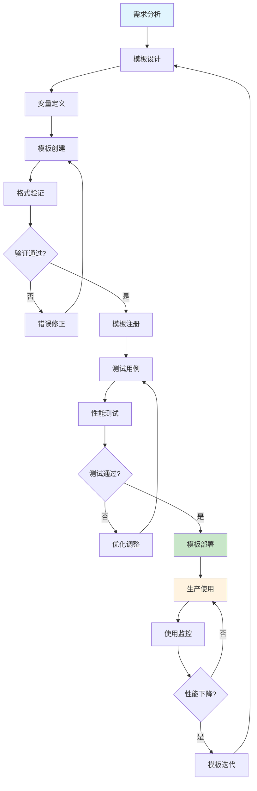

## 2. Prompt模板使用流程

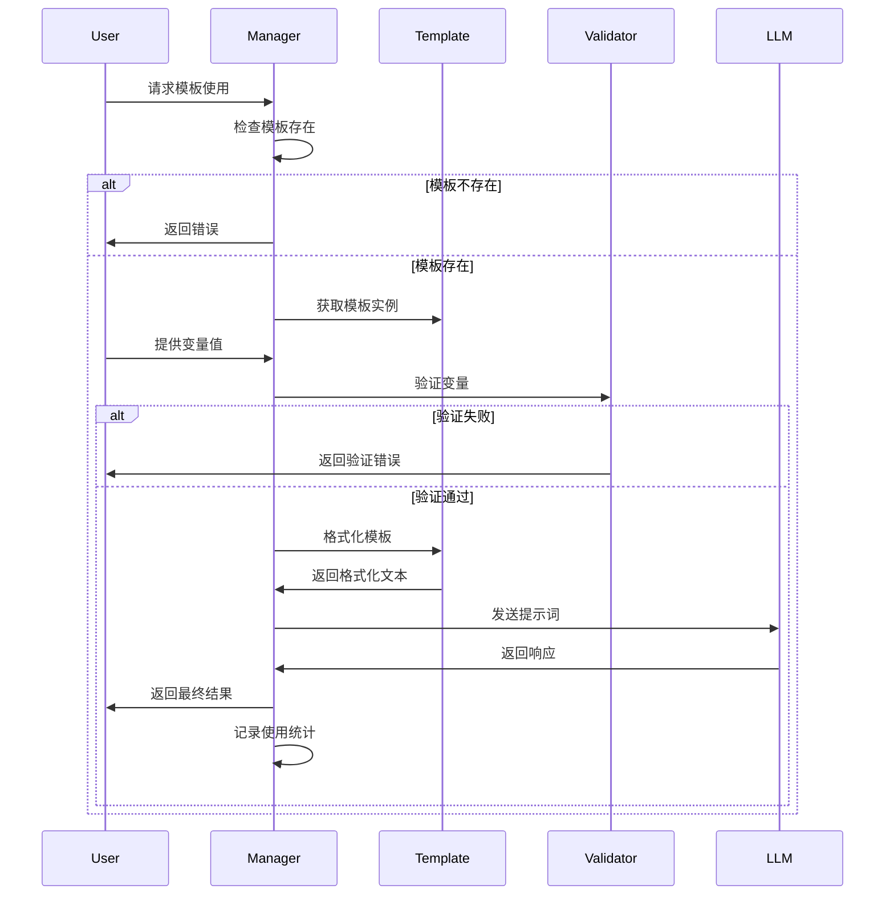

## 3. 模板类型选择决策树

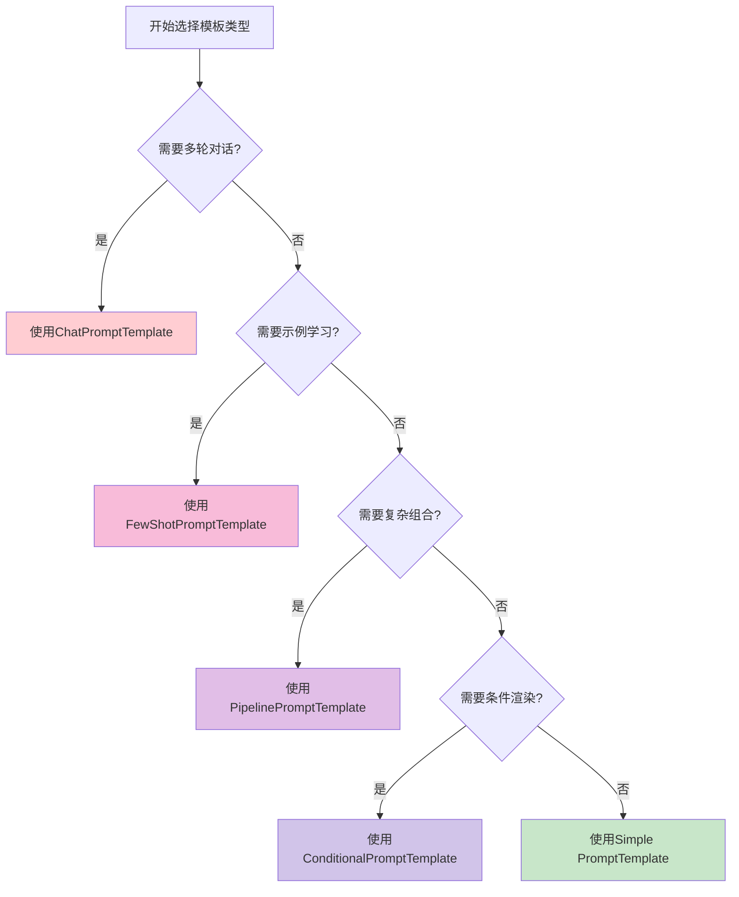

## 4. 模板验证流程

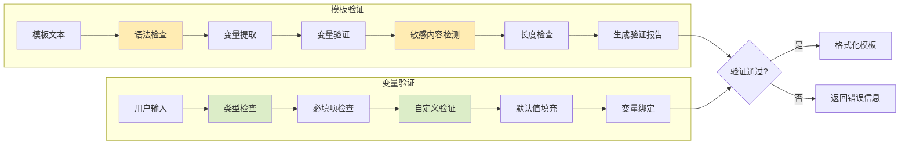

## 5. 性能优化流程

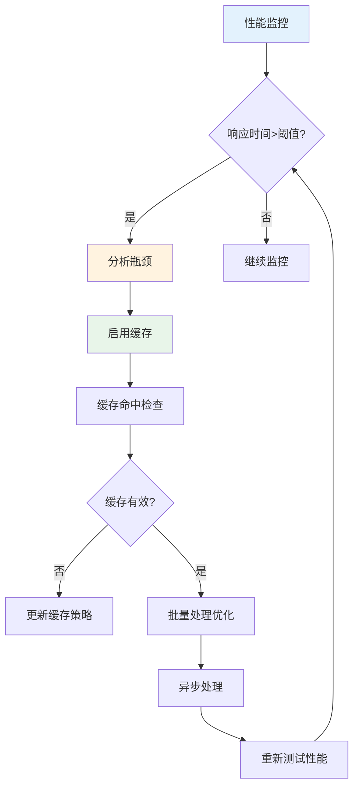

## 6. 模板版本管理

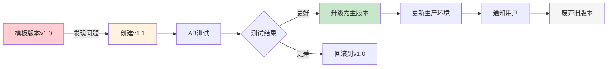

## 7. 实际应用场景流程

### 7.1 客服机器人流程

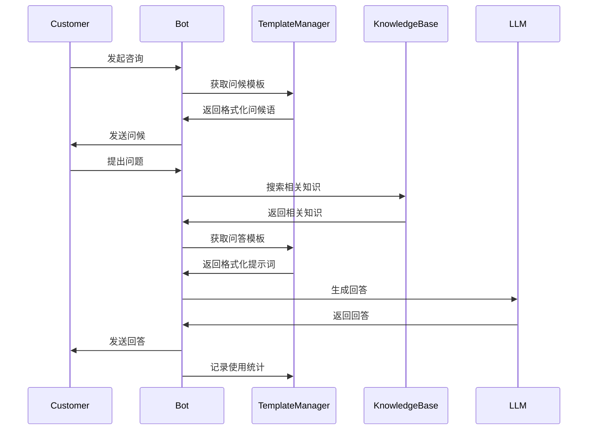

### 7.2 代码审查流程

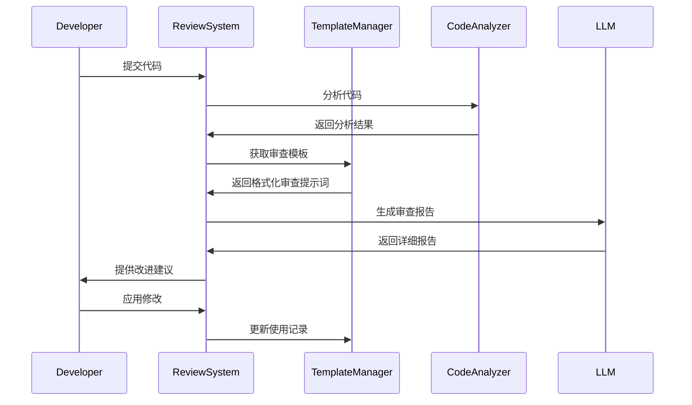

## 8. 错误处理流程

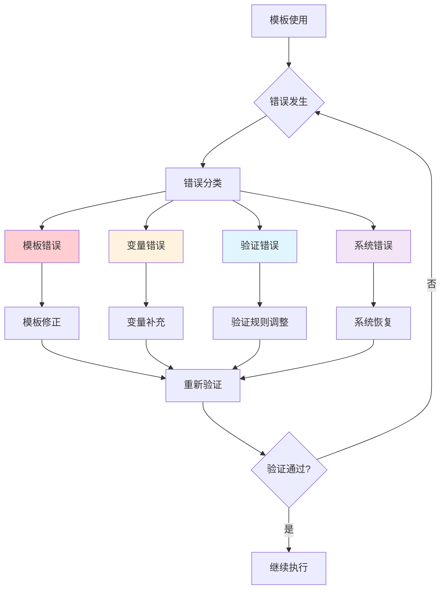

## 9. 监控告警流程

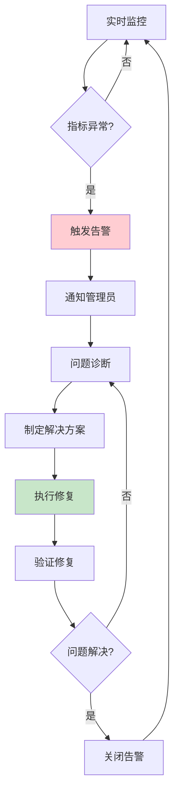

## 10. 模板库管理架构

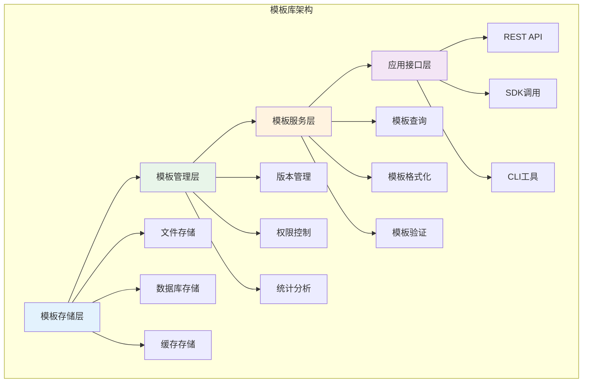

## 使用建议

1. **模板设计阶段**
   - 明确业务需求
   - 设计合理的变量结构
   - 考虑扩展性

2. **验证阶段**
   - 建立完整的测试用例
   - 进行压力测试
   - 验证边界条件

3. **部署阶段**
   - 逐步灰度发布
   - 监控关键指标
   - 准备回滚方案

4. **维护阶段**
   - 定期性能评估
   - 收集用户反馈
   - 持续优化迭代