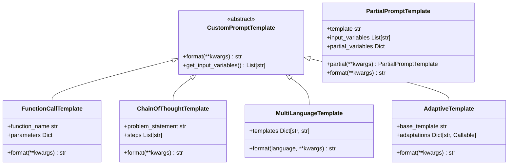

# PartialPromptTemplate与自定义提示词模板技术指南

## 概述

本指南详细介绍LangChain中的**PartialPromptTemplate**和**自定义提示词模板**的高级用法，这些技术允许您构建更加灵活、可重用的提示词系统。

## 1. PartialPromptTemplate详解

### 1.1 核心概念

**PartialPromptTemplate**是一种特殊的模板，允许您：
- **部分预填充**：预先填充部分变量
- **延迟绑定**：剩余变量在实际使用时再填充
- **链式操作**：支持连续的部分填充
- **变量追踪**：自动跟踪剩余未填充的变量

### 1.2 基本用法

```python
from partial_and_custom_templates import PartialPromptTemplate

# 创建基础模板
base_template = PartialPromptTemplate(
    template="你好 {name}，欢迎来到 {place}！今天是 {day}。",
    input_variables=["name", "place", "day"]
)

# 创建部分模板（预填充部分变量）
partial_template = base_template.partial(place="LangChain世界", day="美好的一天")

# 使用剩余变量
result = partial_template.format(name="小明")
print(result)  # 输出：你好 小明，欢迎来到 LangChain世界！今天是 美好的一天。
```

### 1.3 高级特性

#### 1.3.1 变量追踪

```python
# 获取剩余变量
remaining = partial_template.get_remaining_variables()
print("剩余变量:", remaining)  # 输出：['name']

# 检查是否完整
is_complete = partial_template.is_complete()
print("是否完整:", is_complete)  # 输出：False
```

#### 1.3.2 部分格式化

```python
# 部分格式化，返回格式化文本和剩余变量
formatted, remaining = partial_template.format_partial(name="小红")
print("格式化文本:", formatted)
print("剩余变量:", remaining)
```

#### 1.3.3 链式操作

```python
# 连续的部分填充
step1 = base_template.partial(place="LangChain世界")
step2 = step1.partial(day="星期一")
result = step2.format(name="张三")
print(result)  # 输出：你好 张三，欢迎来到 LangChain世界！今天是 星期一。
```

## 2. 自定义提示词模板

### 2.1 基础架构

我们提供了完整的自定义模板系统：



### 2.2 函数调用模板

用于生成函数调用格式的提示词：

```python
from partial_and_custom_templates import FunctionCallTemplate

# 创建函数调用模板
calc_template = FunctionCallTemplate(
    function_name="calculate_discount",
    parameters={
        "original_price": "商品原价",
        "discount_rate": "折扣率",
        "member_level": "会员等级"
    }
)

# 使用模板
result = calc_template.format(
    original_price=100,
    discount_rate=0.8,
    member_level="VIP"
)
print(result)
# 输出：调用函数 calculate_discount 参数: {"original_price": 100, "discount_rate": 0.8, "member_level": "VIP"}
```

### 2.3 思维链模板

实现Chain-of-Thought推理：

```python
from partial_and_custom_templates import ChainOfThoughtTemplate

# 创建思维链模板
cot_template = ChainOfThoughtTemplate(
    problem_statement="如何优化{system_name}的性能?",
    steps=[
        "首先分析{system_name}的当前性能瓶颈",
        "然后考虑使用{optimization_method}进行优化",
        "最后评估优化后的性能提升{expected_improvement}%"
    ]
)

# 使用模板
result = cot_template.format(
    system_name="LangChain应用",
    optimization_method="缓存优化",
    expected_improvement=50
)
print(result)
```

### 2.4 多语言模板

支持多语言动态切换：

```python
from partial_and_custom_templates import MultiLanguageTemplate

# 创建多语言模板
multilingual = MultiLanguageTemplate({
    "zh": "你好 {name}，欢迎来到我们的平台！",
    "en": "Hello {name}, welcome to our platform!",
    "ja": "こんにちは {name}さん、私たちのプラットフォームへようこそ！"
})

# 使用不同语言
for lang in ["zh", "en", "ja"]:
    result = multilingual.format(language=lang, name="用户")
    print(f"{lang}: {result}")
```

### 2.5 自适应模板

根据上下文动态调整内容：

```python
from partial_and_custom_templates import AdaptiveTemplate

# 创建自适应模板
adaptive = AdaptiveTemplate(
    base_template="代码审查报告：\n\n代码：{code_block}\n\n语言：{language}\n严重性：{severity_level}\n\n审查结果：{review_result}",
    adaptations={
        "code_block": lambda code, ctx: f"```{ctx.get('language', 'text')}\\n{code}\\n```",
        "severity_level": lambda severity, ctx: {"low": "轻微", "high": "严重"}.get(severity, "中等")
    }
)

# 使用模板
result = adaptive.format(
    code="print('Hello World')",
    language="python",
    severity="high",
    review_result="代码缺少错误处理"
)
print(result)
```

## 3. 动态模板引擎

### 3.1 Jinja2集成

支持完整的Jinja2语法：

```python
from partial_and_custom_templates import DynamicTemplateEngine

# 创建引擎
engine = DynamicTemplateEngine()

# 添加自定义过滤器
engine.add_filter('reverse', lambda x: str(x)[::-1])
engine.add_filter('word_count', lambda x: len(str(x).split()))

# 使用复杂模板
template = """

欢迎管理员 {{ name }}！

欢迎用户 {{ name }}！


您的权限：

- {{ permission|upper }}


消息长度：{{ message|word_count }} 个单词
"""

result = engine.render_template(template, {
    "user_type": "admin",
    "name": "张三",
    "permissions": ["read", "write", "delete"],
    "message": "Hello LangChain Templates"
})
print(result)
```

### 3.2 条件模板生成

```python
# 创建条件模板
conditional = engine.create_conditional_template(
    base_template="基础内容：{base}",
    conditions={
        "premium_user": "\n高级用户专享内容：{premium_content}",
        "new_user": "\n新用户欢迎信息：{welcome_message}"
    }
)

print(conditional)
```

## 4. 模板注册中心

### 4.1 注册和管理模板

```python
from partial_and_custom_templates import TemplateRegistry

# 创建注册中心
registry = TemplateRegistry()

# 注册模板
registry.register(
    "greeting",
    PartialPromptTemplate(
        template="你好 {name}，欢迎来到 {place}！",
        input_variables=["name", "place"]
    ),
    category="greeting",
    tags=["welcome", "personal"]
)

registry.register(
    "code_review",
    AdaptiveTemplate(
        base_template="代码审查：{code}",
        adaptations={"code": lambda c, ctx: f"```{ctx.get('lang')}\\n{c}\\n```"}
    ),
    category="development",
    tags=["review", "code"]
)
```

### 4.2 搜索和使用模板

```python
# 搜索模板
results = registry.search("greeting")
print("搜索结果:", results)

# 使用模板
result = registry.format_template("greeting", name="小明", place="LangChain")
print("使用结果:", result)

# 列出特定分类的模板
greeting_templates = registry.list_templates("greeting")
print("问候模板:", greeting_templates)
```

### 4.3 导出注册表

```python
# 导出所有模板到文件
registry.export_registry("templates_export.json")
```

## 5. 实际应用示例

### 5.1 RAG系统模板

```python
from partial_and_custom_templates import AdvancedTemplateFactory

# 创建RAG模板
rag_template = AdvancedTemplateFactory.create_rag_template_with_context()

# 使用示例
rag_partial = rag_template.partial(
    context="LangChain是一个用于构建LLM应用的强大框架，支持多种模型和工具集成。"
)

result = rag_partial.format(
    question="LangChain的主要特点是什么？"
)
print(result)
```

### 5.2 客服对话模板

```python
# 创建客服模板
support_template = ChainOfThoughtTemplate(
    problem_statement="用户反馈：{user_feedback}",
    steps=[
        "理解用户的问题：{user_feedback}",
        "分析问题的紧急程度：{priority}",
        "提供相应的解决方案：{solution}",
        "确认用户满意度：{satisfaction_check}"
    ]
)

# 使用模板
response = support_template.format(
    user_feedback="我的订单状态显示错误",
    priority="中等",
    solution="请提供订单号，我帮您查询",
    satisfaction_check="请问这个解决方案是否帮到您？"
)
print(response)
```

### 5.3 代码生成模板

```python
# 创建代码生成模板
code_gen = AdaptiveTemplate(
    base_template="""
生成{language}代码：

功能要求：{requirements}

代码规范：
{code_standards}

生成的代码：
{generated_code}
""",
    adaptations={
        "code_standards": lambda std, ctx: f"\n".join(f"- {s}" for s in std.split(";")) if ";" in std else f"- {std}",
        "generated_code": lambda code, ctx: f"```{ctx.get('language', 'python')}\\n{code}\\n```"
    }
)

result = code_gen.format(
    language="Python",
    requirements="创建一个简单的HTTP服务器",
    code_standards="使用PEP8规范;添加类型注解;包含错误处理",
    generated_code="import http.server\nimport socketserver\n\nclass MyHandler(http.server.SimpleHTTPRequestHandler):\n    pass\n\nwith socketserver.TCPServer((\"\", 8000), MyHandler) as httpd:\n    httpd.serve_forever()"
)
print(result)
```

## 6. 最佳实践

### 6.1 模板设计原则

1. **模块化设计**：将复杂模板拆分为可重用的子模板
2. **变量命名**：使用清晰、描述性的变量名
3. **错误处理**：添加输入验证和错误提示
4. **文档化**：为每个模板添加使用说明和示例

### 6.2 性能优化

1. **缓存模板**：使用`lru_cache`缓存已编译的模板
2. **延迟加载**：只在需要时加载模板内容
3. **批量处理**：批量处理多个模板格式化请求

### 6.3 版本管理

```python
# 模板版本控制示例
class VersionedTemplate:
    def __init__(self, template, version="1.0"):
        self.template = template
        self.version = version
        self.created_at = datetime.now()
    
    def upgrade(self, new_template):
        """升级模板版本"""
        major, minor = map(int, self.version.split("."))
        return VersionedTemplate(
            new_template,
            version=f"{major}.{minor + 1}"
        )
```

## 7. 集成示例

### 7.1 与LangChain集成

```python
from langchain.prompts import PromptTemplate
from langchain.chains import LLMChain

# 将PartialPromptTemplate转换为LangChain格式
partial_template = PartialPromptTemplate(
    template="回答这个问题：{question}",
    input_variables=["question"]
)

# 创建LangChain PromptTemplate
langchain_prompt = PromptTemplate(
    template=partial_template.template,
    input_variables=partial_template.input_variables
)

# 创建链
chain = LLMChain(llm=llm, prompt=langchain_prompt)
```

### 7.2 模板测试框架

```python
import unittest

class TemplateTestSuite(unittest.TestCase):
    
    def test_partial_template(self):
        template = PartialPromptTemplate(
            template="Hello {name}",
            input_variables=["name"]
        )
        
        partial = template.partial()
        result = partial.format(name="World")
        
        self.assertEqual(result, "Hello World")
    
    def test_function_call_template(self):
        template = FunctionCallTemplate(
            function_name="test",
            parameters={"param": "value"}
        )
        
        result = template.format(param="test_value")
        self.assertIn("test_value", result)
```

## 总结

PartialPromptTemplate和自定义提示词模板为LangChain应用提供了：

1. **灵活性**：支持部分填充、动态调整
2. **可重用性**：模板注册和组合
3. **可维护性**：版本管理和分类组织
4. **扩展性**：支持自定义模板类型
5. **多语言**：国际化支持

这些高级特性使您能够构建更加智能、适应性更强的LLM应用。