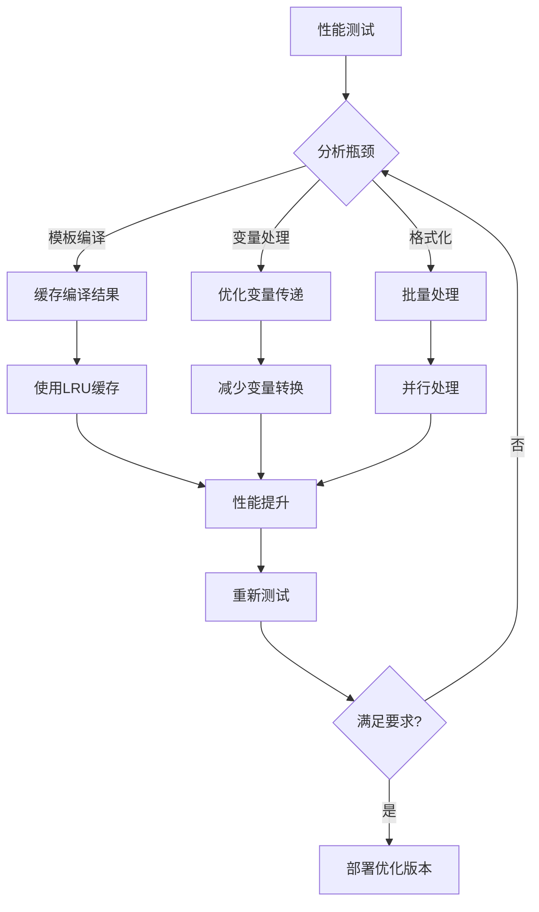

# PartialPromptTemplate与自定义模板流程图

## 1. 整体架构图


## 2. PartialPromptTemplate工作流程


## 3. 自定义模板类型图


## 4. 模板生命周期图


## 5. 多语言模板流程


## 6. 客服机器人模板流程

```mermaid
sequenceDiagram
    participant Customer
    participant Bot
    partial_template PT
    registry TR
    
    Customer->>Bot: 发送问题
    Bot->>TR: 获取问候模板
    TR->>PT: 返回PartialPromptTemplate
    PT->>Bot: 生成个性化问候
    
    Bot->>TR: 获取问题分类模板
    TR->>PT: 返回ChainOfThoughtTemplate
    PT->>Bot: 分析问题类型
    
    Bot->>TR: 获取解决方案模板
    TR->>PT: 返回AdaptiveTemplate
    PT->>Bot: 生成定制解决方案
    
    Bot->>Customer: 返回完整响应
```

## 7. 代码生成助手流程


## 8. 模板组合器工作流程


## 9. 性能优化流程



## 10. 模板测试流程

```mermaid
stateDiagram-v2
    [*] --> TestSetup: 设置测试环境
    TestSetup --> UnitTests: 单元测试
    UnitTests --> IntegrationTests: 集成测试
    IntegrationTests --> PerformanceTests: 性能测试
    
    PerformanceTests --> TestReport: 生成测试报告
    TestReport --> {测试结果}
    
    {测试结果} --> Success: 测试通过
    {测试结果} --> Failure: 测试失败
    
    Success --> [*]: 发布模板
    Failure --> Debug: 调试修复
    Debug --> UnitTests: 重新测试
```

## 使用建议

### 1. 选择合适的模板类型

- **PartialPromptTemplate**：需要部分预填充的场景
- **FunctionCallTemplate**：需要生成函数调用格式的场景
- **ChainOfThoughtTemplate**：需要思维链推理的场景
- **MultiLanguageTemplate**：需要多语言支持的场景
- **AdaptiveTemplate**：需要根据上下文动态调整的场景

### 2. 性能优化建议

1. **缓存模板**：使用TemplateRegistry缓存常用模板
2. **批量处理**：合并多个模板请求
3. **延迟加载**：只在需要时加载模板内容
4. **预编译**：提前编译复杂模板

### 3. 最佳实践

1. **模板命名**：使用清晰、描述性的模板名称
2. **变量验证**：添加输入验证和错误处理
3. **版本管理**：使用TemplateRegistry进行版本控制
4. **文档化**：为每个模板添加使用说明和示例

这些流程图和模板系统为LangChain应用提供了强大的提示词管理能力，支持复杂的业务需求和多样化的使用场景。