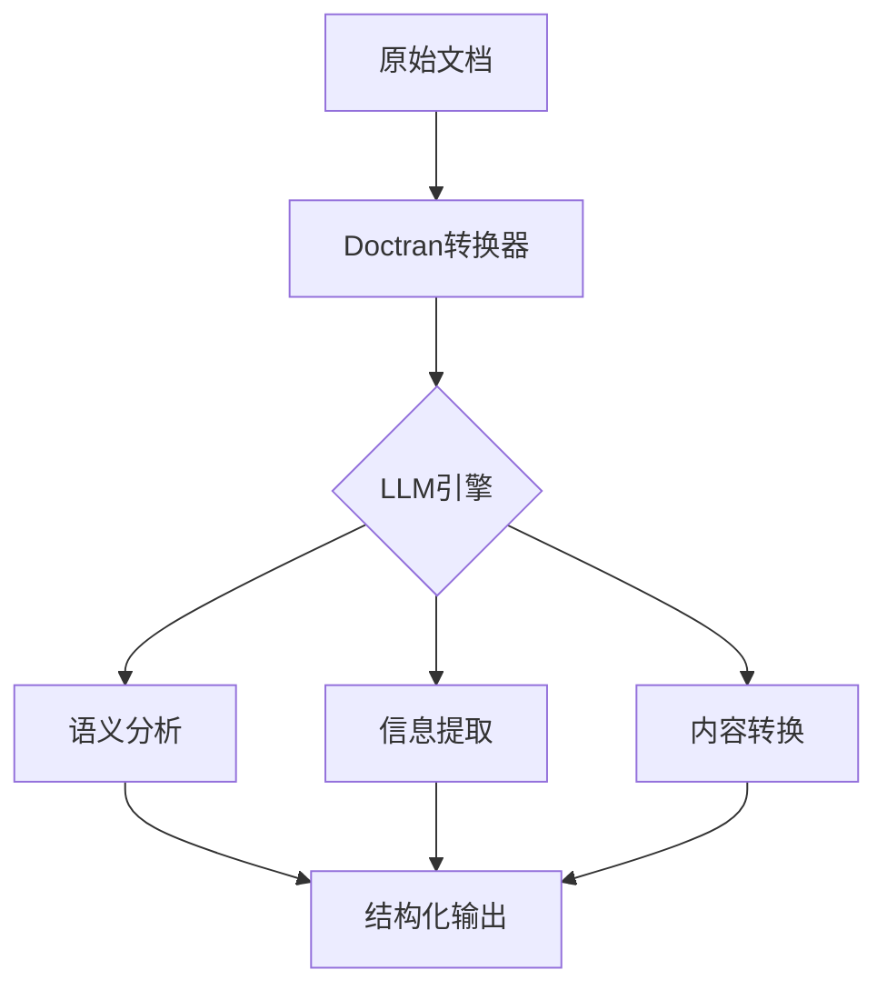

# LangChain Doctran系列转换器深度剖析

## 目录
1. [Doctran技术架构概览](#doctran技术架构概览)
2. [doctranPropertyExtractor深度解析](#doctranpropertyextractor深度解析)
3. [DoctranTextTransformer全面解析](#doctrantexttransformer全面解析)
4. [doctranqatransformer原理与实战](#doctranqatransformer原理与实战)
5. [核心应用场景分析](#核心应用场景分析)
6. [高级实战案例](#高级实战案例)
7. [性能优化与最佳实践](#性能优化与最佳实践)
8. [常见问题与解决方案](#常见问题与解决方案)

---

## Doctran技术架构概览

### Doctran设计理念

Doctran系列转换器基于**LLM驱动的文档智能转换**理念，通过大语言模型实现：
- **语义级文档理解**：超越传统文本处理的语义分析
- **结构化信息提取**：将非结构化文本转换为结构化数据
- **上下文感知转换**：基于完整上下文进行智能转换

### 核心架构组件



---

## doctranPropertyExtractor深度解析

### 核心原理

**doctranPropertyExtractor**是基于LLM的属性提取器，核心机制包括：

1. **Prompt工程驱动**：通过精心设计的prompt引导LLM提取特定属性
2. **Schema验证**：确保提取结果符合预定义的数据结构
3. **置信度评估**：为每个提取结果提供置信度评分

### 技术实现深度剖析

```python
class DoctranPropertyExtractor:
    """
    基于LLM的文档属性提取器
    
    核心算法：
    1. 文档分块：将长文档分割为适合LLM处理的chunk
    2. 属性提取：对每个chunk进行属性提取
    3. 结果聚合：合并chunk级别的提取结果
    4. 冲突解决：处理chunk间的不一致
    """
    
    def __init__(self, properties: List[str], llm_model: str = "gpt-4"):
        self.properties = properties
        self.llm_model = llm_model
        self.chunk_size = 4000  # 适合GPT-4的token限制
        self.overlap = 200
    
    def extract_properties(self, document: Document) -> Dict[str, Any]:
        """提取文档属性"""
        
        # 1. 文档分块
        chunks = self._chunk_document(document)
        
        # 2. 并行属性提取
        chunk_results = []
        for chunk in chunks:
            result = self._extract_chunk_properties(chunk)
            chunk_results.append(result)
        
        # 3. 结果聚合与冲突解决
        aggregated = self._aggregate_results(chunk_results)
        
        return aggregated
    
    def _extract_chunk_properties(self, chunk: Document) -> Dict[str, Any]:
        """从单个chunk提取属性"""
        
        prompt = f"""
        分析以下文档片段，提取指定的属性信息。
        
        文档内容：
        {chunk.page_content}
        
        需要提取的属性：
        {', '.join(self.properties)}
        
        要求：
        1. 为每个属性提供准确值
        2. 如果属性不存在，返回null
        3. 保持JSON格式输出
        
        输出格式：
        {{
            "property1": "value1",
            "property2": "value2",
            ...
        }}
        """
        
        response = self._call_llm(prompt)
        return json.loads(response)
```

### 实际应用场景

#### 场景1：合同关键信息提取

```python
# 合同信息提取示例
contract_extractor = DoctranPropertyExtractor(
    properties=[
        "contract_parties",
        "effective_date", 
        "termination_date",
        "payment_terms",
        "liability_clauses",
        "confidentiality_level"
    ]
)

contract_doc = Document(
    page_content="""
    服务协议
    
    甲方：ABC科技有限公司（以下简称"甲方"）
    乙方：XYZ数据服务提供商（以下简称"乙方"）
    
    本协议自2024年1月15日起生效，有效期至2025年1月14日。
    
    付款条款：乙方应在每月15日前支付服务费用人民币50,000元。
    违约责任：任何一方违约需承担合同总额20%的违约金。
    保密条款：双方应对本协议内容及合作过程中获知的商业秘密严格保密。
    """
)

result = contract_extractor.extract_properties(contract_doc)
print(json.dumps(result, indent=2, ensure_ascii=False))
```

#### 输出结果

```json
{
  "contract_parties": ["ABC科技有限公司", "XYZ数据服务提供商"],
  "effective_date": "2024-01-15",
  "termination_date": "2025-01-14",
  "payment_terms": "每月15日前支付人民币50,000元",
  "liability_clauses": "违约方承担合同总额20%违约金",
  "confidentiality_level": "严格保密"
}
```

#### 场景2：简历信息结构化

```python
# 简历信息提取
resume_extractor = DoctranPropertyExtractor(
    properties=[
        "personal_info",
        "education_background",
        "work_experience",
        "skills",
        "certifications",
        "contact_info"
    ]
)
```

---

## DoctranTextTransformer全面解析

### 核心功能

**DoctranTextTransformer**实现**文档级文本转换**，支持：
- **语言翻译**：多语言高质量翻译
- **风格转换**：正式/非正式、技术/通俗等
- **内容重写**：摘要、扩展、改写
- **格式标准化**：统一文档格式

### 技术实现架构

```python
class DoctranTextTransformer:
    """
    基于LLM的文本转换器
    
    转换类型：
    1. Translation: 多语言翻译
    2. Summarization: 内容摘要
    3. Rewriting: 内容重写
    4. StyleTransfer: 风格转换
    """
    
    def __init__(self, transformation_type: str, target_config: Dict[str, Any]):
        self.transformation_type = transformation_type
        self.target_config = target_config
        self.llm_model = "gpt-4-turbo"
    
    def transform(self, document: Document) -> Document:
        """执行文本转换"""
        
        transformation_prompt = self._build_transformation_prompt()
        
        transformed_content = self._execute_transformation(
            document.page_content, 
            transformation_prompt
        )
        
        return Document(
            page_content=transformed_content,
            metadata={
                **document.metadata,
                'transformation_type': self.transformation_type,
                'transformation_config': self.target_config,
                'transformed_at': datetime.now().isoformat()
            }
        )
    
    def _build_transformation_prompt(self) -> str:
        """构建转换prompt"""
        
        prompt_templates = {
            'translation': """
                将以下文本翻译成{target_language}，保持原意和语气。
                
                要求：
                1. 准确传达原文含义
                2. 符合{target_language}的语言习惯
                3. 保持专业术语准确性
                
                原文：{text}
            """,
            
            'summarization': """
                为以下文本生成{summary_length}的摘要。
                
                要求：
                1. 保留关键信息
                2. 去除冗余内容
                3. 使用{summary_style}风格
                
                原文：{text}
            """,
            
            'style_transfer': """
                将以下文本改写为{target_style}风格。
                
                原文风格：{source_style}
                目标风格：{target_style}
                
                要求：
                1. 保持核心信息不变
                2. 调整语言风格符合目标要求
                
                原文：{text}
            """
        }
        
        return prompt_templates[self.transformation_type].format(**self.target_config)
```

### 高级转换示例

#### 示例1：技术文档通俗化

```python
# 技术文档转通俗解释
tech_transformer = DoctranTextTransformer(
    transformation_type="style_transfer",
    target_config={
        'source_style': 'technical',
        'target_style': 'layman_friendly',
        'audience_level': 'beginner'
    }
)

tech_doc = Document(
    page_content="""
    微服务架构通过将单体应用分解为小型、独立的服务集合来提高系统的可扩展性和可维护性。
    每个服务运行在自己的进程中，通过轻量级通信机制（通常是HTTP/REST或gRPC）进行交互。
    服务围绕业务能力构建，通过自动化部署机制独立部署。
    """
)

simplified = tech_transformer.transform(tech_doc)
print(simplified.page_content)
```

#### 输出结果
```
想象一下，微服务就像乐高积木。传统的应用程序是一个大积木块，
而微服务把这个大积木分成很多小块，每块都有特定的功能。
这些小块可以独立工作，也可以轻松组合在一起。
就像乐高积木可以搭建不同的城堡一样，微服务可以灵活地构建各种应用程序。
```

#### 示例2：多语言翻译管道

```python
# 多语言翻译管道
class MultiLanguageTransformer:
    """多语言转换管道"""
    
    def __init__(self, target_languages: List[str]):
        self.target_languages = target_languages
        self.transformers = {
            lang: DoctranTextTransformer(
                transformation_type="translation",
                target_config={'target_language': lang}
            )
            for lang in target_languages
        }
    
    def translate_document(self, document: Document) -> Dict[str, Document]:
        """翻译成多种语言"""
        results = {}
        for lang, transformer in self.transformers.items():
            results[lang] = transformer.transform(document)
        return results

# 使用示例
multi_transformer = MultiLanguageTransformer(['zh', 'es', 'fr'])
translations = multi_transformer.translate_document(original_doc)
```

---

## doctranqatransformer原理与实战

### 核心机制

**doctranqatransformer**实现**问答对生成与优化**：
- **问题生成**：从文档内容自动生成相关问题
- **答案提取**：基于文档内容生成准确答案
- **问答优化**：提升问答质量和相关性
- **知识库构建**：构建结构化问答知识库

### 技术实现详解

```python
class DoctranQATransformer:
    """
    基于LLM的问答转换器
    
    功能特性：
    1. 自动问题生成
    2. 答案提取与验证
    3. 问答质量评分
    4. 多轮问答优化
    """
    
    def __init__(self, qa_config: Dict[str, Any]):
        self.question_types = qa_config.get('question_types', ['what', 'how', 'why'])
        self.answer_style = qa_config.get('answer_style', 'concise')
        self.max_qa_pairs = qa_config.get('max_qa_pairs', 10)
        self.llm_model = "gpt-4-turbo"
    
    def generate_qa_pairs(self, document: Document) -> List[Dict[str, str]]:
        """生成问答对"""
        
        # 1. 文档分析
        doc_analysis = self._analyze_document_content(document)
        
        # 2. 问题生成
        questions = self._generate_questions(doc_analysis)
        
        # 3. 答案提取
        qa_pairs = []
        for question in questions[:self.max_qa_pairs]:
            answer = self._extract_answer(document.page_content, question)
            qa_pairs.append({
                'question': question,
                'answer': answer,
                'confidence': self._calculate_confidence(question, answer),
                'question_type': self._classify_question_type(question)
            })
        
        # 4. 质量过滤
        filtered_pairs = self._filter_by_quality(qa_pairs)
        
        return filtered_pairs
    
    def _generate_questions(self, doc_analysis: Dict[str, Any]) -> List[str]:
        """基于文档分析生成问题"""
        
        prompt = f"""
        基于以下文档分析，生成{self.max_qa_pairs}个高质量的问题。
        
        文档关键信息：
        - 主题：{doc_analysis.get('main_topic', '')}
        - 关键概念：{', '.join(doc_analysis.get('key_concepts', []))}
        - 重要细节：{', '.join(doc_analysis.get('important_details', []))}
        
        问题类型：{', '.join(self.question_types)}
        
        要求：
        1. 问题必须能从文档中找到答案
        2. 问题要有实际价值
        3. 避免重复或过于简单的问题
        4. 使用自然语言表述
        
        返回格式：每行一个问题
        """
        
        response = self._call_llm(prompt)
        return [q.strip() for q in response.split('\n') if q.strip()]
    
    def _extract_answer(self, content: str, question: str) -> str:
        """基于问题提取答案"""
        
        prompt = f"""
        基于以下文档内容，回答给定问题。
        
        文档内容：
        {content}
        
        问题：{question}
        
        要求：
        1. 答案必须基于文档内容
        2. {self.answer_style}回答
        3. 如果信息不足，明确说明
        4. 保持答案准确性
        
        答案：
        """
        
        return self._call_llm(prompt).strip()
    
    def _calculate_confidence(self, question: str, answer: str) -> float:
        """计算问答对的置信度"""
        
        # 基于多个维度评估置信度
        factors = [
            answer_length=len(answer),
            specificity=self._measure_specificity(answer),
            relevance=self._measure_relevance(question, answer),
            completeness=self._measure_completeness(answer)
        ]
        
        # 综合评分
        confidence = np.mean([
            min(answer_length / 100, 1.0),
            specificity,
            relevance,
            completeness
        ])
        
        return round(confidence, 2)
```

### 实战应用案例

#### 案例1：技术文档FAQ生成

```python
# 技术文档FAQ自动生成
tech_qa_transformer = DoctranQATransformer({
    'question_types': ['what', 'how', 'why', 'when'],
    'answer_style': 'detailed',
    'max_qa_pairs': 15
})

tech_doc = Document(
    page_content="""
    LangChain是一个用于构建基于大语言模型的应用程序的框架。
    它提供了标准化的接口来与各种语言模型交互，支持链式调用和模块化设计。
    
    核心组件包括：
    1. 模型I/O：统一的语言模型接口
    2. 数据连接：支持多种数据源和文档格式
    3. 链式调用：构建复杂的处理流程
    4. 记忆机制：维护对话上下文
    
    主要优势：
    - 降低开发复杂度
    - 提高代码复用性
    - 支持多种模型提供商
    - 丰富的集成生态
    """
)

faq_pairs = tech_qa_transformer.generate_qa_pairs(tech_doc)

for i, qa in enumerate(faq_pairs, 1):
    print(f"Q{i}: {qa['question']}")
    print(f"A{i}: {qa['answer']}")
    print(f"置信度: {qa['confidence']}")
    print("-" * 50)
```

#### 案例2：客服知识库构建

```python
# 客服知识库自动构建
class CustomerServiceKnowledgeBase:
    """客服知识库构建器"""
    
    def __init__(self):
        self.qa_transformer = DoctranQATransformer({
            'question_types': ['what', 'how', 'why', 'troubleshooting'],
            'answer_style': 'customer_friendly',
            'max_qa_pairs': 20
        })
    
    def build_from_documentation(self, docs_path: str) -> Dict[str, Any]:
        """从文档构建知识库"""
        
        knowledge_base = {
            'total_qa_pairs': 0,
            'categories': {},
            'qa_pairs': []
        }
        
        for doc_file in Path(docs_path).glob("*.md"):
            with open(doc_file, 'r', encoding='utf-8') as f:
                content = f.read()
            
            doc = Document(page_content=content)
            qa_pairs = self.qa_transformer.generate_qa_pairs(doc)
            
            category = doc_file.stem
            knowledge_base['categories'][category] = len(qa_pairs)
            knowledge_base['qa_pairs'].extend(qa_pairs)
            knowledge_base['total_qa_pairs'] += len(qa_pairs)
        
        return knowledge_base
    
    def export_to_json(self, knowledge_base: Dict[str, Any], output_path: str):
        """导出知识库"""
        with open(output_path, 'w', encoding='utf-8') as f:
            json.dump(knowledge_base, f, ensure_ascii=False, indent=2)

# 使用示例
kb_builder = CustomerServiceKnowledgeBase()
knowledge_base = kb_builder.build_from_documentation("docs/customer_service")
kb_builder.export_to_json(knowledge_base, "customer_service_kb.json")
```

---

## 核心应用场景分析

### 1. 企业文档智能化处理

#### 合同管理系统

```python
class ContractIntelligenceSystem:
    """合同智能处理系统"""
    
    def __init__(self):
        self.property_extractor = DoctranPropertyExtractor([
            "contract_type", "parties", "duration", "payment_terms",
            "liability", "termination", "confidentiality", "governing_law"
        ])
        
        self.qa_generator = DoctranQATransformer({
            "question_types": ["legal", "financial", "operational"],
            "max_qa_pairs": 12
        })
        
        self.translator = DoctranTextTransformer(
            transformation_type="translation",
            target_config={"target_language": "zh"}
        )
    
    def process_contract(self, contract_path: str) -> Dict[str, Any]:
        """处理单个合同"""
        
        with open(contract_path, 'r', encoding='utf-8') as f:
            content = f.read()
        
        doc = Document(page_content=content)
        
        # 提取关键属性
        properties = self.property_extractor.extract_properties(doc)
        
        # 生成FAQ
        faq_pairs = self.qa_generator.generate_qa_pairs(doc)
        
        # 生成中文版本
        chinese_doc = self.translator.transform(doc)
        
        return {
            "properties": properties,
            "faq_pairs": faq_pairs,
            "chinese_version": chinese_doc.page_content,
            "processing_timestamp": datetime.now().isoformat()
        }
```

### 2. 教育内容个性化

```python
class EducationalContentProcessor:
    """教育内容处理器"""
    
    def __init__(self):
        self.difficulty_levels = ["beginner", "intermediate", "advanced"]
        self.transformers = {}
        
        for level in self.difficulty_levels:
            self.transformers[level] = DoctranTextTransformer(
                transformation_type="style_transfer",
                target_config={
                    "source_style": "academic",
                    "target_style": level,
                    "audience": "students"
                }
            )
    
    def generate_learning_materials(self, academic_content: str) -> Dict[str, Document]:
        """生成不同难度的学习材料"""
        
        original_doc = Document(page_content=academic_content)
        materials = {}
        
        for level, transformer in self.transformers.items():
            materials[level] = transformer.transform(original_doc)
        
        return materials
    
    def create_quiz_questions(self, content: str, num_questions: int = 5) -> List[Dict]:
        """生成测验问题"""
        
        qa_transformer = DoctranQATransformer({
            "question_types": ["quiz", "comprehension", "application"],
            "max_qa_pairs": num_questions,
            "answer_style": "educational"
        })
        
        doc = Document(page_content=content)
        return qa_transformer.generate_qa_pairs(doc)
```

### 3. 医疗文档智能分析

```python
class MedicalDocumentAnalyzer:
    """医疗文档分析器"""
    
    def __init__(self):
        self.clinical_extractor = DoctranPropertyExtractor([
            "diagnosis", "symptoms", "medications", "dosage",
            "side_effects", "contraindications", "follow_up_required"
        ])
        
        self.patient_translator = DoctranTextTransformer(
            transformation_type="style_transfer",
            target_config={
                "source_style": "medical_jargon",
                "target_style": "patient_friendly"
            }
        )
    
    def analyze_clinical_note(self, note_content: str) -> Dict[str, Any]:
        """分析临床记录"""
        
        doc = Document(page_content=note_content)
        
        # 提取医疗信息
        medical_info = self.clinical_extractor.extract_properties(doc)
        
        # 生成患者版本
        patient_version = self.patient_translator.transform(doc)
        
        # 生成护理指导问题
        care_qa = DoctranQATransformer({
            "question_types": ["patient_care", "medication", "lifestyle"],
            "max_qa_pairs": 8,
            "answer_style": "patient_guidance"
        })
        
        care_questions = care_qa.generate_qa_pairs(doc)
        
        return {
            "medical_summary": medical_info,
            "patient_friendly_version": patient_version.page_content,
            "care_guidelines": care_questions
        }
```

---

## 高级实战案例

### 案例1：智能客服系统完整实现

```python
class IntelligentCustomerService:
    """智能客服系统"""
    
    def __init__(self):
        self.knowledge_base = {}
        self.context_retention = {}
        
        # 初始化各种转换器
        self.query_interpreter = DoctranTextTransformer(
            transformation_type="style_transfer",
            target_config={
                "source_style": "customer_query",
                "target_style": "standardized_query"
            }
        )
        
        self.response_formatter = DoctranTextTransformer(
            transformation_type="style_transfer", 
            target_config={
                "source_style": "technical_answer",
                "target_style": "customer_friendly"
            }
        )
    
    def load_knowledge_base(self, docs_directory: str):
        """加载知识库"""
        
        qa_builder = DoctranQATransformer({
            "max_qa_pairs": 50,
            "question_types": ["troubleshooting", "how_to", "what_is", "pricing"]
        })
        
        for doc_file in Path(docs_directory).glob("*.txt"):
            with open(doc_file, 'r', encoding='utf-8') as f:
                content = f.read()
            
            doc = Document(page_content=content)
            qa_pairs = qa_builder.generate_qa_pairs(doc)
            
            category = doc_file.stem
            self.knowledge_base[category] = {
                'qa_pairs': qa_pairs,
                'last_updated': datetime.now().isoformat()
            }
    
    def process_customer_query(self, query: str, session_id: str) -> Dict[str, Any]:
        """处理客户查询"""
        
        # 标准化查询
        query_doc = Document(page_content=query)
        standardized_query = self.query_interpreter.transform(query_doc)
        
        # 检索相关答案
        relevant_answers = self._find_relevant_answers(standardized_query.page_content)
        
        # 个性化响应
        if session_id in self.context_retention:
            context = self.context_retention[session_id]
            personalized_response = self._personalize_response(relevant_answers, context)
        else:
            personalized_response = relevant_answers[0] if relevant_answers else None
        
        # 格式化最终响应
        if personalized_response:
            response_doc = Document(page_content=personalized_response['answer'])
            formatted_response = self.response_formatter.transform(response_doc)
            
            # 更新上下文
            self.context_retention[session_id] = {
                'last_query': query,
                'last_response': formatted_response.page_content,
                'timestamp': datetime.now().isoformat()
            }
            
            return {
                'response': formatted_response.page_content,
                'confidence': personalized_response['confidence'],
                'related_questions': self._suggest_related_questions(query)
            }
        
        return {
            'response': "抱歉，我暂时无法回答这个问题。请联系人工客服。",
            'confidence': 0.0,
            'escalate_to_human': True
        }
    
    def _find_relevant_answers(self, query: str) -> List[Dict[str, Any]]:
        """查找相关答案"""
        
        relevant = []
        for category, kb_data in self.knowledge_base.items():
            for qa in kb_data['qa_pairs']:
                # 简单的语义相似度匹配
                similarity = self._calculate_similarity(query, qa['question'])
                if similarity > 0.7:
                    relevant.append({
                        **qa,
                        'category': category,
                        'similarity': similarity
                    })
        
        return sorted(relevant, key=lambda x: x['similarity'], reverse=True)
```

### 案例2：教育内容个性化引擎

```python
class PersonalizedEducationEngine:
    """个性化教育内容引擎"""
    
    def __init__(self):
        self.student_profiles = {}
        self.content_templates = {}
        
        # 学习风格转换器
        self.learning_style_adapters = {
            'visual': DoctranTextTransformer(
                transformation_type="style_transfer",
                target_config={"target_style": "visual_learner"}
            ),
            'auditory': DoctranTextTransformer(
                transformation_type="style_transfer", 
                target_config={"target_style": "auditory_learner"}
            ),
            'kinesthetic': DoctranTextTransformer(
                transformation_type="style_transfer",
                target_config={"target_style": "hands_on_learner"}
            )
        }
    
    def create_personalized_content(self, student_id: str, topic: str, 
                                  base_content: str) -> Dict[str, Any]:
        """创建个性化学习内容"""
        
        student_profile = self.student_profiles.get(student_id, {})
        learning_style = student_profile.get('learning_style', 'visual')
        proficiency_level = student_profile.get('level', 'intermediate')
        
        # 基础内容适配
        base_doc = Document(page_content=base_content)
        adapted_content = self.learning_style_adapters[learning_style].transform(base_doc)
        
        # 难度调整
        difficulty_transformer = DoctranTextTransformer(
            transformation_type="style_transfer",
            target_config={"target_style": f"{proficiency_level}_level"}
        )
        
        final_content = difficulty_transformer.transform(adapted_content)
        
        # 生成配套练习
        exercise_generator = DoctranQATransformer({
            "question_types": ["practice", "quiz", "application"],
            "max_qa_pairs": 8,
            "difficulty_level": proficiency_level
        })
        
        exercises = exercise_generator.generate_qa_pairs(final_content)
        
        return {
            'personalized_content': final_content.page_content,
            'exercises': exercises,
            'learning_path': self._generate_learning_path(topic, proficiency_level),
            'next_topics': self._suggest_next_topics(topic, student_profile)
        }
```

---

## 性能优化与最佳实践

### 1. 缓存策略优化

```python
class CachedDoctranTransformer:
    """带缓存的Doctran转换器"""
    
    def __init__(self, base_transformer, cache_size: int = 1000):
        self.base_transformer = base_transformer
        self.cache = LRUCache(maxsize=cache_size)
        self.cache_stats = {'hits': 0, 'misses': 0}
    
    def transform_with_cache(self, document: Document) -> Document:
        """带缓存的转换"""
        
        cache_key = self._generate_cache_key(document)
        
        if cache_key in self.cache:
            self.cache_stats['hits'] += 1
            return self.cache[cache_key]
        
        self.cache_stats['misses'] += 1
        result = self.base_transformer.transform(document)
        self.cache[cache_key] = result
        
        return result
    
    def _generate_cache_key(self, document: Document) -> str:
        """生成缓存键"""
        content_hash = hashlib.md5(
            document.page_content.encode()
        ).hexdigest()
        
        config_hash = hashlib.md5(
            json.dumps(self.base_transformer.target_config, sort_keys=True).encode()
        ).hexdigest()
        
        return f"{content_hash}_{config_hash}"
```

### 2. 批处理优化

```python
class BatchDoctranProcessor:
    """批处理Doctran处理器"""
    
    def __init__(self, batch_size: int = 10, max_workers: int = 4):
        self.batch_size = batch_size
        self.max_workers = max_workers
        self.executor = ThreadPoolExecutor(max_workers=max_workers)
    
    def process_batch_async(self, documents: List[Document], 
                          transformer) -> List[Document]:
        """异步批处理"""
        
        batches = [documents[i:i+self.batch_size] 
                  for i in range(0, len(documents), self.batch_size)]
        
        futures = []
        for batch in batches:
            future = self.executor.submit(self._process_batch_sync, batch, transformer)
            futures.append(future)
        
        results = []
        for future in as_completed(futures):
            results.extend(future.result())
        
        return results
    
    def _process_batch_sync(self, batch: List[Document], 
                           transformer) -> List[Document]:
        """同步批处理"""
        return [transformer.transform(doc) for doc in batch]
```

### 3. 错误处理与重试机制

```python
class RobustDoctranTransformer:
    """健壮的Doctran转换器"""
    
    def __init__(self, base_transformer, max_retries: int = 3, 
                 backoff_factor: float = 2.0):
        self.base_transformer = base_transformer
        self.max_retries = max_retries
        self.backoff_factor = backoff_factor
    
    def transform_with_retry(self, document: Document) -> Document:
        """带重试的转换"""
        
        last_exception = None
        
        for attempt in range(self.max_retries):
            try:
                return self.base_transformer.transform(document)
            except Exception as e:
                last_exception = e
                if attempt < self.max_retries - 1:
                    sleep_time = self.backoff_factor ** attempt
                    time.sleep(sleep_time)
                else:
                    # 最后一次失败，返回错误文档
                    return Document(
                        page_content=f"转换失败: {str(e)}",
                        metadata={'error': True, 'original_length': len(document.page_content)}
                    )
        
        raise last_exception
```

### 4. 监控与度量

```python
class DoctranMetricsCollector:
    """Doctran指标收集器"""
    
    def __init__(self):
        self.metrics = {
            'total_transformations': 0,
            'successful_transformations': 0,
            'failed_transformations': 0,
            'average_processing_time': 0.0,
            'cache_hit_rate': 0.0
        }
    
    def record_transformation(self, processing_time: float, success: bool):
        """记录转换指标"""
        self.metrics['total_transformations'] += 1
        if success:
            self.metrics['successful_transformations'] += 1
        else:
            self.metrics['failed_transformations'] += 1
        
        # 更新平均处理时间
        total_time = self.metrics['average_processing_time'] * (self.metrics['total_transformations'] - 1)
        self.metrics['average_processing_time'] = (total_time + processing_time) / self.metrics['total_transformations']
    
    def generate_report(self) -> Dict[str, Any]:
        """生成性能报告"""
        return {
            **self.metrics,
            'success_rate': self.metrics['successful_transformations'] / max(self.metrics['total_transformations'], 1),
            'error_rate': self.metrics['failed_transformations'] / max(self.metrics['total_transformations'], 1)
        }
```

---

## 常见问题与解决方案

### 1. Token限制问题

**问题**：文档过长导致LLM token限制

**解决方案**：

```python
class ChunkedDoctranTransformer:
    """分块Doctran转换器"""
    
    def __init__(self, base_transformer, chunk_size: int = 3000, overlap: int = 200):
        self.base_transformer = base_transformer
        self.chunk_size = chunk_size
        self.overlap = overlap
    
    def transform_large_document(self, document: Document) -> Document:
        """处理大文档"""
        
        # 文档分块
        chunks = self._split_document(document)
        
        # 分块处理
        chunk_results = []
        for chunk in chunks:
            result = self.base_transformer.transform(chunk)
            chunk_results.append(result)
        
        # 结果合并
        merged_content = self._merge_results(chunk_results)
        
        return Document(
            page_content=merged_content,
            metadata=document.metadata
        )
    
    def _split_document(self, document: Document) -> List[Document]:
        """智能文档分块"""
        # 使用RecursiveCharacterTextSplitter进行语义分块
        splitter = RecursiveCharacterTextSplitter(
            chunk_size=self.chunk_size,
            chunk_overlap=self.overlap
        )
        return splitter.split_documents([document])
```

### 2. 成本控制策略

```python
class CostOptimizedDoctran:
    """成本优化的Doctran"""
    
    def __init__(self, budget_limit: float = 1.0):
        self.budget_limit = budget_limit
        self.cost_tracker = 0.0
        self.model_tiers = {
            'gpt-3.5-turbo': 0.0015,  # $0.0015 per 1K tokens
            'gpt-4': 0.03            # $0.03 per 1K tokens
        }
    
    def select_optimal_model(self, content_length: int) -> str:
        """选择最优模型"""
        estimated_cost = {}
        
        for model, rate in self.model_tiers.items():
            cost = (content_length / 1000) * rate
            if self.cost_tracker + cost <= self.budget_limit:
                estimated_cost[model] = cost
        
        # 选择最便宜的可用模型
        return min(estimated_cost.items(), key=lambda x: x[1])[0] if estimated_cost else 'gpt-3.5-turbo'
```

### 3. 质量保证机制

```python
class QualityAssuranceDoctran:
    """质量保证Doctran"""
    
    def __init__(self, quality_threshold: float = 0.8):
        self.quality_threshold = quality_threshold
        self.validator = DoctranPropertyExtractor([
            "accuracy", "completeness", "relevance", "clarity"
        ])
    
    def transform_with_quality_check(self, document: Document) -> Dict[str, Any]:
        """带质量检查的转换"""
        
        # 执行转换
        transformed = self.base_transformer.transform(document)
        
        # 质量评估
        quality_metrics = self.validator.extract_properties(
            Document(page_content=transformed.page_content)
        )
        
        # 质量判断
        overall_quality = np.mean([
            quality_metrics.get('accuracy', 0),
            quality_metrics.get('completeness', 0),
            quality_metrics.get('relevance', 0),
            quality_metrics.get('clarity', 0)
        ])
        
        return {
            'transformed_document': transformed,
            'quality_score': overall_quality,
            'quality_metrics': quality_metrics,
            'passed_quality_check': overall_quality >= self.quality_threshold
        }
```

---

## 总结与展望

### 技术总结

Doctran系列转换器代表了**文档智能处理**的前沿技术：

1. **doctranPropertyExtractor**：实现精准的结构化信息提取
2. **DoctranTextTransformer**：支持多样化的文本转换需求
3. **doctranqatransformer**：构建智能化的问答系统

### 核心优势

- **语义理解深度**：超越传统NLP的语义分析能力
- **转换质量**：基于大模型的智能转换
- **应用广泛**：覆盖企业、教育、医疗等多个领域
- **扩展性强**：支持自定义转换逻辑和场景适配

### 未来发展方向

1. **多模态支持**：扩展到图像、音频等多模态文档
2. **实时处理**：支持流式文档的实时转换
3. **个性化增强**：基于用户画像的个性化转换
4. **边缘计算**：支持本地部署的边缘计算方案

通过这套完整的Doctran系列转换器技术方案，开发者可以构建出真正智能化的文档处理系统，实现从传统文本处理到AI驱动文档智能的跨越。