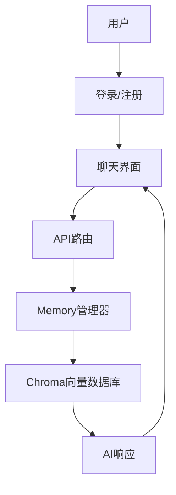

# AI对话系统 - 用户对话历史管理

基于87_memory_app.md技术方案构建的完整Web应用，实现用户隔离的对话历史管理与LangChain Memory集成。

## 🌟 功能特性

- ✅ **用户认证系统**：注册、登录、会话管理
- ✅ **对话历史隔离**：每个用户独立的对话记录
- ✅ **向量数据库存储**：使用Chroma存储对话历史
- ✅ **持久化记忆**：用户会话间的历史记录保持
- ✅ **实时对话**：Web界面实时交互
- ✅ **历史管理**：查看和清空对话历史

## 🚀 快速开始

### 1. 环境准备

```bash
# 进入项目目录
cd 88_memory_web_app

# 创建虚拟环境
python -m venv venv

# 激活虚拟环境
# Windows
venv\Scripts\activate
# macOS/Linux
source venv/bin/activate

# 安装依赖
pip install -r requirements.txt
```

### 2. 配置API密钥

编辑 `memory_manager.py` 文件，将 `OPENAI_API_KEY` 替换为您的实际API密钥：

```python
os.environ["OPENAI_API_KEY"] = "sk-your-actual-openai-api-key"
```

或者使用环境变量：

```bash
export OPENAI_API_KEY="sk-your-actual-openai-api-key"
```

### 3. 启动应用

```bash
python run.py
```

访问 http://127.0.0.1:5000 开始使用

## 📱 使用指南

### 注册新用户
1. 点击"注册"按钮
2. 填写用户名、邮箱和密码
3. 点击"注册"完成账号创建

### 开始对话
1. 登录您的账号
2. 在输入框中输入消息
3. 按回车键或点击发送按钮
4. AI会立即回复您的消息

### 管理对话历史
- **查看历史**：侧边栏显示最近5条对话
- **清空历史**：点击"清空历史"按钮（需要确认）

## 🏗️ 技术架构

### 核心组件

```
88_memory_web_app/
├── app.py              # Flask主应用
├── memory_manager.py   # LangChain + Chroma集成
├── chat_routes.py      # 聊天API路由
├── run.py             # 启动脚本
├── templates/         # HTML模板
│   ├── base.html      # 基础模板
│   ├── login.html     # 登录页面
│   ├── register.html  # 注册页面
│   └── chat.html      # 聊天界面
└── requirements.txt   # 依赖列表
```

### 数据流



## 🔧 API接口

### 聊天接口
- **POST /api/chat** - 发送消息
- **GET /api/chat/history** - 获取历史
- **POST /api/chat/clear** - 清空历史
- **GET /api/chat/status** - 获取状态

### 用户接口
- **POST /register** - 用户注册
- **POST /login** - 用户登录
- **GET /logout** - 用户登出

## 🗄️ 数据存储

### 用户数据
- **SQLite数据库**：`users.db`
- **表结构**：用户ID、用户名、邮箱、密码哈希、创建时间

### 对话历史
- **Chroma向量数据库**：`chroma_db/{user_id}/`
- **存储内容**：消息内容、时间戳、消息类型
- **隔离方式**：每个用户独立目录和集合

## 🚨 注意事项

### 生产环境建议
1. **API密钥安全**：使用环境变量存储敏感信息
2. **数据库迁移**：使用Flask-Migrate管理数据库
3. **错误处理**：添加更完善的错误处理和日志记录
4. **性能优化**：
   - 使用Redis缓存用户链
   - 添加请求限流
   - 实现异步处理
5. **安全加固**：
   - 使用HTTPS
   - 添加CSRF保护
   - 实现输入验证

### 当前限制
- 每个用户只能有一个活跃会话
- 对话历史无限制增长（需要定期清理）
- 依赖OpenAI API（需要网络连接）

## 🐛 故障排除

### 常见问题

**Q: 启动时报错"No module named 'xxx'"**
A: 确保已安装所有依赖：`pip install -r requirements.txt`

**Q: OpenAI API错误**
A: 检查API密钥是否正确设置，确保账户有足够余额

**Q: 数据库错误**
A: 删除 `users.db` 和 `chroma_db/` 目录后重启应用

**Q: 端口占用**
A: 修改 `run.py` 中的端口号，或使用 `lsof -i :5000` 查看占用进程

## 📞 支持与联系

如有问题，请检查日志输出或提交Issue。本应用基于LangChain官方最佳实践构建，可参考相关文档获取更多信息。