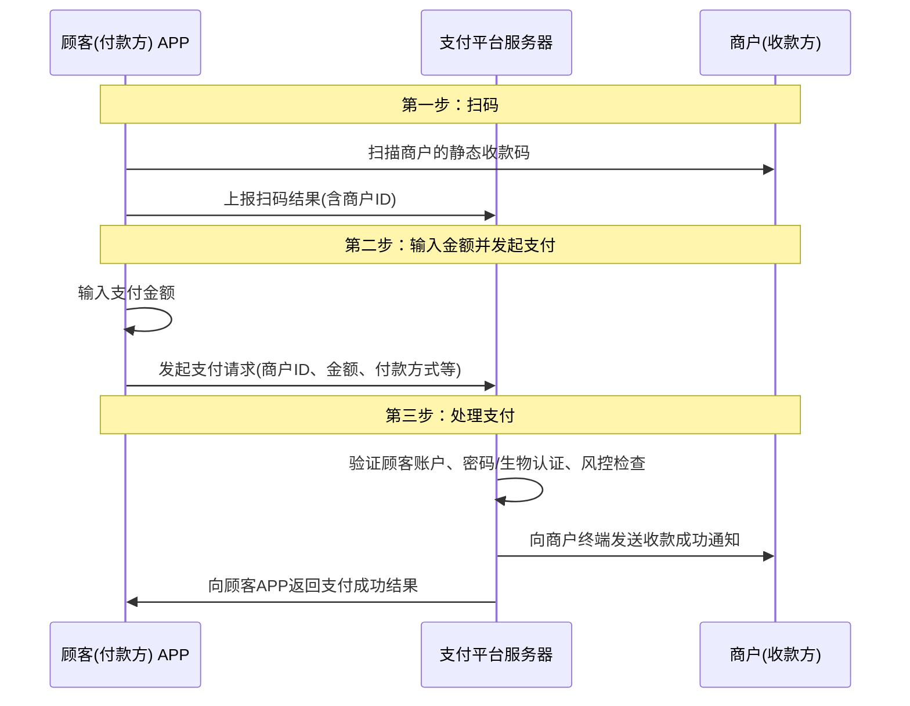
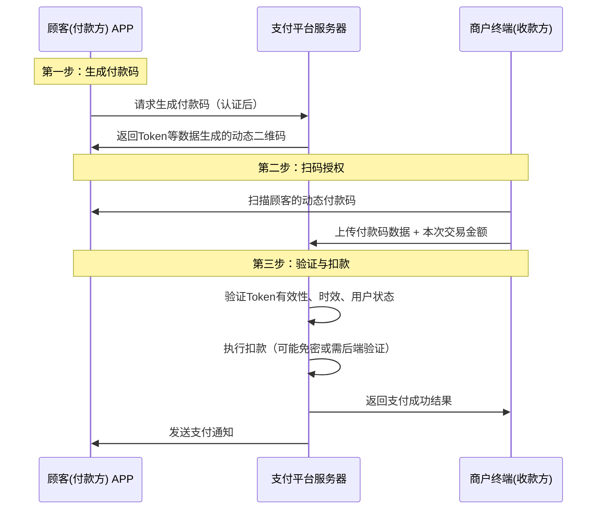

## 付款码和收款码

下面我将从多个维度进行详细的系统级区分。

---

### 一、 核心业务逻辑的本质区别

这是理解所有设计差异的基石。

*   **收款码 (静态码)：** **发起一个“收款请求”**。
    *   **角色：** 商家（收款方）主动出示。
    *   **动作：** “请向我支付X元”。
    *   **本质：** 是一个**固定的、与收款账户绑定的身份标识**。它本身不包含交易金额，金额由收款方在终端输入。它的主要目的是告诉别人“这是我的收款账户”。

*   **付款码 (动态码)：** **发起一个“付款授权”**。
    *   **角色：** 用户（付款方）主动出示。
    *   **动作：** “我授权从我的账户中扣款”。
    *   **本质：** 是一个**一次性的、有时效性的、包含用户身份和令牌（Token）的支付授权凭证**。它相当于用户的“虚拟银行卡+密码”的组合，但做了安全处理。

### 二、 系统设计上的详细区分

基于上述本质区别，支付系统（如支付宝、微信支付）对两者的处理流程、安全体系和数据结构设计完全不同。

#### 1. 生成阶段

| 维度 | 收款码 (静态码) | 付款码 (动态码) |
| :--- | :--- | :--- |
| **触发条件** | 商户在支付平台注册并通过认证后，由系统**一次性生成**。 | 用户在APP内主动**触发**（点击“付款”按钮）。 |
| **内容构成** | 内容固定，通常包含： 1. **商户ID** (Merchant ID) 2. 网关地址/协议头 | 内容动态变化，每次生成都不同，通常包含： 1. **用户标识** (User Token/ID) 2. **一次性的令牌** (One-Time Token) 3. **时间戳** (Timestamp) 4. 其他防伪信息 |
| **密钥管理** | 使用商户的**长期私钥**进行签名，验证方使用对应的公钥验签。 | 使用用户的**动态密钥**或会话密钥，由支付平台中心系统颁发和管理。 |
| **有效期** | **长期有效**（除非商户注销或违规）。 | **极短有效期**（通常1-2分钟），且**一次生效即失效**。 |
| **存储方式** | 生成后可**离线保存**（打印成纸质、存为图片）。 | **不可存储**，必须实时生成、实时使用。 |

#### 2. 扫码与支付流程

这是一个核心的交互流程差异，体现了“主扫” vs “被扫”的模式区别。

**收款码流程 (主扫模式：付款方主动扫收款方)**

**付款码流程 (被扫模式：收款方主动扫付款方)**

#### 3. 安全与风控设计

| 维度 | 收款码 (静态码) | 付款码 (动态码) |
| :--- | :--- | :--- |
| **主要风险** | 1. **二维码被篡改**（狸猫换太子） 2. 商户资质风险（洗钱、诈骗） | 1. **屏幕截图、拍照盗用** 2. 网络传输劫持 3. 超时和重复使用 |
| **风控策略** | 1. **商户准入审核**（实名制、营业执照） 2. 交易额度限制（单笔、日累计） 3. 二维码内容自带数字签名，防篡改 | 1. **超短时效**（1-2分钟失效） 2. **一次性使用**（用后即废） 3. **Token化**：码中不包含任何核心支付信息（卡号、CVV） 4. **付款额度限制**（小额免密，大额需在APP内再次验证） 5. 实时风控系统监测（如：地理位置异常、交易频次异常） |

#### 4. 数据结构示例（简化）

*   **收款码数据**：
    `https://pay.qq.com/pay?mch_id=123456789&signature=abcdef123456...`
    （一个带签名的URL，指向商户的收款账户）

*   **付款码数据**：
    `{"token": "a1b2c3d4e5f6...", "timestamp": 1627891234, "uid": "encrypted_user_info"}`
    （一个结构化的、加密后的数据包）

### 三、 总结对比表

| 特性 | 收款码 (静态码) | 付款码 (动态码) |
| :--- | :--- | :--- |
| **业务本质** | 收款请求、身份标识 | 付款授权、支付凭证 |
| **生成方式** | 一次性生成，长期有效 | 实时动态生成，每次不同 |
| **有效期** | 长期 | 极短（~1-2分钟），一次性 |
| **内容** | 固定商户信息 | 动态Token、用户标识、时间戳 |
| **使用模式** | **主扫**（顾客扫商家） | **被扫**（商家扫顾客） |
| **核心安全** | 商户资质审核、签名防篡改 | Token化、短时效、用后即焚、额度限制 |
| **风险承担** | 平台主要防范商户端风险（诈骗、洗钱） | 平台主要防范用户端风险（盗刷、盗用） |
| **离线使用** | 支持（可打印） | 不支持（需联网生成和验证） |

### 结论

从系统设计的角度来看，**收款码是一个“身份系统”**，设计重点是确保商户身份的**真实性和不可篡改性**。而**付款码是一个“授权系统”**，设计核心是确保支付授权的**时效性、唯一性和安全性**，通过Token化、短时效等关键技术，在便捷性和安全性之间取得最佳平衡。

这两种码的设计完美体现了支付系统对不同业务场景的深度理解和精细化设计。