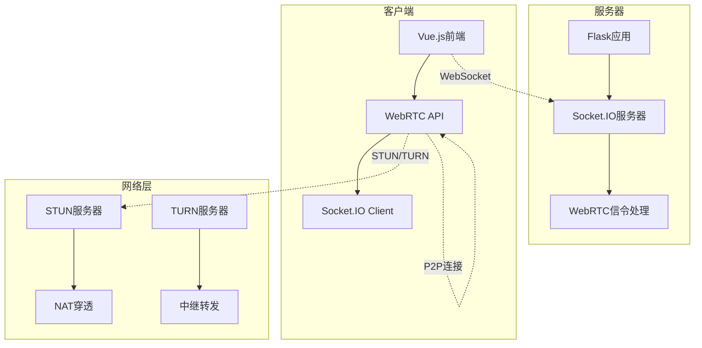
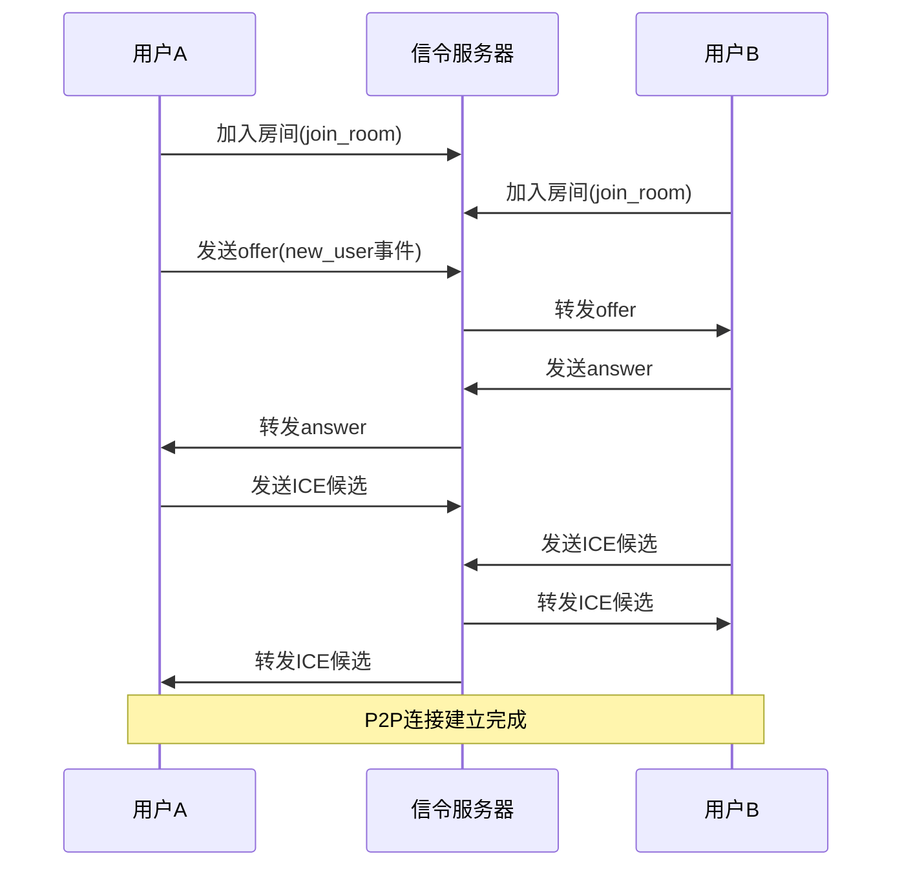
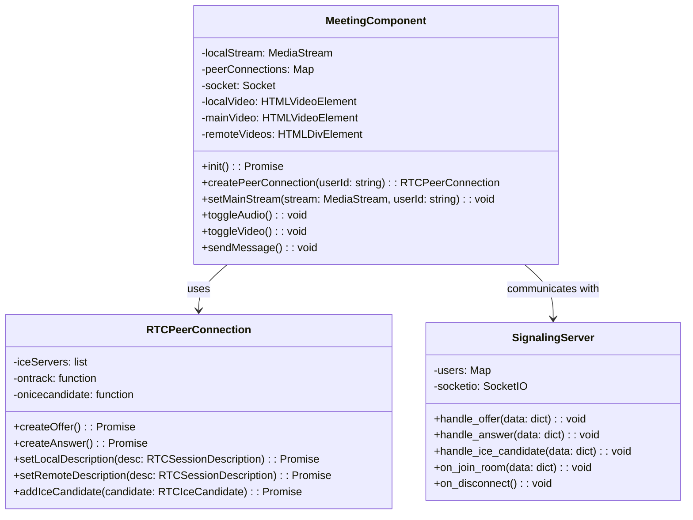
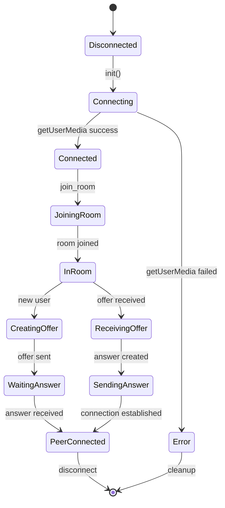

# 在线会议技术实现文档

## 1. 技术架构概览

本项目实现了一个基于WebRTC + Socket.IO的多人在线会议系统，支持实时音视频通信、屏幕共享、文字聊天等功能。

### 1.1 核心技术栈

**前端技术：**
- Vue 3 + TypeScript：现代化前端框架
- WebRTC API：浏览器原生实时通信
- Socket.IO Client：WebSocket通信
- Ant Design Vue：UI组件库

**后端技术：**
- Flask：轻量级Python Web框架
- Flask-SocketIO：WebSocket实时通信
- WebRTC信令服务器：处理SDP和ICE候选交换

**网络协议：**
- WebRTC：P2P实时通信
- WebSocket：双向实时通信
- STUN/TURN：NAT穿透和中继

## 2. 系统架构图



## 3. 核心实现详解

### 3.1 WebRTC连接建立流程



### 3.2 前端实现详解

#### 3.2.1 媒体设备管理

```typescript
// Meeting.vue - 媒体设备初始化
async function init() {
  try {
    // 检查浏览器支持
    if (!navigator.mediaDevices || !navigator.mediaDevices.getUserMedia) {
      throw new Error('浏览器不支持WebRTC');
    }
    
    // 获取媒体流
    localStream = await navigator.mediaDevices.getUserMedia({
      video: true,
      audio: true
    });
    
    // 设置本地视频
    if (localVideo.value) {
      localVideo.value.srcObject = localStream;
      setMainStream(localStream, 'local');
    }
  } catch (error) {
    console.error('媒体设备访问失败:', error);
  }
}
```

#### 3.2.2 RTCPeerConnection管理

```typescript
// 创建RTCPeerConnection配置
const createPeerConnection = async (userId: string) => {
  if (!peerConnections[userId]) {
    peerConnections[userId] = new RTCPeerConnection({
      iceServers: [
        { urls: 'stun:stun.l.google.com:19302' },
        { urls: 'stun:stun1.l.google.com:19302' }
      ]
    });

    // 处理远程媒体流
    peerConnections[userId].ontrack = (event) => {
      if (event.streams && event.streams.length > 0) {
        event.streams.forEach((stream) => {
          addRemoteVideo(stream, userId);
        });
      }
    };

    // 处理ICE候选
    peerConnections[userId].onicecandidate = (event) => {
      if (event.candidate) {
        socket.emit('ice_candidate', {
          candidate: event.candidate,
          user_id: socket.id,
          other_user_id: userId
        });
      }
    };

    // 添加本地媒体流
    localStream.getTracks().forEach(track =>
      peerConnections[userId].addTrack(track, localStream)
    );
  }
  return peerConnections[userId];
};
```

#### 3.2.3 信令处理

```typescript
// 处理新用户加入
socket.on('new_user', async (data) => {
  const otherUserId = data.user_id;
  otherUserIds.push(otherUserId);

  const pc = await createPeerConnection(otherUserId);
  
  // 创建并发送offer
  const offer = await pc.createOffer();
  await pc.setLocalDescription(offer);
  
  socket.emit('offer', {
    offer: { type: offer.type, sdp: offer.sdp },
    user_id: socket.id,
    other_user_id: otherUserId
  });
});

// 处理offer响应
socket.on('offer', async (offer) => {
  const pc = await createPeerConnection(offer.user_id);
  
  await pc.setRemoteDescription(new RTCSessionDescription(offer.offer));
  const answer = await pc.createAnswer();
  await pc.setLocalDescription(answer);
  
  socket.emit('answer', {
    answer: { type: answer.type, sdp: answer.sdp },
    user_id: socket.id,
    other_user_id: offer.user_id
  });
});
```

#### 3.2.4 用户界面控制

```typescript
// 主视频流切换
const setMainStream = (stream: MediaStream, userId: string) => {
  mainStream.value = stream;
  mainStreamIsLocal.value = userId === 'local';
  selectedUserId.value = userId;
  
  if (mainVideo.value) {
    mainVideo.value.srcObject = stream;
  }
  
  updateSelectedVideoStyle();
};

// 媒体控制功能
const toggleAudio = () => {
  const audioTrack = localStream.getAudioTracks()[0];
  if (audioTrack) {
    audioTrack.enabled = !audioTrack.enabled;
    isAudioMuted.value = !audioTrack.enabled;
  }
};

const toggleVideo = () => {
  const videoTrack = localStream.getVideoTracks()[0];
  if (videoTrack) {
    videoTrack.enabled = !videoTrack.enabled;
    isVideoMuted.value = !videoTrack.enabled;
  }
};
```

### 3.3 后端实现详解

#### 3.3.1 Socket.IO服务器配置

```python
# meeting.py - 信令服务器实现
from flask import Blueprint, request, jsonify
from flask_socketio import SocketIO, join_room, leave_room
import logging

# 创建蓝图
bp = Blueprint('meeting', __name__, url_prefix='/api/meeting')

# 存储用户信息
users = {}

# WebRTC信令处理
@socketio.on('offer')
def handle_offer(data):
    user_id = data['user_id']
    other_user_id = data['other_user_id']
    offer = data['offer']
    
    logger.info(f'WebRTC信令: 用户 {user_id} 向用户 {other_user_id} 发送offer')
    
    # 转发offer给目标用户
    socketio.emit('offer', data, room=other_user_id)
    
    return jsonify({'status': 'success'})

@socketio.on('answer')
def handle_answer(data):
    user_id = data['user_id']
    other_user_id = data['other_user_id']
    answer = data['answer']
    
    logger.info(f'WebRTC信令: 用户 {user_id} 向用户 {other_user_id} 发送answer')
    
    # 转发answer给目标用户
    socketio.emit('answer', data, room=other_user_id)
    
    return jsonify({'status': 'success'})

@socketio.on('ice_candidate')
def handle_ice_candidate(data):
    user_id = data['user_id']
    other_user_id = data['other_user_id']
    candidate = data['candidate']
    
    logger.info(f'WebRTC信令: 用户 {user_id} 向用户 {other_user_id} 发送ICE候选')
    
    # 转发ICE候选给目标用户
    socketio.emit('ice_candidate', data, room=other_user_id)
    
    return jsonify({'status': 'success'})
```

#### 3.3.2 房间管理

```python
@socketio.on('join_room')
def on_join_room(data):
    user_id = request.sid
    room = data['room']
    
    # 存储用户信息
    users[user_id] = {'sid': user_id, 'room': room}
    join_room(room)
    
    logger.info(f'用户 {user_id} 加入房间 {room}')
    
    # 通知房间内其他用户有新成员加入
    for user in users.values():
        if user['room'] == room and user['sid'] != user_id:
            socketio.emit('new_user', {'user_id': user_id}, room=user['sid'])

@socketio.on('disconnect')
def on_disconnect():
    user_id = request.sid
    if user_id in users:
        room = users[user_id]['room']
        leave_room(room)
        del users[user_id]
        logger.info(f'用户 {user_id} 断开连接')
```

#### 3.3.3 消息广播

```python
@socketio.on('message')
def handle_message(data):
    print('Received message: ' + str(data))
    # 广播消息给所有用户
    socketio.emit('message', data)
```

## 4. 类图设计



## 5. 状态管理



## 6. 部署配置

### 6.1 Nginx配置

```nginx
# 01_nginx_config_for_rtmp.conf
server {
    listen 443 ssl;
    server_name alphago.ltd;
    
    ssl_certificate /path/to/cert.pem;
    ssl_certificate_key /path/to/key.pem;
    
    location / {
        proxy_pass http://localhost:5000;
        proxy_set_header Host $host;
        proxy_set_header X-Real-IP $remote_addr;
    }
    
    location /api/meeting/socket.io/ {
        proxy_pass http://localhost:5000;
        proxy_http_version 1.1;
        proxy_set_header Upgrade $http_upgrade;
        proxy_set_header Connection "upgrade";
    }
}
```

### 6.2 Docker部署

```yaml
# docker-compose.yml
version: '3.8'
services:
  backend:
    build: ./backend
    ports:
      - "5000:5000"
    environment:
      - FLASK_ENV=production
    volumes:
      - ./backend:/app
      
  frontend:
    build: ./frontend
    ports:
      - "80:80"
    depends_on:
      - backend
```

## 7. 性能优化

### 7.1 媒体流优化
- 自适应码率调整
- 分辨率动态调整
- 音频降噪处理

### 7.2 网络优化
- ICE候选优化
- TURN服务器部署
- 带宽检测和适应

### 7.3 内存管理
- 及时释放未使用的媒体流
- 定期清理peer连接
- 优化DOM操作

## 8. 安全考虑

### 8.1 传输安全
- HTTPS/WSS加密传输
- 身份验证机制
- 房间访问控制

### 8.2 隐私保护
- 本地媒体权限管理
- 屏幕共享权限控制
- 数据本地化处理

## 9. 扩展功能

### 9.1 屏幕共享
```typescript
const startScreenShare = async () => {
  try {
    const screenStream = await navigator.mediaDevices.getDisplayMedia({
      video: true,
      audio: true
    });
    
    // 替换视频轨道
    const videoTrack = screenStream.getVideoTracks()[0];
    Object.values(peerConnections).forEach(pc => {
      const sender = pc.getSenders().find(s => s.track.kind === 'video');
      if (sender) {
        sender.replaceTrack(videoTrack);
      }
    });
  } catch (error) {
    console.error('屏幕共享失败:', error);
  }
};
```

### 9.2 录制功能
```typescript
const startRecording = () => {
  const mediaRecorder = new MediaRecorder(localStream);
  const chunks = [];
  
  mediaRecorder.ondataavailable = (event) => {
    chunks.push(event.data);
  };
  
  mediaRecorder.onstop = () => {
    const blob = new Blob(chunks, { type: 'video/webm' });
    const url = URL.createObjectURL(blob);
    // 下载录制文件
  };
  
  mediaRecorder.start();
};
```

## 10. 故障排查

### 10.1 常见问题
- 摄像头/麦克风权限问题
- NAT穿透失败
- 浏览器兼容性问题

### 10.2 调试工具
- Chrome WebRTC Internals
- 网络抓包分析
- 日志级别配置

## 11. 测试策略

### 11.1 单元测试
```typescript
// 测试信令处理
import { describe, it, expect } from 'vitest';

describe('WebRTC信令测试', () => {
  it('应该正确处理offer交换', async () => {
    const mockSocket = { emit: vi.fn() };
    // 测试逻辑
  });
});
```

### 11.2 集成测试
- 多人会议场景测试
- 网络切换测试
- 设备热插拔测试

## 12. 总结

本在线会议系统采用WebRTC技术实现了低延迟、高质量的实时音视频通信。通过前后端协同设计，提供了完整的会议体验。系统设计考虑了扩展性、安全性和性能优化，为后续功能扩展奠定了良好基础。

关键技术点：
- 使用WebRTC实现P2P通信，减少服务器负载
- 基于Socket.IO的信令系统，确保实时性
- 模块化设计，便于维护和扩展
- 完整的错误处理和用户体验优化