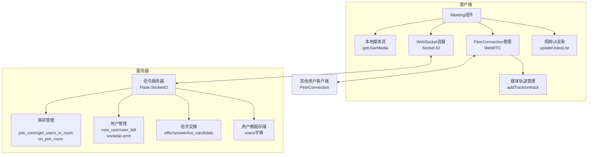
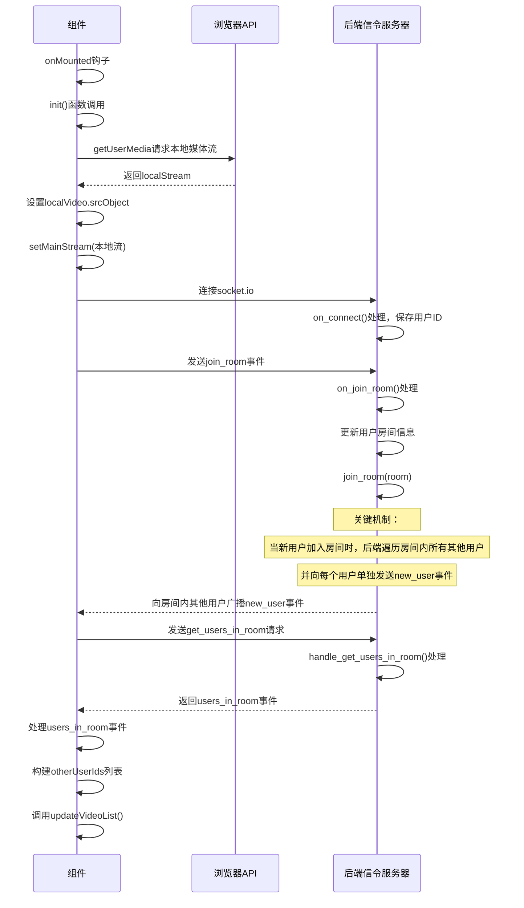
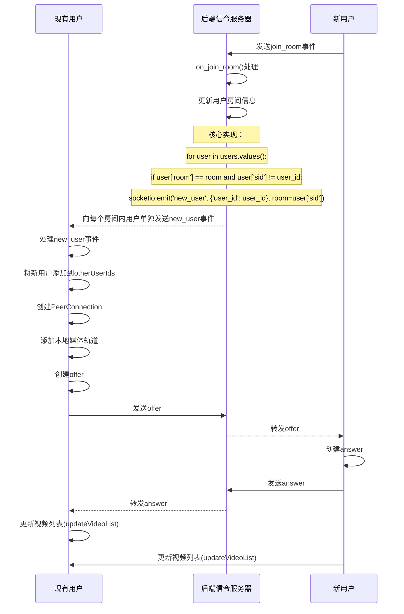
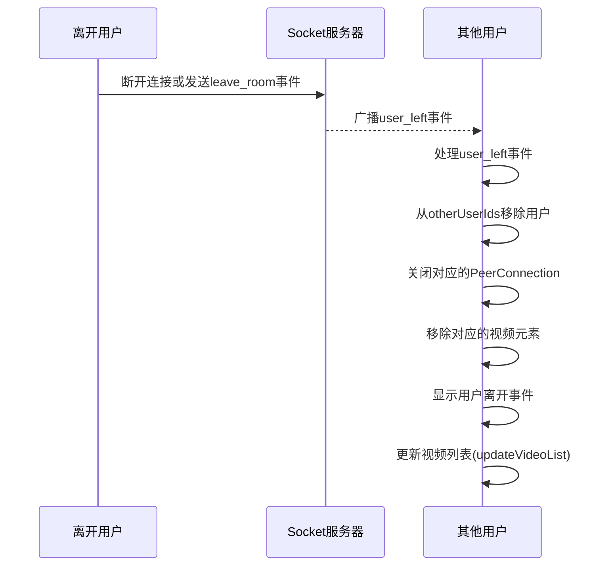

# Meeting 组件技术实现报告

## 1. 组件概述

`Meeting.vue` 是一个基于 WebRTC 和 Socket.IO 实现的视频会议组件，提供了多用户实时视频通话、消息发送、用户管理等功能。该组件支持本地视频显示、远程用户视频列表、主视频切换、音频/视频控制等核心功能。

## 2. 核心技术架构

### 2.1 技术栈
- Vue 3 (Composition API)
- TypeScript
- WebRTC (实时通信)
- Socket.IO (信令服务器通信)
- Ant Design Vue (UI组件)
- Flask (后端服务框架)
- Flask-SocketIO (后端WebSocket服务)

### 2.2 系统架构图



## 3. 初始化页面组件流程

初始化流程负责建立本地媒体流、连接服务器、获取房间用户列表并构建初始视频列表。该流程涉及前端组件初始化和后端信令服务器的交互。

### 3.1 初始化流程详解



### 3.2 初始化时视频列表构建关键代码

```typescript
// 处理房间用户列表
socket.on('users_in_room', (data) => {
  const { users } = data
  console.log(`[WebRTC] 收到房间用户列表，共 ${users.length} 位用户`)
  
  // 清除旧的用户列表
  otherUserIds.value = []
  
  // 只添加其他用户（排除自己）
    users.forEach((userId: string) => {
      if (userId !== socket.id && !otherUserIds.value.includes(userId)) {
        otherUserIds.value.push(userId)
        console.log(`[WebRTC] 添加现有用户到列表: ${userId}`)
      }
    })
    
    // 更新视频列表
    updateVideoList();
})
```

## 4. 用户加入流程

当有新用户加入会议室时，后端会先处理join_room事件，然后向房间内所有其他用户广播new_user事件，触发前端创建新的PeerConnection、交换信令并更新视频列表。

### 4.1 新用户加入流程详解



### 4.2 新用户加入时视频列表构建关键代码

```typescript
// 处理新用户加入
socket.on('new_user', async (data) => {
  const otherUserId = data.user_id
  console.log(`[WebRTC] 检测到新用户加入，用户ID: ${otherUserId}，当前用户ID: ${socket.id}`)
  
  // 显示用户加入事件
  showEvent(`${otherUserId} 加入了会议`, 'join')
  
  // 添加到用户列表，避免重复添加
  if (!otherUserIds.value.includes(otherUserId)) {
    otherUserIds.value.push(otherUserId)
    console.log(`[WebRTC] 用户已添加到用户列表，当前用户总数: ${otherUserIds.value.length}`)
  } else {
    console.log(`[WebRTC] 用户 ${otherUserId} 已在列表中，跳过重复添加`)
  }

  // 创建新的PeerConnection
  console.log(`[WebRTC] 开始为新用户创建PeerConnection，用户ID: ${otherUserId}`)
  const pc = await createPeerConnection(otherUserId)
  console.log(`[WebRTC] PeerConnection创建成功，准备添加媒体轨道`)
  
  // 添加本地媒体轨道
  const trackCount = localStream.getTracks().length
  localStream.getTracks().forEach((track, index) => {
    console.log(`[WebRTC] 添加第${index+1}/${trackCount}个媒体轨道，类型: ${track.kind}`)
    pc.addTrack(track, localStream)
  })
  console.log(`[WebRTC] 所有媒体轨道添加完成`)

  // 创建并发送offer
  // ...省略offer创建和发送代码...
  
  // 更新视频列表
  updateVideoList();
})
```

## 5. 用户离开流程

当用户离开会议室时，系统需要清理相关资源、更新用户列表并刷新视频显示。

### 5.1 用户离开流程详解



### 5.2 用户离开处理关键代码

```typescript
// 处理用户离开
socket.on('user_left', (data) => {
  const { user_id } = data
  console.log(`[WebRTC] 用户离开会议，用户ID: ${user_id}`)
  
  // 从用户列表中移除
  const index = otherUserIds.value.indexOf(user_id)
  if (index > -1) {
    otherUserIds.value.splice(index, 1)
  }
  
  // 关闭对应的PeerConnection
  if (peerConnections[user_id]) {
    peerConnections[user_id].close()
    delete peerConnections[user_id]
  }
  
  // 移除对应的视频元素
  const videoElement = document.querySelector(`.remote-video[data-user-id="${user_id}"]`)
  if (videoElement) {
    videoElement.remove()
    console.log(`[WebRTC] 用户 ${user_id} 的视频元素已移除`)
  }
  
  // 显示用户离开事件
  showEvent(`${user_id} 离开了会议`, 'leave')
  
  // 更新视频列表
  updateVideoList();
})
```

## 6. 视频列表构建机制分析

`updateVideoList()` 函数是构建和更新视频列表的核心，负责为每个用户创建或更新视频容器、视频元素和图片元素。

### 6.1 核心构建逻辑

```typescript
function updateVideoList() {
  if (!remoteVideos.value) return;
  
  console.log(`[WebRTC] updateVideoList - 开始更新视频列表，用户数量: ${otherUserIds.value.length}`);
  
  // 获取当前存在的用户容器ID
  const existingUserIds = new Set<string>();
  const currentUserContainers = remoteVideos.value.querySelectorAll('.user-video-container');
  currentUserContainers.forEach(container => {
    const userId = container.getAttribute('data-user-id');
    if (userId) existingUserIds.add(userId);
  });
  
  // 为每个活跃用户创建或更新用户容器
  otherUserIds.value.forEach((userId, index) => {
    let userContainer = document.querySelector(`.user-video-container[data-user-id="${userId}"]`) as HTMLDivElement | null;
    let videoElement: HTMLVideoElement | null = null;
    let imageElement: HTMLImageElement | null = null;
    
    // 如果用户容器不存在，创建新的
    if (!userContainer) {
      // 创建用户容器、视频元素、图片元素等
      // ...省略创建DOM元素代码...
      
      // 尝试从peerConnections获取已有的媒体流
      if (peerConnections[userId]) {
        const pc = peerConnections[userId];
        const receivers = pc.getReceivers();
        const tracks = receivers.map(receiver => receiver.track)
          .filter(track => track !== null && track.readyState === 'live');
        
        if (tracks.length > 0) {
          try {
            const stream = new MediaStream(tracks);
            videoElement.srcObject = stream;
            attemptToPlayVideo(videoElement, userId);
          } catch (error) {
            console.error(`[WebRTC] updateVideoList - 从peerConnections设置媒体流失败:`, error);
          }
        }
      }
      
      // 添加点击事件到容器
      // ...省略事件处理代码...
      
      remoteVideos.value.appendChild(userContainer);
    } else {
      // 更新现有用户容器
      // ...省略更新代码...
    }
    
    // 从存在列表中移除，剩下的就是需要删除的
    existingUserIds.delete(userId);
  });
  
  // 删除不在用户列表中的用户容器
  existingUserIds.forEach(userId => {
    const containerToRemove = document.querySelector(`.user-video-container[data-user-id="${userId}"]`);
    if (containerToRemove) {
      containerToRemove.remove();
    }
  });
}
```

## 7. 初始化与新用户加入视频列表构建的差异性分析

### 7.1 关键差异点

| 比较点 | 初始化时视频列表构建 | 新用户加入时视频列表构建 |
|-------|---------------------|-------------------------|
| 触发方式 | `socket.on('users_in_room')` 事件 | `socket.on('new_user')` 事件 |
| 后端触发机制 | 前端主动请求 `get_users_in_room` | 后端自动广播 `new_user` 事件给房间内其他用户 |
| 用户列表处理 | 清空 `otherUserIds` 后重新填充 | 向 `otherUserIds` 添加单个用户 |
| PeerConnection 状态 | 此时可能尚未创建完成 | 已在 new_user 事件中创建完成 |
| 媒体流获取时机 | 尝试从已有 PeerConnection 获取 | 尝试从刚创建的 PeerConnection 获取 |
| 时序问题 | 可能存在用户列表先于 PeerConnection 创建的情况 | PeerConnection 创建后才调用 updateVideoList |

### 7.1.1 后端核心实现分析

结合后端 `meeting.py` 的实现，新用户加入房间时的核心逻辑如下：

```python
@socketio.on('join_room')
def on_join_room(data):
    user_id = request.sid
    room = data['room']
    users[user_id]['room'] = room
    join_room(room)
    logger.info(f'WebSocket连接: 用户 {user_id} 加入房间 {room}')

    # 向房间内的所有其他用户发送信令
    for user in users.values():
        if user['room'] == room and user['sid'] != user_id:
            socketio.emit('new_user', {'user_id': user_id}, room=user['sid'])
```

这段代码展示了后端如何处理新用户加入房间的核心逻辑：
1. 获取用户ID（从 `request.sid` 自动生成）
2. 更新用户房间信息
3. 将用户添加到指定房间
4. **关键机制**：遍历房间内所有其他用户，并向每个用户单独发送 `new_user` 事件

这解释了为什么新用户加入时，现有用户的前端会收到 `new_user` 事件，而不是新用户直接与其他用户建立连接。这种设计使得所有连接建立都是由后端信令服务器协调的，确保了系统的一致性。

### 7.2 潜在问题分析

根据代码实现和差异分析，新用户加入时视频流无法正常构建的主要原因可能有：

1. **时序问题**：在新用户加入时，`updateVideoList()` 被调用，但此时 PeerConnection 可能尚未完全建立，或者媒体轨道尚未准备就绪。

2. **媒体流获取方式**：当前实现直接从 PeerConnection 的 `getReceivers()` 获取轨道并创建新的 MediaStream，这种方式可能会丢失原始流中的元数据和状态信息。

3. **重试机制不完善**：虽然 `createPeerConnection` 函数中有 `trySetMediaStream` 重试机制，但在 `updateVideoList` 中的媒体流获取逻辑缺少类似的重试机制。

4. **流缓存缺失**：当前实现没有维护单独的媒体流缓存，每次都创建新的 MediaStream 对象，可能导致性能问题和状态丢失。

## 8. 问题排查与解决方案

### 8.1 排查思路

1. **检查 PeerConnection 状态**：在 `updateVideoList` 中添加日志，检查 PeerConnection 的 `signalingState` 和 `iceConnectionState`。

2. **验证媒体轨道可用性**：在获取媒体轨道时，检查轨道的 `readyState` 和 `enabled` 属性。

3. **跟踪媒体流事件**：添加更多日志，跟踪媒体流的 `addtrack`、`removetrack` 等事件。

4. **确认 DOM 元素完整性**：确保在设置媒体流时，视频元素已经正确创建并添加到 DOM。

### 8.2 推荐解决方案

1. **实现媒体流缓存机制**：

```typescript
// 在组件顶部添加流缓存
const streamCache = new Map<string, MediaStream>();

// 在 ontrack 事件中存储流
socket.on('new_user', async (data) => {
  // ...现有代码...
  peerConnections[otherUserId].ontrack = (event) => {
    if (event.streams && event.streams.length > 0) {
      streamCache.set(otherUserId, event.streams[0]);
    }
  };
  // ...现有代码...
});

// 在 updateVideoList 中使用缓存的流
function updateVideoList() {
  // ...现有代码...
  if (streamCache.has(userId)) {
    videoElement.srcObject = streamCache.get(userId);
    attemptToPlayVideo(videoElement, userId);
  } else if (peerConnections[userId]) {
    // 现有从 PeerConnection 获取流的逻辑
  }
  // ...现有代码...
}
```

2. **增强 `updateVideoList` 中的重试机制**：

```typescript
function updateVideoList() {
  // ...现有代码...
  if (!userContainer) {
    // ...创建容器代码...
    
    // 添加重试逻辑
    setupStreamWithRetry(videoElement, userId, 0);
    
    // ...其他代码...
  }
  // ...现有代码...
}

function setupStreamWithRetry(videoElement: HTMLVideoElement, userId: string, retryCount: number) {
  const MAX_RETRIES = 5;
  
  if (retryCount >= MAX_RETRIES) {
    console.error(`[WebRTC] 达到最大重试次数，无法为用户 ${userId} 设置媒体流`);
    return;
  }
  
  if (streamCache.has(userId)) {
    videoElement.srcObject = streamCache.get(userId);
    attemptToPlayVideo(videoElement, userId);
    console.log(`[WebRTC] 通过缓存成功为用户 ${userId} 设置媒体流`);
  } else if (peerConnections[userId]) {
    const pc = peerConnections[userId];
    const receivers = pc.getReceivers();
    const tracks = receivers.map(receiver => receiver.track)
      .filter(track => track !== null && track.readyState === 'live');
    
    if (tracks.length > 0) {
      try {
        const stream = new MediaStream(tracks);
        videoElement.srcObject = stream;
        attemptToPlayVideo(videoElement, userId);
        console.log(`[WebRTC] 通过PeerConnection成功为用户 ${userId} 设置媒体流`);
      } catch (error) {
        console.error(`[WebRTC] 设置媒体流失败，${retryCount+1}/${MAX_RETRIES}，用户ID: ${userId}`);
        setTimeout(() => setupStreamWithRetry(videoElement, userId, retryCount + 1), 300 * (retryCount + 1));
      }
    } else {
      console.log(`[WebRTC] 没有找到活动的媒体轨道，${retryCount+1}/${MAX_RETRIES}，用户ID: ${userId}`);
      setTimeout(() => setupStreamWithRetry(videoElement, userId, retryCount + 1), 300 * (retryCount + 1));
    }
  } else {
    console.log(`[WebRTC] 未找到PeerConnection，${retryCount+1}/${MAX_RETRIES}，用户ID: ${userId}`);
    setTimeout(() => setupStreamWithRetry(videoElement, userId, retryCount + 1), 300 * (retryCount + 1));
  }
}
```

3. **优化 `attemptToPlayVideo` 函数**：确保视频播放的多层策略更加健壮。

4. **添加更多的错误处理和日志**：帮助快速定位问题。

## 9. 代码优化建议

### 9.1 架构优化

1. **分离关注点**：将 WebRTC 相关逻辑、UI 渲染逻辑和状态管理逻辑分离，提高代码可维护性。

2. **使用状态管理**：引入 Vuex 或 Pinia 管理复杂的应用状态，如用户列表、媒体流状态等。

3. **组件化设计**：将视频容器、控制面板等拆分为独立组件，降低主组件复杂度。

### 9.2 性能优化

1. **实现流缓存**：如前所述，维护一个单独的媒体流缓存，避免重复创建 MediaStream 对象。

2. **懒加载非可见视频**：对于不在视口内的视频，可以降低其质量或暂停，提高性能。

3. **优化视频编解码**：配置适当的编解码器和分辨率，平衡质量和性能。

### 9.3 可靠性优化

1. **完善错误处理**：为所有异步操作添加完整的错误处理逻辑。

2. **增强重试机制**：为关键操作（如媒体流获取、连接建立）添加智能重试机制。

3. **网络状态监测**：添加网络状态监测，在网络波动时自动调整参数或给出提示。

## 10. 总结

`Meeting.vue` 组件实现了基本的视频会议功能，但在处理新用户加入时的视频流构建方面存在一些问题。通过实现媒体流缓存机制、增强重试逻辑和优化事件处理流程，可以有效解决新用户视频不显示和点击不触发通信的问题。建议按照本文提出的架构优化和代码优化建议进行全面改进，提高系统的稳定性、性能和用户体验。